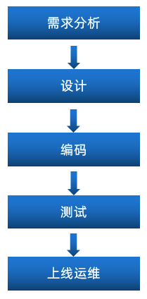

# 软件开发介绍

作为一名软件开发工程师，我们需要了解在软件开发过程中的**开发流程**， 以及软件开发过程中涉及到的**岗位角色**，**角色的分工、职责**， 并了解软件开发中涉及到的三种**软件环境**。

## 软件开发流程

作为软件开发工程师， 我们主要的任务是在编码阶段， 但是在一些小的项目组当中， 也会涉及到数据库的设计、测试等方面的工作。

### 需求分析

完成产品原型、需求规格说明书的编写。  

- **产品原型**：一般是通过网页(html)的形式展示当前的页面展示什么样的数据, 页面的布局是什么样子的，点击某个菜单，打开什么页面，点击某个按钮，出现什么效果，都可以通过产品原型看到。 

- **需求规格说明书**：一般来说就是使用 Word 文档来描述当前项目有哪些功能，每一项功能的需求及业务流程是什么样的，都会在文档中描述。

### 设计

设计的内容包含**产品设计、UI界面设计、概要设计、详细设计、数据库设计**。

在设计阶段，会出具相关的UI界面、及相关的设计文档。比如数据库设计，需要设计当前项目中涉及到哪些数据库，每一个数据库里面包含哪些表，这些表结构之间的关系是什么样的，表结构中包含哪些字段，字段类型都会在文档中描述清楚。

### 编码

编写**项目代码**、并完成**单元测试**。

作为软件开发工程师，我们主要的工作就是在该阶段， 对分配给我们的模块功能，进行编码实现。编码实现完毕后，进行单元测试，单元测试通过后再进入到下一阶段。

### 测试

在该阶段中主要由测试人员, 对部署在测试环境的项目进行功能测试, 并出具测试报告。

### 上线运维

在项目上线之前， 会由运维人员准备服务器上的软件环境安装、配置， 配置完毕后， 再将我们开发好的项目，部署在服务器上运行。

## 角色分工

学习了软件开发的流程之后， 我们还有必要了解一下在整个软件开发过程中涉及到的岗位角色，以及各个角色的职责分工。

| 岗位/角色                           | 职责/分工                                  |
| ----------------------------------- | ------------------------------------------ |
| 项目经理                            | 对整个项目负责，任务分配、把控进度         |
| 产品经理                            | 进行需求调研，输出需求调研文档、产品原型等 |
| UI设计师                            | 根据产品原型输出界面效果图                 |
| 架构师                              | 项目整体架构设计、技术选型等               |
| **开发工程师** | **功能代码实现**  |
| 测试工程师                          | 编写测试用例，输出测试报告                 |
| 运维工程师                          | 软件环境搭建、项目上线                     |

上述讲解的角色分工, 是在一个项目组中比较标准的角色分工, 但是在实际的项目中, 有一些项目组由于人员配置紧张, 可能并没有专门的架构师或测试人员, 这个时候可能需要有项目经理或者程序员兼任。

## 软件环境

在我们日常的软件开发中，会涉及到软件开发中的三套环境， 那么这三套环境分别是: 开发环境、测试环境、生产环境。 

### 开发环境development

我们作为软件开发人员，在开发阶段使用的环境，就是开发环境，一般外部用户无法访问。

比如，我们在开发中使用的MySQL数据库和其他的一些常用软件，我们可以安装在本地， 也可以安装在一台专门的服务器中， 这些应用软件仅仅在软件开发过程中使用， 项目测试、上线时，我们不会使用这套环境了，这个环境就是开发环境。

### 测试环境testing

当软件开发工程师，将项目的功能模块开发完毕，并且单元测试通过后，就需要将项目部署到测试服务器上，让测试人员对项目进行测试。那这台测试服务器就是专门给测试人员使用的环境， 也就是测试环境，用于项目测试，一般外部用户无法访问。

### 生产环境production

当项目开发完毕，并且由测试人员测试通过之后，就可以上线项目，将项目部署到线上环境，并正式对外提供服务，这个线上环境也称之为生产环境。

>补充：
>**准生产环境:** 对于有的公司来说，项目功能开发好, 并测试通过以后，并不是直接就上生产环境。为了保证我们开发的项目在上线之后能够完全满足要求，就需要把项目部署在真实的环境中, 测试一下是否完全符合要求啊，这时候就诞生了准生产环境，你可以把他当做生产环境的克隆体，准生产环境的服务器配置, 安装的应用软件(JDK、Tomcat、数据库、中间件 ...) 的版本都一样，这种环境也称为 "仿真环境"。
>由于项目的性质和类型不同，有的项目可能不需要这个环境

# 瑞吉外卖

## 项目介绍

本项目（瑞吉外卖）是专门为餐饮企业（餐厅、饭店）定制的一款软件产品，包括 **系统管理后台** 和 **移动端应用** 两部分。
- 系统管理后台主要提供给餐饮企业内部员工使用，可以对餐厅的分类、菜品、套餐、订单、员工等进行管理维护。
- 移动端应用主要提供给消费者使用，可以在线浏览菜品、添加购物车、下单等。

本项目共分为3期进行开发：

| 阶段   | 功能实现                                                     |
| ------ | ------------------------------------------------------------ |
| 第一期 | 主要实现基本需求，其中移动端应用通过H5实现，用户可以通过手机浏览器访问 |
| 第二期 | 主要针对移动端应用进行改进，使用微信小程序实现，用户使用起来更加方便 |
| 第三期 | 主要针对系统进行优化升级，提高系统的访问性能                 |

## 产品原型

**产品原型**，就是一款产品成型之前，由产品经理绘制的一个简单的框架，就是将页面的排版布局展现出来，使产品的初步构思有一个可视化的展示。**通过原型展示，可以更加直观的了解项目的需求和提供的功能。**

> **注意：** 产品原型主要用于展示项目的功能，并不是最终的页面效果。

在课程资料的产品原型文件夹下,提供了两份产品原型。

### 管理端

餐饮企业内部员工使用。 主要功能有: 

| 模块      | 描述                                                         |
| --------- | ------------------------------------------------------------ |
| 登录/退出 | 内部员工必须登录后,才可以访问系统管理后台                    |
| 员工管理  | 管理员可以在系统后台对员工信息进行管理，包含查询、新增、编辑、禁用等功能 |
| 分类管理  | 主要对当前餐厅经营的 菜品分类 或 套餐分类 进行管理维护， 包含查询、新增、修改、删除等功能 |
| 菜品管理  | 主要维护各个分类下的菜品信息，包含查询、新增、修改、删除、启售、停售等功能 |
| 套餐管理  | 主要维护当前餐厅中的套餐信息，包含查询、新增、修改、删除、启售、停售等功能 |
| 订单明细  | 主要维护用户在移动端下的订单信息，包含查询、取消、派送、完成，以及订单报表下载等功能 |

### 用户端

移动端应用主要提供给消费者使用。主要功能有:

| 模块        | 描述                                                         |
| ----------- | ------------------------------------------------------------ |
| 登录/退出   | 在移动端, 用户也需要登录后使用APP进行点餐                    |
| 点餐-菜单   | 在点餐界面需要展示出菜品分类/套餐分类, 并根据当前选择的分类加载其中的菜品信息, 供用户查询选择 |
| 点餐-购物车 | 用户选中的菜品就会加入用户的购物车, 主要包含 查询购物车、加入购物车、删除购物车、清空购物车等功能 |
| 订单支付    | 用户选完菜品/套餐后, 可以对购物车菜品进行结算支付, 这时就需要进行订单的支付 |
| 个人信息    | 在个人中心页面中会展示当前用户的基本信息, 用户可以管理收货地址, 也可以查询历史订单数据 |

## 技术选型

关于本项目的技术选型, 我们将会从 **用户层、网关层、应用层、数据层** 这几个方面进行介绍，而对于我们**服务端开发工程师**来说，在项目开发过程中，我们主要关注**应用层及数据层技术**的应用。

### 用户层

本项目中在构建系统管理后台的前端页面，我们会用到**H5、Vue.js、ElementUI**等技术。而在构建移动端应用时，我们会使用到**微信小程序**。

### 网关层

Nginx是一个服务器，主要用来作为Http服务器，部署静态资源，访问性能高。在Nginx中还有两个比较重要的作用： **反向代理**和**负载均衡**， 在进行项目部署时，要实现Tomcat的负载均衡，就可以通过Nginx来实现。

### 应用层

**SpringBoot**： 快速构建Spring项目, 采用 "约定优于配置" 的思想, 简化Spring项目的配置开发。

**Spring**: 统一管理项目中的各种资源(bean), 在web开发的各层中都会用到。

**SpringMVC**：SpringMVC是spring框架的一个模块，springmvc和spring无需通过中间整合层进行整合，可以无缝集成。

**SpringSession**: 主要解决在集群环境下的Session共享问题。

**lombok**：能以简单的注解形式来简化java代码，提高开发人员的开发效率。例如开发中经常需要写的javabean，都需要花时间去添加相应的getter/setter，也许还要去写构造器、equals等方法。

**Swagger**： 可以自动的帮助开发人员生成接口文档，并对接口进行测试。

### 数据层

**MySQL**： 关系型数据库, 本项目的核心业务数据都会采用MySQL进行存储。

**MybatisPlus**： 本项目持久层将会使用MybatisPlus来简化开发, 基本的单表增删改查直接调用框架提供的方法即可。

**Redis**： 基于key-value格式存储的内存数据库, 访问速度快, 经常使用它做缓存(降低数据库访问压力, 提供访问效率), 在后面的性能优化中会使用。

### 工具

**git**: 版本控制工具, 在团队协作中, 使用该工具对项目中的代码进行管理。

**maven**: 项目构建工具。

**junit**：单元测试工具，开发人员功能实现完毕后，需要通过junit对功能进行单元测试。

## 功能架构

### 移动端前台功能
手机号登录 , 微信登录 , 收件人地址管理 , 用户历史订单查询 , 菜品规格查询 , 购物车功能 , 下单 , 分类及菜品浏览。

### 系统管理后台功能

员工登录/退出 , 员工信息管理 , 分类管理 , 菜品管理 , 套餐管理 , 菜品口味管理 , 订单管理 。

## 角色

在瑞吉外卖这个项目中，存在以下三种用户，这三种用户对应三个角色： 后台系统管理员、后台系统普通员工、C端(移动端)用户。

| 角色             | 权限操作                                                     |
| ---------------- | ------------------------------------------------------------ |
| **后台系统管理员**   | 登录后台管理系统，拥有后台系统中的所有操作权限               |
| **后台系统普通员工** | 登录后台管理系统，对菜品、套餐、订单等进行管理 (不包含员工管理) |
| **C端用户**          | 登录移动端应用，可以浏览菜品、添加购物车、设置地址、在线下单等 |

# 相关链接

- [黑马程序员Java项目实战《瑞吉外卖》](https://www.bilibili.com/video/BV13a411q753?spm_id_from=333.337.search-card.all.click&vd_source=9b0258c7e42727ec8e9a971ffbfe97b0)
- [瑞吉外卖Gitee完善版](https://gitee.com/firstyyds/reggie-takeout)
- [瑞吉外卖项目剩余功能补充](https://blog.csdn.net/weixin_53142722/article/details/124371940)