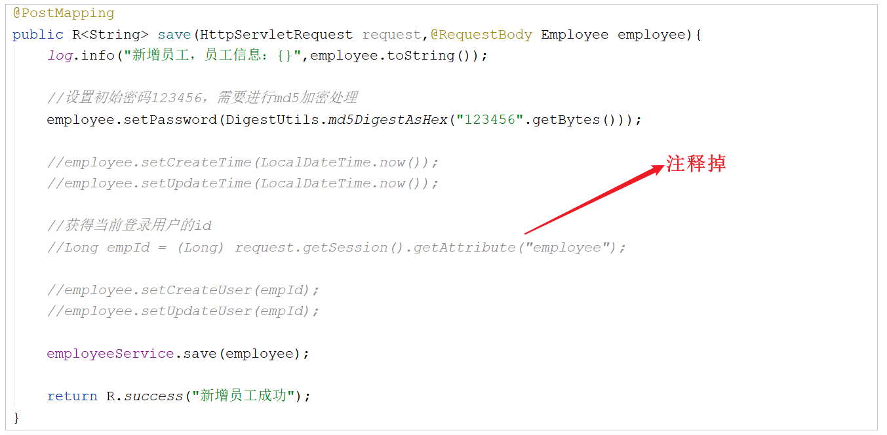

# 公共字段自动填充

## 问题分析

前面我们已经完成了后台系统的员工管理功能的开发，在**新增员工**时需要设置创建时间、创建人、修改时间、修改人等字段，在**编辑员工**时需要设置修改时间、修改人等字段。

这些字段属于公共字段，也就是也就是在我们的系统中很多表中都会有这些字段，如下：


而针对于这些字段，我们的赋值方式为： 

- 在新增数据时, 将createTime、updateTime 设置为当前时间, createUser、updateUser设置为当前登录用户ID。

- 在更新数据时, 将updateTime 设置为当前时间, updateUser设置为当前登录用户ID。

目前,在我们的项目中处理这些字段都是在每一个业务方法中进行赋值操作,如下:


如果都按照上述的操作方式来处理这些公共字段, 需要在每一个业务方法中进行操作, 编码相对冗余、繁琐，那能不能对于**这些公共字段在某个地方统一处理，来简化开发**呢？

**答案是可以的，我们使用Mybatis Plus提供的公共字段自动填充功能。**

## 功能实现

### 思路分析

Mybatis Plus公共字段自动填充，也就是在插入或者更新的时候为指定字段赋予指定的值，使用它的好处就是可以统一对这些字段进行处理，避免了重复代码。

在上述的问题分析中，我们提到有四个公共字段，需要在[新增员工](../../../../JAVA/3.Web框架/项目%20&%20实战案例/瑞吉外卖/5.后台系统功能之新增员工.md#代码实现)和[更新员工](../../../../JAVA/3.Web框架/项目%20&%20实战案例/瑞吉外卖/8.后台系统功能之启用_禁用员工账号.md#代码实现)中进行赋值操作, 具体情况如下: 

| 字段名     | 赋值时机                    | 说明           |
| ---------- | --------------------------- | -------------- |
| createTime | 插入(INSERT)                | 当前时间       |
| updateTime | 插入(INSERT) , 更新(UPDATE) | 当前时间       |
| createUser | 插入(INSERT)                | 当前登录用户ID |
| updateUser | 插入(INSERT) , 更新(UPDATE) | 当前登录用户ID |


实现步骤：

1. 在实体类的属性上加入 **@TableField** 注解，指定自动填充的策略。

2. 按照框架要求**编写元数据对象处理器**，在此类中统一为公共字段赋值，此类需要**实现MetaObjectHandler接口**。


### 代码实现

#### @TableField注解

实体类的属性上加入 **@TableField注解**，指定自动填充的策略。

在员工Employee实体类的**公共字段属性上加上注解@ableField, fill 指定填充策略**。


```
    @TableField(fill = FieldFill.INSERT)
    private LocalDateTime createTime;

    @TableField(fill = FieldFill.INSERT_UPDATE)
    private LocalDateTime updateTime;

    @TableField(fill = FieldFill.INSERT)
    private Long createUser;

    @TableField(fill = FieldFill.INSERT_UPDATE)
    private Long updateUser;
```


- **FieldFill.INSERT**: 插入时填充该属性值

- **FieldFill.INSERT_UPDATE**: 插入/更新时填充该属性值

#### 元数据对象处理器

按照框架要求编写元数据对象处理器，在此类中统一为公共字段赋值，此类需要实现MetaObjectHandler接口。

所属包: cn.suliu.reggie.common

```java
/**
 * 自定义元数据对象处理器
 */
@Component
@Slf4j
public class MyMetaObjecthandler implements MetaObjectHandler {
    /**
     * 插入操作，自动填充
     * @param metaObject
     */
    @Override
    public void insertFill(MetaObject metaObject) {
        log.info("公共字段自动填充[insert]...");
        log.info(metaObject.toString());
        
        metaObject.setValue("createTime", LocalDateTime.now());
        metaObject.setValue("updateTime",LocalDateTime.now());
        metaObject.setValue("createUser",new Long(1));
        metaObject.setValue("updateUser",new Long(1));
    }

    /**
     * 更新操作，自动填充
     * @param metaObject
     */
    @Override
    public void updateFill(MetaObject metaObject) {
        log.info("公共字段自动填充[update]...");
        log.info(metaObject.toString());

        metaObject.setValue("updateTime",LocalDateTime.now());
        metaObject.setValue("updateUser",new Long(1));
    }
}
```

### 功能测试

编写完了元数据对象处理器之后，我们就可以将之前在新增和修改方法中手动赋值的代码删除或注释掉。




然后，我们启动项目，在员工管理模块中，测试增加/更新员工信息功能，然后通过debug 或者 直接查询数据库数据变更的形式，看看我们在新增/修改数据时，这些公共字段数据是否能够完成自动填充。

## 功能完善

### 思路分析

前面我们已经完成了公共字段自动填充功能的代码开发，但是还有一个问题没有解决，就是我们在**自动填充createUser和updateUser时设置的用户id是固定值**，现在我们需要完善，改造成**动态获取当前登录用户的id**。

大家可能想到，用户登录成功后我们将用户id存入了HttpSession中，现在我从HttpSession中获取不就行了？


注意，我们**在MyMetaObjectHandler类中是不能直接获得HttpSession对象**的，所以我们需要通过其他方式来获取登录用户id。

### 修改员工执行流程

首先搞清楚我们业务的执行流程是什么样子的 , 以**修改员工信息**为例如下图:


**客户端发送的每次http请求，对应的在服务端都会分配一个新的线程来处理**，在处理过程中涉及到下面类中的方法都属于相同的一个线程：

1. LoginCheckFilter的doFilter方法

2. EmployeeController的update方法

3. MyMetaObjectHandler的updateFill方法

我们可以在上述类的方法中加入如下代码(获取当前线程ID,并输出):

```
long id = Thread.currentThread().getId();
log.info("线程id为：{}",id);
```

执行修改员工功能进行验证，通过观察控制台输出可以发现，一次请求对应的线程id是相同的：


经过上述的分析之后,发现我们可以使用JDK提供的一个类, 来解决此问题,它是JDK中提供的 **ThreadLocal**。

### ThreadLocal

ThreadLocal并不是一个Thread，而是**Thread的局部变量**。

当使用ThreadLocal维护变量时，ThreadLocal为每个使用该变量的线程提供独立的变量副本，所以每一个线程都可以独立地改变自己的副本，而不会影响其它线程所对应的副本。

ThreadLocal为每个线程提供单独一份存储空间，具有线程隔离的效果，只有在线程内才能获取到对应的值，线程外则不能访问当前线程对应的值。


#### 常用方法

-  public void set(T value) : 设置当前线程的线程局部变量的值

-  public T get() : 返回当前线程所对应的线程局部变量的值

-  public void remove() : 删除当前线程所对应的线程局部变量的值 


我们可以在LoginCheckFilter的doFilter方法中获取当前登录用户id，并调用ThreadLocal的set方法来设置当前线程的**线程局部变量的值**（用户id），然后在MyMetaObjectHandler的updateFill方法中调用ThreadLocal的get方法来获得当前线程所对应的线程局部变量的值（用户id）。 

如果在后续的操作中, 我们需要在Controller / Service中要使用当前登录用户的ID, 可以直接从ThreadLocal直接获取。

### 代码实现

实现步骤：

1. 编写BaseContext工具类，基于ThreadLocal封装的工具类

2. 在LoginCheckFilter的doFilter方法中调用BaseContext来设置当前登录用户的id

3. 在MyMetaObjectHandler的方法中调用BaseContext获取登录用户的id

#### BaseContext工具类

所属包: cn.suliu.reggie.common

```
/**
 * 基于ThreadLocal封装工具类，用户保存和获取当前登录用户id
 */
public class BaseContext {
    private static ThreadLocal<Long> threadLocal = new ThreadLocal<>();
    /**
     * 设置值
     * @param id
     */
    public static void setCurrentId(Long id){
        threadLocal.set(id);
    }
    /**
     * 获取值
     * @return
     */
    public static Long getCurrentId(){
        return threadLocal.get();
    }
}
```


#### 存放ID

LoginCheckFilter中存放当前登录用户到ThreadLocal

在doFilter方法中, 判定用户是否登录, 如果用户登录, 在放行之前, 获取HttpSession中的登录用户信息, 调用BaseContext的setCurrentId方法将当前登录用户ID存入ThreadLocal。

```
Long empId = (Long) request.getSession().getAttribute("employee");
BaseContext.setCurrentId(empId);
```


#### 获取ID


MyMetaObjectHandler中从ThreadLocal中获取

将之前在代码中固定的当前登录用户1， 修改为动态调用BaseContext中的getCurrentId方法获取当前登录用户ID


### 功能测试

完善了元数据对象处理器之后，我们就可以重新启动项目，完成登录操作后, 在员工管理模块中，测试增加/更新员工信息功能, 直接查询数据库数据变更，看看我们在新增/修改数据时，这些公共字段数据是否能够完成自动填充, 并且看看填充的create_user 及 update_user字段值是不是本地登录用户的ID。


