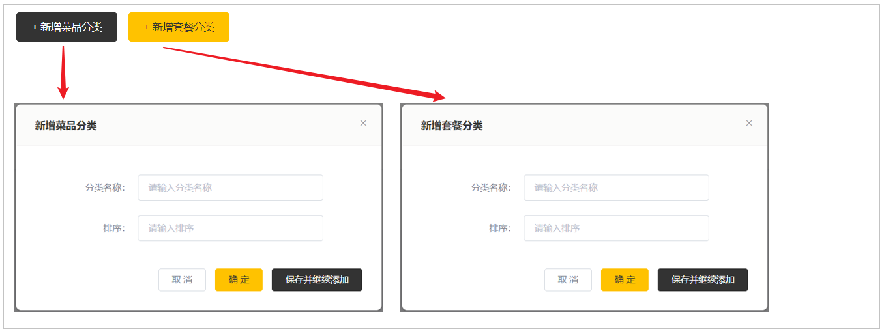
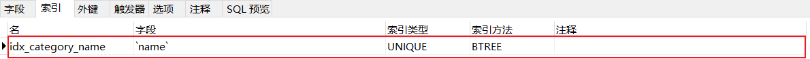

# 新增分类

## 需求分析

后台系统中可以管理分类信息，分类包括两种类型，分别是 **菜品分类** 和 **套餐分类** 。

当我们在后台系统中添加菜品时需要选择一个菜品分类，当我们在后台系统中添加一个套餐时需要选择一个套餐分类，在移动端也会按照菜品分类和套餐分类来展示对应的菜品和套餐。


在分类管理中,我们新增分类时:
- 可以选择新增菜品分类(川菜、湘菜、粤菜...)
- 也可以选择新增套餐分类(营养早餐、超值午餐...)。 

在添加套餐的时候, **输入的排序字段, 控制的是移动端套餐列表的展示顺序**。




## 数据模型

新增分类其实就是将我们**新增窗口录入的分类数据**插入到**category表**，具体表结构如下：


我们添加的**套餐名称是唯一的**，不能够重复的，所以在设计表结构时，已经针对于name字段建立了唯一索引，如下：




## 前端页面分析

在开发代码之前，需要梳理一下整个程序的执行过程：

1. 在页面(backend/page/category/list.html)的新增分类表单中填写数据，点击 "确定" 发送ajax请求，将新增分类窗口输入的数据以json形式提交到服务端

2. 服务端Controller接收页面提交的数据并调用Service将数据进行保存

3. Service调用Mapper操作数据库，保存数据


可以看到新增菜品分类和新增套餐分类请求的服务端地址和提交的json数据结构相同，所以服务端**只需要提供一个方法统一处理**即可：


具体请求信息整理如下: 

| 请求     | 说明                                           |
| -------- | ---------------------------------------------- |
| 请求方式 | POST                                           |
| 请求路径 | /category                                      |
| 请求参数 | json格式: `{"name":"川菜","type":"1","sort":2}` |


## 代码实现

代码实现的具体步骤如下: 

1. 实体类Category

1. Mapper接口CategoryMapper

1. 业务层接口CategoryService

1. 业务层实现类CategoryServiceImpl

1. 控制层CategoryController

### 实体类Category

所属包: cn.suliu.reggie.entity

```
/**
 * 分类
 */
@Data
public class Category implements Serializable {

    private static final long serialVersionUID = 1L;

    private Long id;

    //类型 1 菜品分类 2 套餐分类
    private Integer type;

    //分类名称
    private String name;

    //顺序
    private Integer sort;

    //创建时间
    @TableField(fill = FieldFill.INSERT)
    private LocalDateTime createTime;

    //更新时间
    @TableField(fill = FieldFill.INSERT_UPDATE)
    private LocalDateTime updateTime;
    
    //创建人
    @TableField(fill = FieldFill.INSERT)
    private Long createUser;
    
    //修改人
    @TableField(fill = FieldFill.INSERT_UPDATE)
    private Long updateUser;
}
```

### CategoryMapper

Mapper接口CategoryMapper

所属包: cn.suliu.reggie.mapper

```
@Mapper
public interface CategoryMapper extends BaseMapper<Category> {
}
```

### CategoryService

业务层接口CategoryService

所属包: cn.suliu.reggie.service

```
public interface CategoryService extends IService<Category> {
}
```

### CategoryServiceImpl

业务层实现类CategoryServiceImpl

所属包: cn.suliu.reggie.service.impl

```
@Service
public class CategoryServiceImpl extends ServiceImpl<CategoryMapper,Category> implements CategoryService{
}
```

### CategoryController

控制层CategoryController

```
/**
 * 分类管理
 */
@RestController
@RequestMapping("/category")
@Slf4j
public class CategoryController {
    @Autowired
    private CategoryService categoryService;
	
    /**
     * 新增分类
     * @param category
     * @return
     */
    @PostMapping
    public R<String> save(@RequestBody Category category){
        log.info("category:{}",category);
        categoryService.save(category);
        return R.success("新增分类成功");
    }
} 
```


## 功能测试

新增分类的代码编写完毕之后, 我们需要重新启动项目，进入管理系统访问分类管理, 然后进行新增分类测试，需要将所有情况都覆盖全，例如：

1. 输入的分类名称不存在

2. 输入已存在的分类名称

3. 新增菜品分类

4. 新增套餐分类


