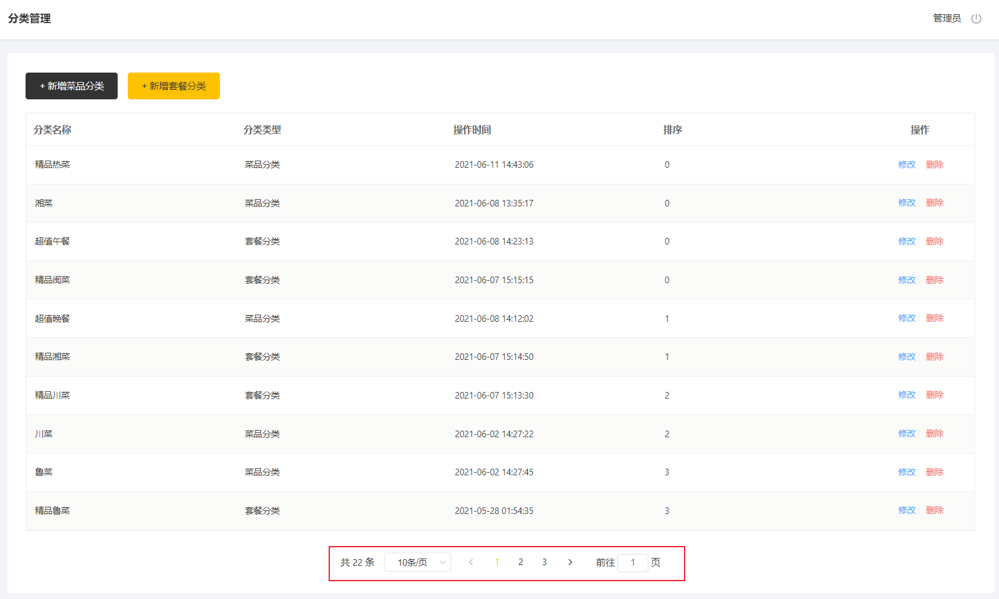

# 分类信息分页查询

## 需求分析

系统中的分类很多的时候，如果在一个页面中全部展示出来会显得比较乱，不便于查看，所以一般的系统中都会以分页的方式来展示列表数据。




## 前端页面分析

在开发代码之前，需要梳理一下整个程序的执行过程：

1. 页面发送ajax请求，将分页查询参数(page、pageSize)提交到服务端

2. 服务端Controller接收页面提交的数据并调用Service查询数据

3. Service调用Mapper操作数据库，查询分页数据

4. Controller将查询到的分页数据响应给页面

5. 页面接收到分页数据并通过ElementUI的Table组件展示到页面上


页面加载时,就会触发Vue声明周期的钩子方法,然后执行分页查询,发送异步请求到服务端,前端代码如下: 


页面中使用的是ElementUI提供的分页组件进行分页条的展示:


我们通过浏览器,也可以抓取到分页查询的请求信息, 如下: 


具体的请求信息整理如下: 

| 请求     | 说明                |
| -------- | ------------------- |
| 请求方式 | GET                 |
| 请求路径 | /category/page      |
| 请求参数 | ?page=1&pageSize=10 |

## 代码实现

在CategoryController中增加分页查询的方法，在方法中传递分页条件进行查询，并且需要对查询到的结果，安排设置的套餐顺序字段sort进行排序。

```java
/**
 * 分页查询
 * @param page
 * @param pageSize
 * @return
 */
@GetMapping("/page")
public R<Page> page(int page,int pageSize){
    //分页构造器
    Page<Category> pageInfo = new Page<>(page,pageSize);
    //条件构造器
    LambdaQueryWrapper<Category> queryWrapper = new LambdaQueryWrapper<>();
    //添加排序条件，根据sort进行排序
    queryWrapper.orderByAsc(Category::getSort);

    //分页查询
    categoryService.page(pageInfo,queryWrapper);
    return R.success(pageInfo);
}
```

## 功能测试

分页查询的代码编写完毕之后, 我们需要重新启动项目，然后登陆系统后台，点击分类管理，查询分类列表是否可以正常展示。测试过程中可以使用浏览器的监控工具查看页面和服务端的数据交互细节。

测试完毕后，大家会发现，我们查询数据库返回的类型为 1 或者 2， 但是实际展示到页面上的却是 "菜品分类" 或 "套餐分类"，这一块是在前端页面中进行处理的，处理代码如下： 


