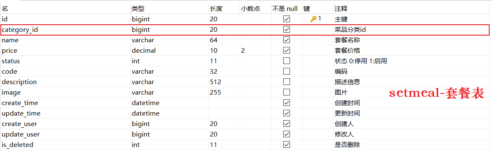

# 删除分类

## 需求分析

在分类管理列表页面，可以对某个分类进行删除操作。


需要注意的是当**分类关联了菜品或者套餐时，此分类不允许删除**。

## 前端页面分析

在前端页面中，点击 "删除" 按钮，就会触发定义的方法，然后往服务端发送异步请求，并传递参数id，执行删除分类操作。


删除操作的具体执行流程如下： 

1. 点击删除，页面发送ajax请求，将参数(id)提交到服务端

2. 服务端Controller接收页面提交的数据并调用Service删除数据

3. Service调用Mapper操作数据库


从上述的分析中，我们可以得到请求的信息如下：

| 请求     | 说明                    |
| -------- | ----------------------- |
| 请求方式 | DELETE                  |
| 请求路径 | /category               |
| 请求参数 | ?id=1395291114922618881 |

## 代码实现

在CategoryController中增加根据ID删除的方法，在方法中接收页面传递参数id，然后执行删除操作。

```
/**
 * 根据id删除分类
 * @param id
 * @return
 */
@DeleteMapping
public R<String> delete(Long id){
    log.info("删除分类，id为：{}",id);
    categoryService.removeById(id);
    return R.success("分类信息删除成功");
}
```

## 功能测试

基本的删除操作代码实现完毕后，重启项目，进行测试。可以通过debug断点调试进行测试，同时结合浏览器监控工具查看请求和响应的具体数据。

## 功能完善

### 思路分析

在上述的测试中，我们看到分类数据是可以正常删除的。但是并没有检查删除的分类是否关联了菜品或者套餐，所以我们需要进行功能完善。完善后的逻辑为：

1. 根据当前分类的ID，查询**该分类下是否存在菜品**，如果存在，则提示错误信息
1. 根据当前分类的ID，查询**该分类下是否存在套餐**，如果存在，则提示错误信息
1. 执行正常的删除分类操作

那么在这里又涉及到我们后面要用到的两张表结构 **dish(菜品表)** 和 **setmeal(套餐表)**。具体的表结构，我们目前先了解一下： 




### 准备工作

#### 菜品Dish实体类

所属包: cn.suliu.reggie.entity

```
/**
 菜品
 */
@Data
public class Dish implements Serializable {
    private static final long serialVersionUID = 1L;

    private Long id;

    //菜品名称
    private String name;

    //菜品分类id
    private Long categoryId;

    //菜品价格
    private BigDecimal price;

    //商品码
    private String code;

    //图片
    private String image;

    //描述信息
    private String description;

    //0 停售 1 起售
    private Integer status;

    //顺序
    private Integer sort;

    @TableField(fill = FieldFill.INSERT)
    private LocalDateTime createTime;

    @TableField(fill = FieldFill.INSERT_UPDATE)
    private LocalDateTime updateTime;

    @TableField(fill = FieldFill.INSERT)
    private Long createUser;

    @TableField(fill = FieldFill.INSERT_UPDATE)
    private Long updateUser;
}
```

#### 套餐Setmeal实体类

所属包: cn.suliu.reggie.entity

```java
/**
 * 套餐
 */
@Data
public class Setmeal implements Serializable {
    private static final long serialVersionUID = 1L;

    private Long id;

    //分类id
    private Long categoryId;

    //套餐名称
    private String name;

    //套餐价格
    private BigDecimal price;

    //状态 0:停用 1:启用
    private Integer status;

    //编码
    private String code;

    //描述信息
    private String description;

    //图片
    private String image;

    @TableField(fill = FieldFill.INSERT)
    private LocalDateTime createTime;

    @TableField(fill = FieldFill.INSERT_UPDATE)
    private LocalDateTime updateTime;

    @TableField(fill = FieldFill.INSERT)
    private Long createUser;

    @TableField(fill = FieldFill.INSERT_UPDATE)
    private Long updateUser;
}
```


#### DishMapper和SetmealMapper

所属包: cn.suliu.reggie.mapper

```
@Mapper
public interface DishMapper extends BaseMapper<Dish> {
}
```


```
@Mapper
public interface SetmealMapper extends BaseMapper<Setmeal> {
}
```


#### DishService和SetmealService

所属包: cn.suliu.reggie.service

```
public interface DishService extends IService<Dish> {
}
```

```
public interface SetmealService extends IService<Setmeal> {
}
```


#### DishServiceImpl和SetmealServiceImpl


```
@Service
@Slf4j
public class DishServiceImpl extends ServiceImpl<DishMapper,Dish> implements DishService {
}
```

```
@Service
@Slf4j
public class SetmealServiceImpl extends ServiceImpl<SetmealMapper,Setmeal> implements SetmealService {
}
```

### 功能实现

#### 自定义异常

在业务逻辑操作过程中,**如果遇到一些业务参数、操作异常的情况下，我们直接抛出此异常**。

所在包: cn.suliu.reggie.common

```
/**
 * 自定义业务异常类
 */
public class CustomException extends RuntimeException {
    public CustomException(String message){
        super(message);
    }
}
```

#### 扩展remove方法

在**CategoryService**中扩展remove方法

```
public interface CategoryService extends IService<Category> {
	//根据ID删除分类
    public void remove(Long id);
}
```

#### 实现remove方法

在CategoryServiceImpl中实现remove方法

```java
@Autowired
private DishService dishService;
@Autowired
private SetmealService setmealService;

/**
 * 根据id删除分类，删除之前需要进行判断
 * @param id
 */
@Override
public void remove(Long id) {
    //添加查询条件，根据分类id进行查询菜品数据
    LambdaQueryWrapper<Dish> dishLambdaQueryWrapper = new LambdaQueryWrapper<>();
    dishLambdaQueryWrapper.eq(Dish::getCategoryId,id);
    int count1 = dishService.count(dishLambdaQueryWrapper);
    //如果已经关联，抛出一个业务异常
    if(count1 > 0){
        throw new CustomException("当前分类下关联了菜品，不能删除");//已经关联菜品，抛出一个业务异常
    }

    //查询当前分类是否关联了套餐，如果已经关联，抛出一个业务异常
    LambdaQueryWrapper<Setmeal> setmealLambdaQueryWrapper = new LambdaQueryWrapper<>();
    setmealLambdaQueryWrapper.eq(Setmeal::getCategoryId,id);
    int count2 = setmealService.count(setmealLambdaQueryWrapper);
    if(count2 > 0){
        throw new CustomException("当前分类下关联了套餐，不能删除");//已经关联套餐，抛出一个业务异常
    }

    //正常删除分类
    super.removeById(id);
}
```

那么在上述的业务逻辑中，当分类下关联的有菜品或者套餐时，我们在业务代码中抛出了自定义异常，并且在异常中封装了错误提示信息，那这个错误提示信息如何提示给页面呢？

异常抛出之后，会被异常处理器捕获，我们只需要在异常处理器中捕获这一类的异常，然后给页面返回对应的提示信息即可。

#### 处理自定义异常

在GlobalExceptionHandler中处理自定义异常

在全局异常处理器中增加方法，用于捕获我们自定义的异常 CustomException

```java
/**
 * 异常处理方法
 * @return
 */
@ExceptionHandler(CustomException.class)
public R<String> exceptionHandler(CustomException ex){
    log.error(ex.getMessage());
    return R.error(ex.getMessage());
}
```


#### 改造delete方法

改造CategoryController的delete方法

注释掉原有的代码，在delete方法中直接调用categoryService中我们自定义的remove方法。

```java
/**
* 根据id删除分类
* @param id
* @return
*/
@DeleteMapping
public R<String> delete(Long id){
    log.info("删除分类，id为：{}",id);

    //categoryService.removeById(id);
    categoryService.remove(id);

    return R.success("分类信息删除成功");
}
```

### 功能测试

功能完善的代码编写完毕之后, 我们需要重新启动项目，进入管理系统访问分类管理, 然后进行删除分类的测试，需要将所有情况都覆盖全，例如：

1. 新增一个分类，然后再直接删除，检查是否可以正常删除成功。(新增的分类时没有关联菜品和套餐的)

2. 在数据库表(dish/setmeal)中，找到一个与菜品或套餐关联的分类，然后在页面中执行删除操作，检查是否可以正常的提示出对应的错误信息。


