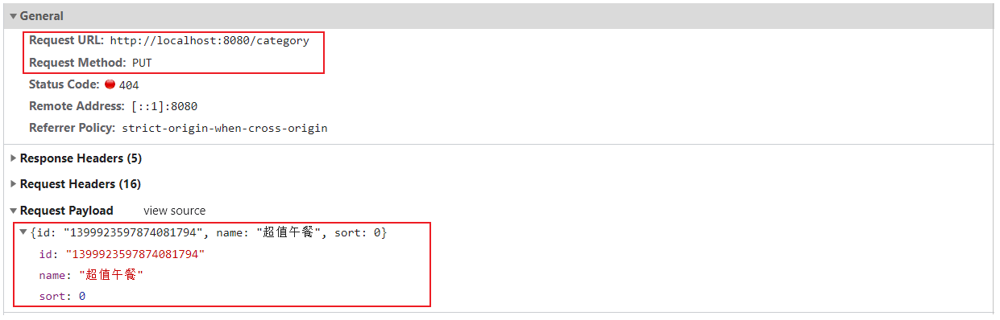

# 修改分类

## 需求分析

在分类管理列表页面点击修改按钮，弹出修改窗口，在修改窗口回显分类信息并进行修改，最后点击确定按钮完成修改操作。


## 前端页面分析

这里面大家会发现，修改功能我们还没有实现，但是当点击 "修改" 按钮的时候，我们并没有开发根据ID查询数据，进行页面回显的功能，但是页面的分类数据确实回显回来了。

这是怎么做到的呢，我们来解析一下前端的代码实现(前端代码已经实现)：


那么回显这一步的操作前端已经实现，**我们就只需要开发一个方法，修改操作的方法即可**。我们可以通过浏览器来抓取一下修改操作的请求信息，如图：



具体的请求信息，整理如下：

| 请求  | 说明  |
| --- | --- |
| 请求方式 | PUT |
| 请求路径 | /category |
| 请求参数 | `{id: "1399923597874081794", name: "超值午餐", sort: 0}` |

## 代码实现

html页面中相关的代码都已经提供好了，我们已经分析了请求的信息，接下来就可以来创建服务端的**CategoryController**方法update方法。

```java
/**
 * 根据id修改分类信息
 * @param category
 * @return
 */
@PutMapping
public R<String> update(@RequestBody Category category){
    log.info("修改分类信息：{}",category);
    categoryService.updateById(category);
    return R.success("修改分类信息成功");
}
```

## 功能测试

按照前面分析的操作流程进行测试，查看数据是否正常修改即可。