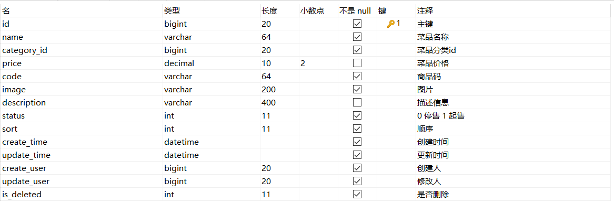

# 菜品新增

## 需求分析

后台系统中可以管理菜品信息，通过新增功能来添加一个新的菜品，在添加菜品时需要选择当前菜品所属的菜品分类，并且需要上传菜品图片，在移动端会按照菜品分类来展示对应的菜品信息 。


## 前端页面分析

基本的准备工作我们已经做完了，那么接下来我们就需要来实现新增菜品功能，在开发代码之前，需要梳理一下新增菜品时前端页面和服务端的交互过程。

1.点击新建菜品按钮, 访问页面(backend/page/food/add.html), 页面加载时发送ajax请求，请求服务端获取菜品分类数据并展示到下拉框中


2.页面发送请求进行图片上传，请求服务端将图片保存到服务器(上传功能已实现)

3.页面发送请求进行图片下载，将上传的图片进行回显(下载功能已实现)


4.点击保存按钮，发送ajax请求，将菜品相关数据以json形式提交到服务端


浏览器抓取请求:


开发新增菜品功能，其实就是在服务端编写代码去处理前端页面发送的这4次请求(上传、下载已实现)即可。经过上述的分析，我们还需要在服务端实现两块功能：

1. 菜品分类数据列表查询, 具体请求信息整理如下 : 

| 请求     | 说明           |
| -------- | -------------- |
| 请求方式 | GET            |
| 请求路径 | /category/list |
| 请求参数 | ?type=1        |


2. 保存菜品信息, 具体请求信息整理如下 : 

| 请求     | 说明     |
| -------- | -------- |
| 请求方式 | POST     |
| 请求路径 | /dish    |
| 请求参数 | json格式 |


下面呢,我们就需要根据这里分析的结果,分别来实现菜品分类列表的展示功能、保存菜品的功能 。

## 数据模型


新增菜品，其实就是将新增页面录入的菜品信息插入到dish表，如果添加了口味做法，还需要向dish_flavor表插入数据。所以在新增菜品时，涉及到两个表：

| 表结构      | 说明       |
| ----------- | ---------- |
| dish        | 菜品表     |
| dish_flavor | 菜品口味表 |


### 菜品表dish



### 菜品口味表dish_flavor


## 准备工作

在开发业务功能前，先将需要用到的类和接口基本结构创建好.

### 实体类 DishFlavor

Dish实体在[13.后台系统功能之删除分类](../../../../JAVA/3.Web框架/项目%20&%20实战案例/瑞吉外卖/13.后台系统功能之删除分类.md#菜品dish实体类)中已经导入过了.所以这里只需要导入实体类 DishFlavor

所属包: cn.suliu.reggie.entity

```java
/**
菜品口味
 */
@Data
public class DishFlavor implements Serializable {

    private static final long serialVersionUID = 1L;
	
    private Long id;
    //菜品id
    private Long dishId;

    //口味名称
    private String name;

    //口味数据list
    private String value;

    @TableField(fill = FieldFill.INSERT)
    private LocalDateTime createTime;

    @TableField(fill = FieldFill.INSERT_UPDATE)
    private LocalDateTime updateTime;

    @TableField(fill = FieldFill.INSERT)
    private Long createUser;

    @TableField(fill = FieldFill.INSERT_UPDATE)
    private Long updateUser;

    //是否删除
    private Integer isDeleted;
}
```

### DishFlavorMapper

Mapper接口DishFlavorMapper

所属包: cn.suliu.reggie.mapper

```java

@Mapper
public interface DishFlavorMapper extends BaseMapper<DishFlavor> {
}
```

### DishFlavorService

业务层接口 DishFlavorService

所属包: cn.suliu.reggie.service

```java

public interface DishFlavorService extends IService<DishFlavor> {
}
```

### DishFlavorServiceImpl

业务层实现类 DishFlavorServiceImpl

所属包: cn.suliu.reggie.service.impl

```java

@Service
public class DishFlavorServiceImpl extends ServiceImpl<DishFlavorMapper,DishFlavor> implements DishFlavorService {
}
```

### DishController

控制层 DishController

菜品及菜品口味的相关操作，我们统一使用这一个controller即可。

所属包： cn.suliu.reggie.controller

```java
/**
 * 菜品管理
 */
@RestController
@RequestMapping("/dish")
@Slf4j
public class DishController {
    @Autowired
    private DishService dishService;

    @Autowired
    private DishFlavorService dishFlavorService;
}    
```

## 代码实现

### 菜品分类查询

在**CategoryController**中增加方法实现**菜品分类查询**，根据分类进行查询，并对查询的结果按照sort排序字段进行升序排序，如果sort相同，再按照修改时间倒序排序。

```java
/**
* 根据条件查询分类数据
* @param category
* @return
*/
@GetMapping("/list")
public R<List<Category>> list(Category category){
    //条件构造器
    LambdaQueryWrapper<Category> queryWrapper = new LambdaQueryWrapper<>();
    //添加条件
    queryWrapper.eq(category.getType() != null,Category::getType,category.getType());
    //添加排序条件
    queryWrapper.orderByAsc(Category::getSort).orderByDesc(Category::getUpdateTime);

    List<Category> list = categoryService.list(queryWrapper);
    return R.success(list);
}
```


代码编写完毕之后，我们可以打开新增菜品页面，查看响应的数据，及页面下拉列表的渲染情况：


### 保存菜品信息

在上述的分析中，我们可以看到在保存菜品时，页面传递过来的是json格式数据，格式如下：

```json
{
    "name":"佛跳墙",
    "price":88800,
    "code":"",
    "image":"da9e1c70-fc32-4781-9510-a1c4ccd2ff59.jpg",
    "description":"佛跳墙",
    "status":1,
    "categoryId":"1397844357980663809",
    "flavors":[
        {
            "name":"辣度",
            "value":"[\"不辣\",\"微辣\",\"中辣\",\"重辣\"]",
            "showOption":false
        },
        {
            "name":"忌口",
            "value":"[\"不要葱\",\"不要蒜\",\"不要香菜\",\"不要辣\"]",
            "showOption":false
        }
    ]
}
```

在服务端我们应该如何来封装前端传递的数据呢，我们发现，如果使用菜品类Dish来封装，只能封装菜品的基本属性，flavors属性是无法封装的。那么这个时候，我们应该如何处理呢?

这个时候，我们需要**自定义一个实体类，然后继承自 Dish，并对Dish的属性进行拓展，增加 flavors 集合属性(内部封装DishFlavor)**。

清楚了这一点之后,接下来就进行功能开发。

#### DishDto 实体类

封装页面传递的请求参数。

所属包: cn.suliu.reggie.dto

```java

@Data
public class DishDto extends Dish {
    private List<DishFlavor> flavors = new ArrayList<>();
	
    private String categoryName;
	
    private Integer copies;
}
```


拓展： 我们在做项目时，经常会涉及到各种类型的实体模型。基本包含以下几种

| 实体模型 | 描述                                                         |
| -------- | ------------------------------------------------------------ |
| DTO      | Data Transfer Object(数据传输对象)，一般用于展示层与服务层之间的数据传输。 |
| Entity   | 最常用实体类，基本和数据表一一对应，一个实体类对应一张表。   |
| VO       | Value Object(值对象), 主要用于封装前端页面展示的数据对象，用一个VO对象来封装整个页面展示所需要的对象数据 |
| PO       | Persistant Object(持久层对象), 是ORM(Objevt Relational Mapping)框架中Entity，PO属性和数据库中表的字段形成一一对应关系 |


### 新增菜品

DishController定义方法新增菜品

在该Controller的方法中，**不仅需要保存菜品的基本信息，还需要保存菜品的口味信息，需要操作两张表**，所以我们需要在DishService接口中定义接口方法，在这个方法中需要保存上述的两部分数据。

```java
/**
 * 新增菜品
 * @param dishDto
 * @return
 */
@PostMapping
public R<String> save(@RequestBody DishDto dishDto){
    log.info(dishDto.toString());

    dishService.saveWithFlavor(dishDto);

    return R.success("新增菜品成功");
}
```

#### saveWithFlavor

DishService中增加方法saveWithFlavor()

```java
//新增菜品，同时插入菜品对应的口味数据，需要操作两张表：dish、dish_flavor
public void saveWithFlavor(DishDto dishDto);
```

DishServiceImpl中实现方法saveWithFlavor()

页面传递的菜品口味信息，仅仅包含name 和 value属性，缺少一个非常重要的属性dishId， 所以在保存完菜品的基本信息后，我们需要获取到菜品ID，然后为菜品口味对象属性dishId赋值。

具体逻辑如下：

1. 保存菜品基本信息 ;

1. 获取保存的菜品ID ;

1. 获取菜品口味列表，遍历列表，为菜品口味对象属性dishId赋值;

1. 批量保存菜品口味列表;

代码实现如下: 

```java
@Autowired
private DishFlavorService dishFlavorService;
/**
* 新增菜品，同时保存对应的口味数据
* @param dishDto
*/
@Transactional
public void saveWithFlavor(DishDto dishDto) {
    //保存菜品的基本信息到菜品表dish
    this.save(dishDto);
	
    Long dishId = dishDto.getId();//菜品id
    //菜品口味
    List<DishFlavor> flavors = dishDto.getFlavors();
    flavors = flavors.stream().map((item) -> {
        item.setDishId(dishId);
        return item;
    }).collect(Collectors.toList());

    //保存菜品口味数据到菜品口味表dish_flavor
    dishFlavorService.saveBatch(flavors);
}
```

注意:
-  由于在 saveWithFlavor 方法中，进行了两次数据库的保存操作，操作了两张表，那么为了保证数据的一致性，我们需要在方法上加上**注解 @Transactional**来控制事务。

### @EnableTransactionManagement

在引导类上加注解 @EnableTransactionManagement

Service层方法上加的注解@Transactional要想生效，需要在引导类上加上注解 @EnableTransactionManagement， 开启对事务的支持。

```java
@Slf4j
@SpringBootApplication
@ServletComponentScan
@EnableTransactionManagement //开启对事物管理的支持
public class ReggieApplication {
    public static void main(String[] args) {
        SpringApplication.run(ReggieApplication.class,args);
        log.info("项目启动成功...");
    }
}
```


## 功能测试

代码编写完毕之后，我们重新启动服务，访问项目，然后登陆到系统中，进行菜品的新增测试，在测试时，我们可以通过debug断点跟踪的形式，查看我们传输的数据，及数据的封装。


debug跟踪数据的封装情况: 


然后在测试完毕后, 我们可以检查一下数据库中的数据保存情况:


