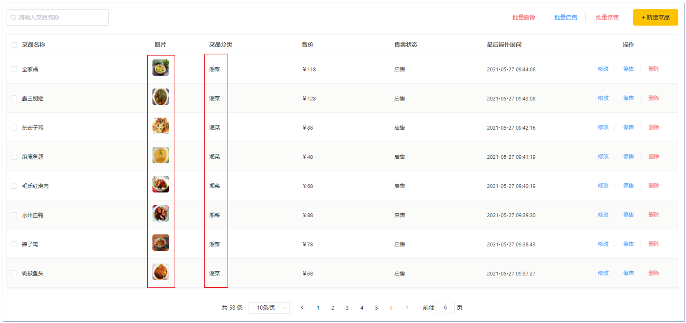
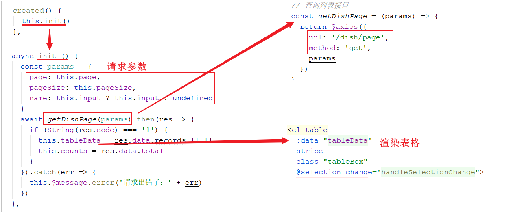
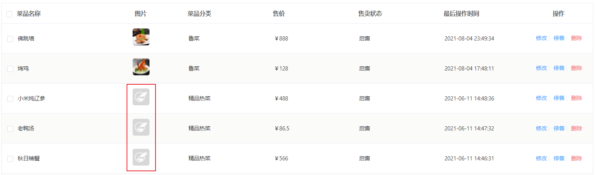

# 菜品分页查询

## 需求分析

系统中的菜品数据很多的时候，如果在一个页面中全部展示出来会显得比较乱，不便于查看，所以一般的系统中都会以分页的方式来展示列表数据。



在菜品列表展示时，除了菜品的基本信息(名称、售价、售卖状态、更新时间)外，还有两个字段略微特殊，第一个是图片字段 ，我们从数据库查询出来的仅仅是图片的名字，图片要想在表格中回显展示出来，就需要下载这个图片。第二个是菜品分类，这里展示的是分类名称，而不是分类ID，此时我们就需要根据菜品的分类ID，去分类表中查询分类信息，然后在页面展示。

## 前端页面分析

在开发代码之前，需要梳理一下菜品分页查询时前端页面和服务端的交互过程：

1. 访问页面(backend/page/food/list.html)时，发送ajax请求，将分页查询参数(page、pageSize、name)提交到服务端，获取分页数据

2. 页面发送请求，请求服务端进行图片下载，用于页面图片展示





开发菜品信息分页查询功能，其实就是在服务端编写代码去处理前端页面发送的这2次请求即可，而前端发起的请求中， 图片文件下载回显的代码，我们已经实现了。

所以，我们只需要开发分页查询的功能即可，分页查询具体的请求信息如下：

| 请求     | 说明                         |
| -------- | ---------------------------- |
| 请求方式 | GET                          |
| 请求路径 | /dish/page                   |
| 请求参数 | ?page=1&pageSize=10&name=xxx |

## 代码实现

### 分析

上述我们已经分析了分页查询的请求信息，那么接下来，我们就需要在 DishController中开发方法，来完成菜品的条件分页查询，在分页查询时还需要给页面返回分类的名称，而分类的名称前端在接收的时候是通过 categoryName 属性获取的，那么对应的服务端也应该封装到 categoryName 属性中。

```html
<el-table-column prop="categoryName" label="菜品分类"></el-table-column>
```


而在我们的实体类 Dish 中，仅仅包含 categoryId， 不包含 categoryName，那么我们应该如何封装查询的数据呢？ 其实，这里我们可以返回DishDto对象，在该对象中我们可以拓展一个属性 categoryName，来封装菜品分类名称。

```java
@Data
public class DishDto extends Dish {
    private List<DishFlavor> flavors = new ArrayList<>();
    private String categoryName; //菜品分类名称
    private Integer copies;
}
```


具体逻辑为： 

1. 构造分页条件对象

2. 构建查询及排序条件

3. 执行分页条件查询

4. 遍历分页查询列表数据，根据分类ID查询分类信息，从而获取该菜品的分类名称

5. 封装数据并返回


### 实现

分析了具体的实现思路之后，接下来就来完成具体的代码实现。

```java

    @Autowired
    private CategoryService categoryService;


/**
 * 菜品信息分页查询
 * @param page
 * @param pageSize
 * @param name
 * @return
 */
@GetMapping("/page")
public R<Page> page(int page,int pageSize,String name){
    //构造分页构造器对象
    Page<Dish> pageInfo = new Page<>(page,pageSize);
    Page<DishDto> dishDtoPage = new Page<>();

    //条件构造器
    LambdaQueryWrapper<Dish> queryWrapper = new LambdaQueryWrapper<>();
    //添加过滤条件
    queryWrapper.like(name != null,Dish::getName,name);
    //添加排序条件
    queryWrapper.orderByDesc(Dish::getUpdateTime);

    //执行分页查询
    dishService.page(pageInfo,queryWrapper);

    //对象拷贝
    BeanUtils.copyProperties(pageInfo,dishDtoPage,"records");
    List<Dish> records = pageInfo.getRecords();
    List<DishDto> list = records.stream().map((item) -> {
        
        DishDto dishDto = new DishDto();
        BeanUtils.copyProperties(item,dishDto);
        Long categoryId = item.getCategoryId();//分类id
        //根据id查询分类对象
        Category category = categoryService.getById(categoryId);
        
        if(category != null){
            String categoryName = category.getName();
            dishDto.setCategoryName(categoryName);
        }
        return dishDto;
    }).collect(Collectors.toList());
    dishDtoPage.setRecords(list);
    
    return R.success(dishDtoPage);
}
```

数据库查询菜品信息时，获取到的分页查询结果 Page 的泛型为 Dish，而我们最终需要给前端页面返回的类型为 DishDto，所以这个时候就要进行转换，基本属性我们可以直接通过属性拷贝的形式对Page中的属性进行复制，而对于结果列表 records属性，我们是需要进行特殊处理的(需要封装菜品分类名称);

- `BeanUtils.copyProperties(pageInfo,dishDtoPage,"records")` 这里 records属性需要进行特殊处理 , 所以就使用字符串形式忽略


## 功能测试

代码编写完毕之后，我们重新启动服务，访问项目，可以通过debug端点的形式跟踪，整个分页查询过程中，数据的转换和封装。 

在测试的过程中，我们发现有一些菜品图片并没有展示出来，如下： 



这是因为我们在导入sql脚本时，导入了一部分菜品的数据，而菜品的图片在我们的磁盘目录中并不存在，所以才会出现图片展示不出来的情况，而我们后续自己添加的菜品信息是没有问题的。


