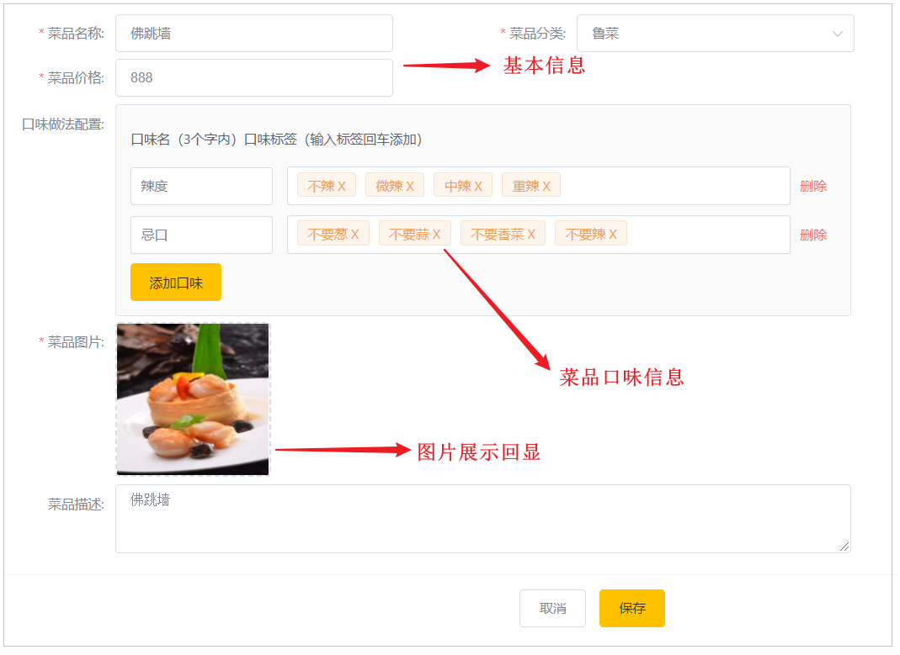
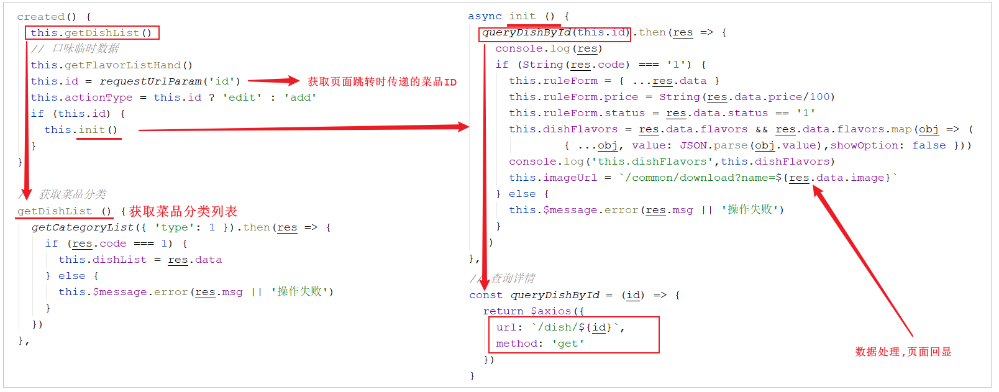

# 菜品修改

## 需求分析

在菜品管理列表页面点击修改按钮，跳转到修改菜品页面，在修改页面回显菜品相关信息并进行修改，最后点击确定按钮完成修改操作。



## 前端页面分析

在开发代码之前，需要梳理一下修改菜品时前端页面（add.html）和服务端的交互过程：

1.点击菜品列表的中的修改按钮，携带菜品id跳转至add.html


2.进入add.html，页面发送ajax请求，请求服务端获取分类数据，用于菜品分类下拉框中数据展示(已实现:[菜品分类查询](../../../../JAVA/3.Web框架/项目%20&%20实战案例/瑞吉外卖/16.后台系统功能之菜品新增.md#菜品分类查询))

3.add.html获取id, 发送ajax请求，请求服务端，根据id查询当前菜品信息，用于菜品信息回显



4.页面发送请求，请求服务端进行图片下载，用于页图片回显(已实现:[文件下载](../../../../JAVA/3.Web框架/项目%20&%20实战案例/瑞吉外卖/15.文件上传下载.md#服务端代码))


5.点击保存按钮，页面发送ajax请求，将修改后的菜品相关数据以json形式提交到服务端


经过上述的分析，我们发现，菜品分类下拉框的展示、图片的下载回显功能我们都已经实现了。我们只需要在这里实现两个功能即可，分别是： 

- **根据ID查询菜品及菜品口味信息**

具体请求信息如下： 

| 请求     | 说明  |
| -------- | ---------- |
| 请求方式 | GET     |
| 请求路径 | `/dish/{id}` |


- **修改菜品及菜品口味信息**

具体请求信息如下：

| 请求     | 说明         |
| -------- | ------------ |
| 请求方式 | PUT          |
| 请求路径 | /dish        |
| 请求参数 | json格式数据 |

具体的json格式数据，我们可以通过浏览器抓取： 

```json
{
    "id":"1422783914845487106",
    "name":"佛跳墙",
    "categoryId":"1397844357980663809",
    "price":88800,
    "code":"",
    "image":"da9e1c70-fc32-4781-9510-a1c4ccd2ff59.jpg",
    "description":"佛跳墙",
    "status":1,
    "sort":0,
    "createTime":"2021-08-04 12:58:14",
    "createUser":"1412578435737350122",
    "updateUser":"1412578435737350122",
    "flavors":[
        {
            "id":"1422783914883235842",
            "dishId":"1422783914845487106",
            "name":"辣度",
            "value":"[\"不辣\",\"微辣\",\"中辣\",\"重辣\"]",
            "createTime":"2021-08-04 12:58:14",
            "updateTime":"2021-08-04 12:58:14",
            "createUser":"1412578435737350122",
            "updateUser":"1412578435737350122",
            "isDeleted":0,
            "showOption":false
        },
        {
            "id":"1422783914895818754",
            "dishId":"1422783914845487106",
            "name":"忌口",
            "value":"[\"不要葱\",\"不要蒜\",\"不要香菜\",\"不要辣\"]",
            "createTime":"2021-08-04 12:58:14",
            "updateTime":"2021-08-04 12:58:14",
            "createUser":"1412578435737350122",
            "updateUser":"1412578435737350122",
            "isDeleted":0,
            "showOption":false
        }
    ]
}
```


## 功能实现

### 根据ID查询菜品信息

#### 代码实现

页面发送ajax请求，请求服务端，根据id查询当前菜品信息和对应的口味信息，用于修改页面中菜品信息回显。


1. 在DishService接口中扩展getByIdWithFlavor方法

```java
//根据id查询菜品信息和对应的口味信息
public DishDto getByIdWithFlavor(Long id);
```


2. 在DishService实现类中实现此方法

	1. 根据ID查询菜品的基本信息 

	1. 根据菜品的ID查询菜品口味列表数据

	1. 组装数据并返回


```java
/**
* 根据id查询菜品信息和对应的口味信息
* @param id
* @return
*/
public DishDto getByIdWithFlavor(Long id) {
    //查询菜品基本信息，从dish表查询
    Dish dish = this.getById(id);
	
    DishDto dishDto = new DishDto();
    BeanUtils.copyProperties(dish,dishDto);
	
    //查询当前菜品对应的口味信息，从dish_flavor表查询
    LambdaQueryWrapper<DishFlavor> queryWrapper = new LambdaQueryWrapper<>();
    queryWrapper.eq(DishFlavor::getDishId,dish.getId());
    List<DishFlavor> flavors = dishFlavorService.list(queryWrapper);
    dishDto.setFlavors(flavors);
	
    return dishDto;
}
```

3. 在DishController中创建get方法

```java
/**
* 根据id查询菜品信息和对应的口味信息
* @param id
* @return
*/
@GetMapping("/{id}")
public R<DishDto> get(@PathVariable Long id){
    DishDto dishDto = dishService.getByIdWithFlavor(id);
    return R.success(dishDto);
}

```

@PathVariable : 该注解可以用来提取url路径中传递的请求参数。


#### 功能测试

编写完代码后，重启服务进行测试，点击列表的修改按钮，查询数据回显情况。


### 修改菜品信息

#### 代码实现

点击保存按钮，页面发送ajax请求，将修改后的菜品相关数据以json形式提交到服务端。在修改菜品信息时需要注意，除了要更新dish菜品表，还需要更新dish_flavor菜品口味表。

1. 在DishService接口中扩展方法updateWithFlavor

```java
//更新菜品信息，同时更新对应的口味信息
public void updateWithFlavor(DishDto dishDto);
```


2. 在DishServiceImpl中实现方法updateWithFlavor

在该方法中，我们既需要更新dish菜品基本信息表，还需要更新dish_flavor菜品口味表。而页面再操作时，关于菜品的口味，有修改，有新增，也有可能删除，我们应该如何更新菜品口味信息呢，其实，无论菜品口味信息如何变化，我们只需要保持一个原则： 先删除，后添加。

```java
@Override
@Transactional
public void updateWithFlavor(DishDto dishDto) {
    //更新dish表基本信息
    this.updateById(dishDto);

    //清理当前菜品对应口味数据---dish_flavor表的delete操作
    LambdaQueryWrapper<DishFlavor> queryWrapper = new LambdaQueryWrapper();
    queryWrapper.eq(DishFlavor::getDishId,dishDto.getId());

    dishFlavorService.remove(queryWrapper);

    //添加当前提交过来的口味数据---dish_flavor表的insert操作
    List<DishFlavor> flavors = dishDto.getFlavors();

    flavors = flavors.stream().map((item) -> {
        item.setDishId(dishDto.getId());
        return item;
    }).collect(Collectors.toList());

    dishFlavorService.saveBatch(flavors);
}
```


3. 在DishController中创建update方法

```java
/**
* 修改菜品
* @param dishDto
* @return
*/
@PutMapping
public R<String> update(@RequestBody DishDto dishDto){
    log.info(dishDto.toString());
    dishService.updateWithFlavor(dishDto);
    return R.success("修改菜品成功");
}
```


#### 功能测试

代码编写完成之后，重启服务，然后按照前面分析的操作流程进行测试，查看数据是否正常修改即可。


