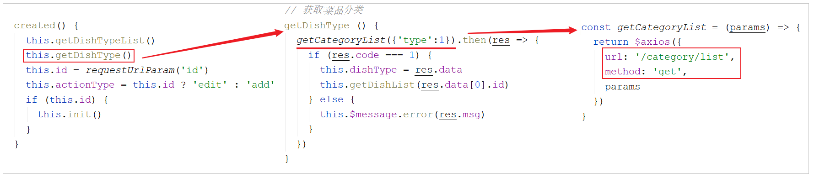
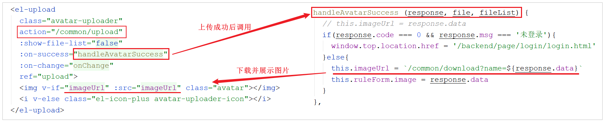
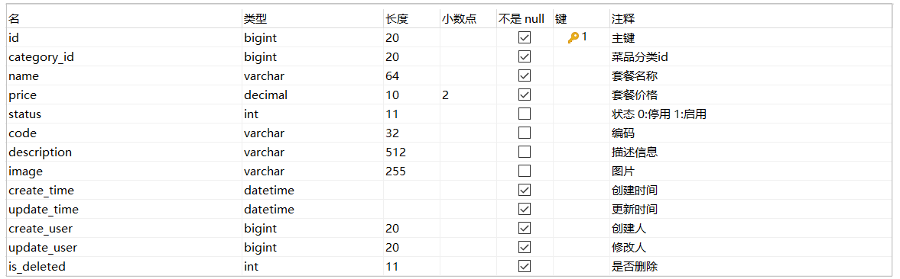
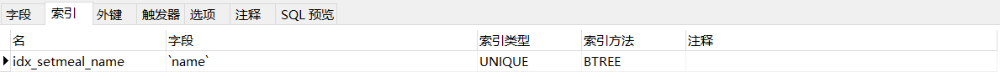

# 新增套餐

## 需求分析

套餐就是菜品的集合。

后台系统中可以管理套餐信息，通过新增套餐功能来添加一个新的套餐，在添加套餐时需要选择当前套餐所属的套餐分类和包含的菜品，并且需要上传套餐对应的图片，在移动端会按照套餐分类来展示对应的套餐。


## 前端页面分析

服务端的基础准备工作我们准备完毕之后，在进行代码开发之前，需要梳理一下新增套餐时前端页面和服务端的交互过程：

1.点击新建套餐按钮，访问页面(backend/page/combo/add.html)，页面加载发送ajax请求，请求服务端获取**套餐分类**数据并展示到下拉框中(已实现:[套餐分类查询:type=2](../../../../JAVA/3.Web框架/项目%20&%20实战案例/瑞吉外卖/16.后台系统功能之菜品新增.md#菜品分类查询))


获取套餐分类列表的功能我们不用开发，之前已经开发完成了，之前查询时type传递的是1，查询菜品分类; 本次查询时，传递的type为2，查询套餐分类列表。


2.访问页面(backend/page/combo/add.html)，页面加载时发送ajax请求，请求服务端获取**菜品分类**数据并展示到添加菜品窗口中(已实现:[菜品分类查询:type=1](../../../../JAVA/3.Web框架/项目%20&%20实战案例/瑞吉外卖/16.后台系统功能之菜品新增.md#菜品分类查询))



本次查询分类列表，传递的type为1，表示需要查询的是菜品的分类。查询菜品分类的目的，是添加套餐关联的菜品时，我们需要根据菜品分类，来过滤查询菜品信息。查询菜品分类列表的代码已经实现， 具体展示效果如下： 


3.当点击添加菜品窗口左侧菜单的某一个分类, 页面发送ajax请求，请求服务端，根据菜品分类查询对应的**菜品**数据并展示到添加菜品窗口中


4.页面发送请求进行**图片上传**，请求服务端将图片保存到服务器(已实现:[文件上传下载](../../../../JAVA/3.Web框架/项目%20&%20实战案例/瑞吉外卖/15.文件上传下载.md))

5.页面发送请求进行**图片下载**，将上传的图片进行回显(已实现:[文件上传下载](../../../../JAVA/3.Web框架/项目%20&%20实战案例/瑞吉外卖/15.文件上传下载.md))



6.点击保存按钮，发送ajax请求，将**套餐**相关数据以json形式提交到服务端


经过上述的页面解析及流程分析，我们发送这里需要发送的请求有6个，分别是 ：

1. 根据传递的参数,查询套餐分类列表

1. 根据传递的参数,查询菜品分类列表

1. 图片上传

1. 图片下载展示

1. 根据菜品分类ID,查询菜品列表

1. 保存套餐信息


而对于以上的前4个功能我们都已经实现, 所以我们接下来需要开发的功能主要是最后两项, 具体的请求信息如下:

- **根据分类ID查询菜品列表**

| 请求     | 说明                            |
| -------- | ------------------------------- |
| 请求方式 | GET                             |
| 请求路径 | /dish/list                      |
| 请求参数 | ?categoryId=1397844263642378242 |


- **保存套餐信息**

| 请求     | 说明         |
| -------- | ------------ |
| 请求方式 | POST         |
| 请求路径 | /setmeal     |
| 请求参数 | json格式数据 |

传递的json格式数据如下: 

```json
{
    "name":"营养超值工作餐",
    "categoryId":"1399923597874081794",
    "price":3800,
    "code":"",
    "image":"9cd7a80a-da54-4f46-bf33-af3576514cec.jpg",
    "description":"营养超值工作餐",
    "dishList":[],
    "status":1,
    "idType":"1399923597874081794",
    "setmealDishes":[
    	{"copies":2,"dishId":"1423329009705463809","name":"米饭","price":200},
    	{"copies":1,"dishId":"1423328152549109762","name":"可乐","price":500},
    	{"copies":1,"dishId":"1397853890262118402","name":"鱼香肉丝","price":3800}
    ]
}
```


## 数据模型

新增套餐，其实就是将新增页面录入的套餐信息插入到setmeal表，还需要向setmeal_dish表插入套餐和菜品关联数据。所以在新增套餐时，涉及到两个表：

| 表           | 说明           | 备注                                               |
| ------------ | -------------- | -------------------------------------------------- |
| setmeal      | 套餐表         | 存储套餐的基本信息                                 |
| setmeal_dish | 套餐菜品关系表 | 存储套餐关联的菜品的信息(一个套餐可以关联多个菜品) |


### 套餐表setmeal



在该表中，套餐名称name字段是不允许重复的，在建表时，已经创建了唯一索引。



### 套餐菜品关系表setmeal_dish


在该表中，菜品的名称name,菜品的原价price 实际上都是冗余字段,因为我们在这张表中存储了菜品的ID(dish_id),根据该ID我们就可以查询出name,price的数据信息,而这里我们又存储了name,price,这样的话,我们在后续的查询展示操作中,就不需要再去查询数据库获取菜品名称和原价了,这样可以简化我们的操作。

## 准备工作

在开发业务功能前，先将需要用到的类和接口基本结构创建好，在做这一块儿的准备工作时，我们无需准备Setmeal的相关实体类、Mapper接口、Service接口及实现，因为之前在做分类管理的时候，我们已经引入了Setmeal的相关基础代码。 

接下来，我们就来完成以下的几步准备工作： 

### 实体类 SetmealDish

所属包： cn.suliu.reggie.entity

```java

/**
 * 套餐菜品关系
 */
@Data
public class SetmealDish implements Serializable {
    private static final long serialVersionUID = 1L;

    private Long id;

    //套餐id
    private Long setmealId;

    //菜品id
    private Long dishId;

    //菜品名称 （冗余字段）
    private String name;
    
    //菜品原价
    private BigDecimal price;
    
    //份数
    private Integer copies;

    //排序
    private Integer sort;

    @TableField(fill = FieldFill.INSERT)
    private LocalDateTime createTime;

    @TableField(fill = FieldFill.INSERT_UPDATE)
    private LocalDateTime updateTime;

    @TableField(fill = FieldFill.INSERT)
    private Long createUser;

    @TableField(fill = FieldFill.INSERT_UPDATE)
    private Long updateUser;

    //是否删除
    private Integer isDeleted;
}
```


### SetmealDto

该数据传输对象DTO,主要用于封装页面在新增套餐时传递过来的json格式的数据,其中包含套餐的基本信息,还包含套餐关联的菜品集合。直接从课程资料中导入即可。

所属包： cn.suliu.reggie.dto

```java

@Data
public class SetmealDto extends Setmeal {

    private List<SetmealDish> setmealDishes;//套餐关联的菜品集合
	
    private String categoryName;//分类名称
}
```

### SetmealDishMapper

Mapper接口 SetmealDishMapper

所属包: cn.suliu.reggie.mapper

```java
@Mapper
public interface SetmealDishMapper extends BaseMapper<SetmealDish> {
}
```

### SetmealDishService

业务层接口 SetmealDishService

所属包： cn.suliu.reggie.service

```java

public interface SetmealDishService extends IService<SetmealDish> {
}
```

### SetmealDishServiceImpl

业务层实现类 SetmealDishServiceImpl

所属包： cn.suliu.reggie.service.impl

```java

@Service
@Slf4j
public class SetmealDishServiceImpl extends ServiceImpl<SetmealDishMapper,SetmealDish> implements SetmealDishService {
}
```

### SetmealController

控制层 SetmealController

套餐管理的相关业务，我们都统一在 SetmealController 中进行统一处理操作。

所属包: cn.suliu.reggie.service.impl

```java

/**
 * 套餐管理
 */
@RestController
@RequestMapping("/setmeal")
@Slf4j
public class SetmealController {
    @Autowired
    private SetmealService setmealService;
    @Autowired
    private SetmealDishService setmealDishService;
}    
```


## 代码开发


### 根据分类查询菜品

#### 功能实现

在当前的需求中，我们只需要根据页面传递的菜品分类的ID(categoryId)来查询菜品列表即可，我们可以直接定义一个DishController的方法，声明一个Long类型的categoryId，这样做是没问题的。但是考虑到该方法的拓展性，我们在这里定义方法时，通过Dish这个实体来接收参数。

在**DishController**中定义方法list，接收Dish类型的参数：

在查询时，需要根据菜品分类categoryId进行查询，并且还要限定菜品的状态为起售状态(status为1)，然后对查询的结果进行排序。

```
/**
* 根据条件查询对应的菜品数据
* @param dish
* @return
*/
@GetMapping("/list")
public R<List<Dish>> list(Dish dish){
    //构造查询条件
    LambdaQueryWrapper<Dish> queryWrapper = new LambdaQueryWrapper<>();
    queryWrapper.eq(dish.getCategoryId() != null ,Dish::getCategoryId,dish.getCategoryId());
    //添加条件，查询状态为1（起售状态）的菜品
    queryWrapper.eq(Dish::getStatus,1);
    //添加排序条件
    queryWrapper.orderByAsc(Dish::getSort).orderByDesc(Dish::getUpdateTime);
	
    List<Dish> list = dishService.list(queryWrapper);
	
    return R.success(list);
}
```

- 前端传过来的参数是**CategoryId** , 我们可以在 `list(Category category)` 用Category接收 , 但是为了方法的通用性 , 这里可以采用**Dish**接收 , 此时不仅可以接收CategoryId , 还可以接收菜品名称name、菜品价格price等参数
- `queryWrapper.orderByAsc(Dish::getSort).orderByDesc(Dish::getUpdateTime)` 这里是添加排序条件 , 首先是按Sort属性升序排序 , 然后是按更新时间降序排序

#### 功能测试

代码编写完毕，我们重新启动服务器，进行测试，可以通过debug断点跟踪的形式查看页面传递的参数封装情况，及响应给页面的数据信息。


### 保存套餐

#### 功能实现

在进行套餐信息保存时，前端提交的数据，不仅包含套餐的基本信息，还包含套餐关联的菜品列表数据 setmealDishes。所以这个时候我们使用Setmeal就不能完成参数的封装了，我们需要在Setmeal的基本属性的基础上，再扩充一个属性 setmealDishes 来接收页面传递的套餐关联的菜品列表，而我们在准备工作中，导入进来的SetmealDto能够满足这个需求。


1. **SetmealController**中定义方法save，新增套餐

在该Controller的方法中,我们不仅需要保存套餐的基本信息，还需要保存套餐关联的菜品数据，所以我们需要再该方法中调用业务层方法,完成两块数据的保存。

页面传递的数据是json格式，需要在方法形参前面加上@RequestBody注解, 完成参数封装。

```java
@PostMapping
public R<String> save(@RequestBody SetmealDto setmealDto){
    log.info("套餐信息：{}",setmealDto);

    setmealService.saveWithDish(setmealDto);

    return R.success("新增套餐成功");
}
```


2. **SetmealService**中定义方法saveWithDish

```java
/**
 * 新增套餐，同时需要保存套餐和菜品的关联关系
 * @param setmealDto
 */
public void saveWithDish(SetmealDto setmealDto);
```


3. **SetmealServiceImpl**实现方法saveWithDish


	1. 保存套餐基本信息
	
	1. 获取套餐关联的菜品集合，并为集合中的每一个元素赋值套餐ID(setmealId)
	
	1. 批量保存套餐关联的菜品集合

代码实现: 

```java

    @Autowired
    private SetmealDishService setmealDishService;

/**
 * 新增套餐，同时需要保存套餐和菜品的关联关系
 * @param setmealDto
 */
@Transactional
public void saveWithDish(SetmealDto setmealDto) {
    //保存套餐的基本信息，操作setmeal，执行insert操作
    this.save(setmealDto);

    List<SetmealDish> setmealDishes = setmealDto.getSetmealDishes();
    setmealDishes.stream().map((item) -> {
        item.setSetmealId(setmealDto.getId());
        return item;
    }).collect(Collectors.toList());

    //保存套餐和菜品的关联信息，操作setmeal_dish,执行insert操作
    setmealDishService.saveBatch(setmealDishes);
}
```


#### 功能测试

代码编写完毕，我们重新启动服务器，进行测试，可以通过debug断点跟踪的形式查看页面传递的参数封装情况，及套餐相关数据的保存情况。

录入表单数据: 


debug跟踪数据封装:


跟踪数据库保存的数据:


