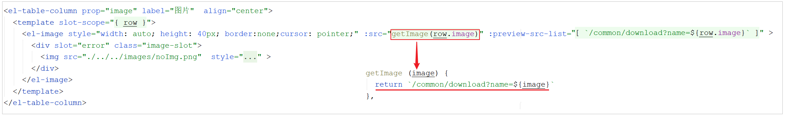

# 套餐分页查询

## 需求分析

系统中的套餐数据很多的时候，如果在一个页面中全部展示出来会显得比较乱，不便于查看，所以一般的系统中都会以分页的方式来展示列表数据。


在进行套餐数据的分页查询时，除了传递分页参数以外，还可以传递一个可选的条件(套餐名称)。查询返回的字段中，包含套餐的基本信息之外，还有一个套餐的分类名称，在查询时，需要关联查询这个字段。


## 前端页面分析

在开发代码之前，需要梳理一下套餐分页查询时前端页面和服务端的交互过程：

1). 访问页面(backend/page/combo/list.html)，页面加载时，会自动发送ajax请求，将分页查询参数(page、pageSize、name)提交到服务端，获取分页数据


2). 在列表渲染展示时，页面发送请求，请求服务端进行图片下载，用于页面图片展示



而对于以上的流程中涉及到2个功能,文件下载功能我们已经实现,本小节我们主要实现列表分页查询功能, 具体的请求信息如下:

| 请求     | 说明                         |
| -------- | ---------------------------- |
| 请求方式 | GET                          |
| 请求路径 | /setmeal/page                |
| 请求参数 | ?page=1&pageSize=10&name=xxx |


## 代码开发

### 基本信息查询

上述我们已经分析列表分页查询功能的请求信息，接下来我们就在SetmealController中创建套餐分页查询方法。

该方法的逻辑如下： 

1. 构建分页条件对象

2. 构建查询条件对象，如果传递了套餐名称，根据套餐名称模糊查询， 并对结果按修改时间降序排序

3. 执行分页查询

4. 组装数据并返回

代码实现 : 

```java
/**
  * 套餐分页查询
  * @param page
  * @param pageSize
  * @param name
  * @return
  */
@GetMapping("/page")
public R<Page> page(int page,int pageSize,String name){
    //分页构造器对象
    Page<Setmeal> pageInfo = new Page<>(page,pageSize);
	
    LambdaQueryWrapper<Setmeal> queryWrapper = new LambdaQueryWrapper<>();
    //添加查询条件，根据name进行like模糊查询
    queryWrapper.like(name != null,Setmeal::getName,name);
    //添加排序条件，根据更新时间降序排列
    queryWrapper.orderByDesc(Setmeal::getUpdateTime);

    setmealService.page(pageInfo,queryWrapper);
    return R.success(pageInfo);
}
```


## 问题分析

基本分页查询代码编写完毕后，重启服务，测试列表查询，我们发现, 列表页面的数据可以展示出来, 但是套餐分类名称没有展示出来。


这是因为在服务端仅返回分类ID(categoryId), 而页面展示需要的是categoryName属性。 


### 功能完善

在查询套餐信息时, 只包含套餐的基本信息, 并不包含套餐的分类名称, 所以在这里查询到套餐的基本信息后, 还需要根据分类ID(categoryId), 查询套餐分类名称(categoryName)，并最终将套餐的基本信息及分类名称信息封装到SetmealDto(在[setmealdto](../../../../JAVA/3.Web框架/项目%20&%20实战案例/瑞吉外卖/19.后台系统功能之新增套餐.md#setmealdto)已经导入)中。

```java
@Data
public class SetmealDto extends Setmeal {
    private List<SetmealDish> setmealDishes; //套餐关联菜品列表
    private String categoryName;//套餐分类名称
}
```


完善后代码: 

```java
/**
* 套餐分页查询
* @param page
* @param pageSize
* @param name
* @return
*/
@GetMapping("/page")
public R<Page> page(int page,int pageSize,String name){
    //分页构造器对象
    Page<Setmeal> pageInfo = new Page<>(page,pageSize);
    Page<SetmealDto> dtoPage = new Page<>();

    LambdaQueryWrapper<Setmeal> queryWrapper = new LambdaQueryWrapper<>();
    //添加查询条件，根据name进行like模糊查询
    queryWrapper.like(name != null,Setmeal::getName,name);
    //添加排序条件，根据更新时间降序排列
    queryWrapper.orderByDesc(Setmeal::getUpdateTime);

    setmealService.page(pageInfo,queryWrapper);

    //对象拷贝
    BeanUtils.copyProperties(pageInfo,dtoPage,"records");
    List<Setmeal> records = pageInfo.getRecords();

    List<SetmealDto> list = records.stream().map((item) -> {
        SetmealDto setmealDto = new SetmealDto();
        //对象拷贝
        BeanUtils.copyProperties(item,setmealDto);
        //分类id
        Long categoryId = item.getCategoryId();
        //根据分类id查询分类对象
        Category category = categoryService.getById(categoryId);
        if(category != null){
            //分类名称
            String categoryName = category.getName();
            setmealDto.setCategoryName(categoryName);
        }
        return setmealDto;
    }).collect(Collectors.toList());

    dtoPage.setRecords(list);
    return R.success(dtoPage);
}
```

- 这里代码可以参考[菜品分页查询代码实现](../../../../JAVA/3.Web框架/项目%20&%20实战案例/瑞吉外卖/17.后台系统功能之菜品分页查询.md#代码实现)
- `BeanUtils.copyProperties(pageInfo,dtoPage,"records")` 这里 records属性需要进行特殊处理 , 所以就使用字符串形式忽略


## 功能测试

代码完善后，重启服务，测试列表查询，我们发现, 抓取浏览器的请求响应数据，我们可以获取到套餐分类名称categoryName，也可以在列表页面展示出来 。


