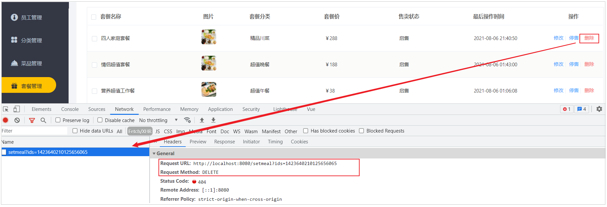
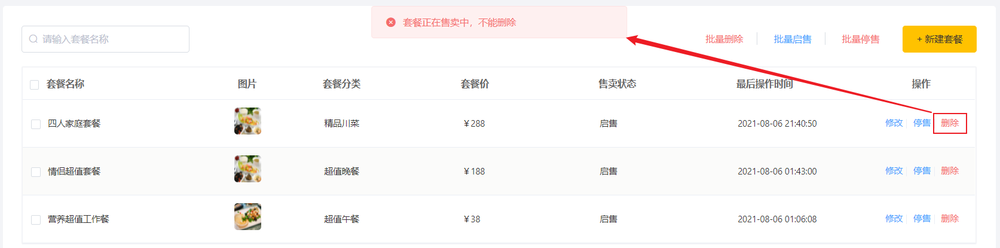

# 删除套餐

## 需求分析

在套餐管理列表页面,点击删除按钮，可以删除对应的套餐信息。也可以通过复选框选择多个套餐，点击批量删除按钮一次删除多个套餐。


注意，对于状态为售卖中的套餐不能删除，需要先停售，然后才能删除。

## 前端页面分析

在开发代码之前，需要梳理一下删除套餐时前端页面和服务端的交互过程：

1.点击删除, 删除单个套餐时，页面发送ajax请求，根据套餐id删除对应套餐



2.删除多个套餐时，页面发送ajax请求，根据提交的多个套餐id删除对应套餐


开发删除套餐功能，其实就是在服务端编写代码去处理前端页面发送的这2次请求即可，一次请求为根据ID删除，一次请求为根据ID批量删除。

观察删除单个套餐和批量删除套餐的请求信息可以发现，两种请求的**地址**和**请求方式**都是相同的，不同的则是传递的id个数，所以在服务端可以提供一个方法来统一处理。

具体的请求信息如下： 

| 请求     | 说明                                         |
| -------- | -------------------------------------------- |
| 请求方式 | DELETE                                       |
| 请求路径 | /setmeal                                     |
| 请求参数 | ?ids=1423640210125656065,1423338765002256385 |


## 代码开发

删除套餐的流程及请求信息，我们分析完毕之后，就来完成服务端的逻辑开发。在服务端的逻辑中, 删除套餐时, 我们不仅要删除套餐, 还要删除套餐与菜品的关联关系。

### delete方法

在**SetmealController**中创建delete方法

我们可以先测试在delete方法中接收页面提交的参数，具体逻辑后续再完善：

```java
/**
 * 删除套餐
 * @param ids
 * @return
 */
@DeleteMapping
public R<String> delete(@RequestParam List<Long> ids){
    log.info("ids:{}",ids);
    return R.success("套餐数据删除成功");
}
```

编写完代码，我们重启服务之后，访问套餐列表页面，勾选复选框，然后点击"批量删除",我们可以看到服务端可以接收到集合参数ids，并且在控制台也可以输出对应的数据 。


### removeWithDish方法

**SetmealService**接口定义方法removeWithDish

```java
/**
 * 删除套餐，同时需要删除套餐和菜品的关联数据
 * @param ids
 */
public void removeWithDish(List<Long> ids);
```


**SetmealServiceImpl**中实现方法removeWithDish

该业务层方法具体的逻辑为: 

1. 查询该批次套餐中是否存在售卖中的套餐, 如果存在, 不允许删除

1. 删除套餐数据

1. 删除套餐关联的菜品数据

代码实现为:

```java
/**
* 删除套餐，同时需要删除套餐和菜品的关联数据
* @param ids
*/
@Transactional
public void removeWithDish(List<Long> ids) {
    //select count(*) from setmeal where id in (1,2,3) and status = 1
    //查询套餐状态，确定是否可用删除
    LambdaQueryWrapper<Setmeal> queryWrapper = new LambdaQueryWrapper();
    queryWrapper.in(Setmeal::getId,ids);
    queryWrapper.eq(Setmeal::getStatus,1);

    int count = this.count(queryWrapper);
    if(count > 0){
   	 	//如果不能删除，抛出一个业务异常
    	throw new CustomException("套餐正在售卖中，不能删除");
    }

    //如果可以删除，先删除套餐表中的数据---setmeal
    this.removeByIds(ids);

    //delete from setmeal_dish where setmeal_id in (1,2,3)
    LambdaQueryWrapper<SetmealDish> lambdaQueryWrapper = new LambdaQueryWrapper<>();
    lambdaQueryWrapper.in(SetmealDish::getSetmealId,ids);
    //删除关系表中的数据----setmeal_dish
    setmealDishService.remove(lambdaQueryWrapper);
}
```


由于当前的业务方法中存在多次数据库操作，为了保证事务的完整性，需要在方法上加注解 @Transactional 来控制事务。

### 完善SetmealController


```java
/**
 * 删除套餐
 * @param ids
 * @return
 */
@DeleteMapping
public R<String> delete(@RequestParam List<Long> ids){
    log.info("ids:{}",ids);
    setmealService.removeWithDish(ids);
    return R.success("套餐数据删除成功");
}
```


## 功能测试

代码完善后，重启服务，测试套餐的删除功能，主要测试以下几种情况。

1.删除正在启用的套餐



2.执行批量操作, 删除两条记录, 一个启售的, 一个停售的

由于当前我们并未实现启售/停售功能，所以我们需要手动修改数据库表结构的status状态，将其中的一条记录status修改为0。


3.删除已经停售的套餐信息，执行删除之后， 检查数据库表结构 setmeal ， setmeal_dish表中的数据


