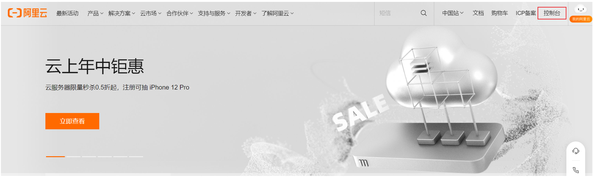
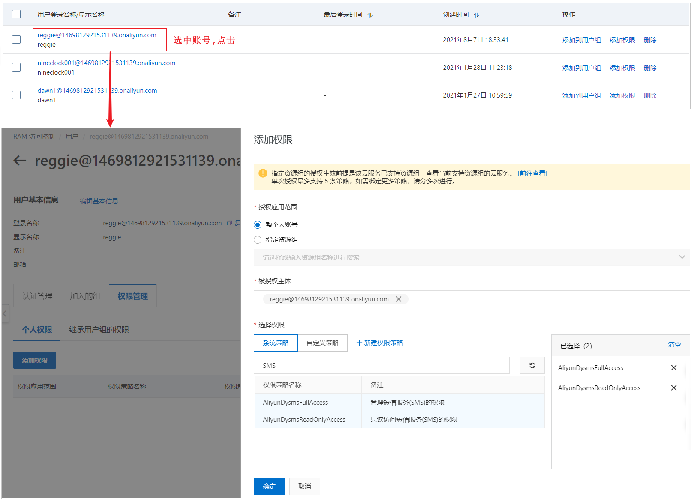
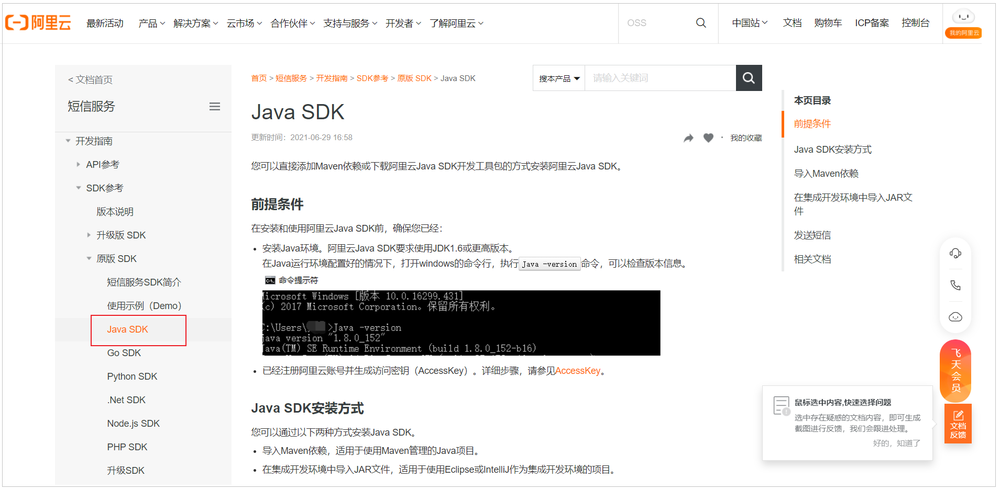
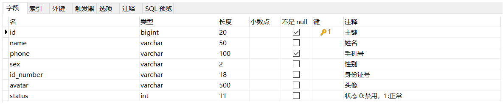
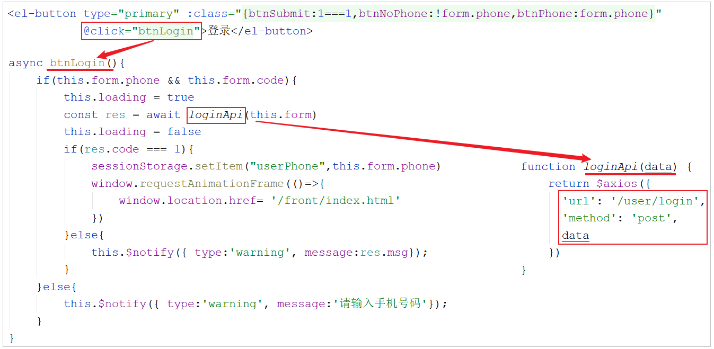

# 短信验证码登录

在我们接下来要实现的移动端的业务开发中，第一块儿我们需要开发的功能就是移动端的登录功能，而移动端的登录功能，比较流行的方式就是**基于短信验证码进行登录**


那么这里涉及到了短信发送的知识，所以我们首先要了解在项目开发中，我们如何发送短信。

## 短信服务

在项目中，如果我们要实现短信发送功能，我们无需自己实现，也无需和运营商直接对接，只需要调用第三方提供的短信服务即可。

目前市面上有很多第三方提供的短信服务，这些第三方短信服务会和各个运营商（移动、联通、电信）对接，我们只需要注册成为会员，并且按照提供的开发文档进行调用就可以发送短信。需要说明的是，这些短信服务一般都是收费服务。

常用短信服务：

- 阿里云
    
- 华为云
    
- 腾讯云
    
- 京东
    
- 梦网
    
- 乐信
    

本项目在选择短信服务的第三方服务提供商时，选择的是阿里云短信服务。

## 阿里云短信服务

**阿里云短信服务SMS**（**Short Message Service**）是广大企业客户快速触达手机用户所优选使用的通信能力。调用API或用群发助手，即可发送验证码、通知类和营销类短信；国内验证短信秒级触达，到达率最高可达99%；国际/港澳台短信覆盖200多个国家和地区，安全稳定，广受出海企业选用。

应用场景：

| 场景  | 案例  |
| --- | --- |
| **验证码** | APP、网站注册账号，向手机下发验证码； 登录账户、异地登录时的安全提醒； 找回密码时的安全验证； 支付认证、身份校验、手机绑定等。 |
| **短信通知** | 向注册用户下发系统相关信息，包括： 升级或维护、服务开通、价格调整、 订单确认、物流动态、消费确认、 支付通知等普通通知短信。 |
| **推广短信** | 向注册用户和潜在客户发送通知和推广信息，包括促销活动通知、业务推广等商品与活动的推广信息。增加企业产品曝光率、提高产品的知名度。 |


可以访问[阿里云短信服务官方网站](https://www.aliyun.com/product/sms?spm=5176.19720258.J_8058803260.52.5c432c4a11Dcwf)，熟悉一下短信服务：


## 短信服务准备

这里还是以阿里云短信服务为例

### 注册账号

访问[阿里云官网](https://www.aliyun.com/)：


点击官网首页注册按钮，跳转到如下注册页面：


当我们把账号注册完毕之后，我们就可以登录到阿里云系统控制台。

### 开通短信服务

注册成功后，点击登录按钮进行登录。登录后进入控制台, 在左上角的菜单栏中搜索短信服务。第一次使用，需要点击，并开通短信服务。




### 设置短信签名

开通短信服务之后，进入短信服务管理页面，选择国内消息菜单，我们需要在这里添加短信签名。


短信签名是短信发送者的署名，表示发送方的身份。我们要调用阿里云短信服务发送短信，签名是必不可少的部分。


那么接下来，我们就需要来添加短信签名。


注意：

目前，阿里云短信服务申请签名主要针对企业开发，个人申请时有一定难度的，在审核时，会审核资质，需要上传营业执照 ；

所以，我们课程中，主要是演示一下短信验证码如何发送，大家只需要学习这块儿的开发流程、实现方式即可，无需真正的发送短信。

如果以后在企业中做项目，需要发送短信，我们会以公司的资质去申请对应的签名。

### 设置短信模板

切换到**模板管理**标签页：


短信模板包含短信**发送内容、场景、变量信息。模板**的详情如下:


最终我们，给用户发送的短信中，具体的短信内容，就是上面配置的这个模板内容，将${code}占位符替换成对应的验证码数据即可。如下:

```
【xxxxx】您好,您的验证码为173822,5分钟之内有效,不要泄露给他人!
```

我们可以点击右上角的按钮,添加模板,然后填写模板的基本信息及设置的模板内容:


添加的短信模板，也是需要进行审核的只有审核通过，才可以正常使用。

### 设置AccessKey

**AccessKey 是访问阿里云 API 的密钥**，具有账户的完全权限，我们要想在后面通过API调用阿里云短信服务的接口发送短信，那么就必须要设置AccessKey。

我们点击右上角的用户头像，选择"AccessKey管理"，这时就可以进入到AccessKey的管理界面。


进入到AccessKey的管理界面之后，提示两个选项 "继续使用AccessKey" 和 "开始使用子用户AccessKey"，两个区别如下:

- **继续使用AccessKey**

如果选择的是该选项，我们创建的是阿里云账号的AccessKey，是**具有账户的完全权限**，有了这个AccessKey以后，我们就可以通过API调用阿里云的服务，不仅是短信服务，其他服务(OSS，语音服务，内容安全服务，视频点播服务...等)也可以调用。 **相对来说，并不安全，当前的AccessKey泄露，会影响到我当前账户的其他云服务**。

- **开始使用子用户AccessKey**

可以创建一个子用户 , 这个子用户我们可以**分配比较低的权限 , 比如仅分配短信发送的权限**，不具备操作其他的服务的权限，即使这个AccessKey泄漏了, 也不会影响其他的云服务, 相对安全。

接下来就来演示一下，如何创建子用户AccessKey。


### 配置权限

上述我们已经创建了子用户, 但是这个子用户,目前没有任何权限,接下来,我们需要为创建的这个用户来分配权限。



经过上述的权限配置之后，那么新创建的这个 reggie 用户，仅有短信服务操作的权限，不具备别的权限，即使当前的AccessKey泄漏了，也只会影响短信服务，其他服务是不受影响的。

### 禁用/删除AccessKey

如果在使用的过程中 AccessKey 不小心泄漏了,我们可以在阿里云控制台中, 禁用或者删除该AccessKey。


然后再创建一个新的AccessKey, 保存好AccessKeyId和AccessKeySecret。


注意： **创建好了AccessKey后，请及时保存AccessKeyId 和 AccessKeySecret** ，弹窗关闭后将无法再次获取该信息，但您可以随时创建新的 AccessKey。

## 代码开发

使用阿里云短信服务发送短信，可以参照[官方文档](https://help.aliyun.com/product/44282.html?spm=5176.12212571.help.dexternal.57a91cbewHHjKq)即可。



我们根据官方文档的提示，引入对应的依赖，然后再引入对应的Java代码，就可以发送消息了。


> SDK : SDK 就是 Software Development Kit 的缩写，翻译过来——软件开发工具包，辅助开发某一类软件的相关文档、范例和工具的集合都可以叫做SDK。在我们与第三方接口相互时， 一般都会提供对应的SDK，来简化我们的开发。

### pom.xml

```xml
<dependency>
    <groupId>com.aliyun</groupId>
    <artifactId>aliyun-java-sdk-core</artifactId>
    <version>4.5.16</version>
</dependency>
<dependency>
    <groupId>com.aliyun</groupId>
    <artifactId>aliyun-java-sdk-dysmsapi</artifactId>
    <version>2.1.0</version>
</dependency>
```

### 封装工具类SMSUtils

将官方提供的main方法封装为一个工具类

```java
/**
 * 短信发送工具类
 */
public class SMSUtils {
   /**
    * 发送短信
    * @param signName 签名
    * @param templateCode 模板
    * @param phoneNumbers 手机号
    * @param param 参数
    */
   public static void sendMessage(String signName, String templateCode,String phoneNumbers,String param){
      DefaultProfile profile = DefaultProfile.getProfile("cn-hangzhou", "xxxxxxxxxxxxxxxx", "xxxxxxxxxxxxxx");
      IAcsClient client = new DefaultAcsClient(profile);

      SendSmsRequest request = new SendSmsRequest();
      request.setSysRegionId("cn-hangzhou");
      request.setPhoneNumbers(phoneNumbers);
      request.setSignName(signName);
      request.setTemplateCode(templateCode);
      request.setTemplateParam("{\"code\":\""+param+"\"}");
      try {
         SendSmsResponse response = client.getAcsResponse(request);
         System.out.println("短信发送成功");
      }catch (ClientException e) {
         e.printStackTrace();
      }
   }

}
```

备注 : 由于我们个人目前无法申请阿里云短信服务，所以这里我们只需要把流程跑通，具体的短信发送可以实现。

# 手机验证码登录

## 需求分析

为了方便用户登录，移动端通常都会提供通过手机验证码登录的功能。手机验证码登录有如下优点：

1.  方便快捷，无需注册，直接登录
    
2.  使用短信验证码作为登录凭证，无需记忆密码
    
3.  安全
    


**登录流程：**

输入手机号 > 获取验证码 > 输入验证码 > 点击登录 \> 登录成功

> 注意：通过手机验证码登录，手机号是区分不同用户的标识。

## 数据模型

通过手机验证码登录时，涉及的表为user表，即用户表。结构如下:



## 前端页面分析

在开发代码之前，需要梳理一下登录时前端页面和服务端的交互过程：

1.在登录页面(front/page/login.html)输入手机号，点击**获取验证码按钮**，页面发送ajax请求，在服务端调用短信服务API给指定手机号发送验证码短信。


这里可能原始页面没有提供`sendMsgApi({phone:this.form.phone})` 这时我们要注释掉原来随机产生的 , 自己添加该方法


同时在 **front/api/login.js** 中增加方法 `sendMsgApi()`

```
function sendMsgApi(data) {
    return $axios({
        'url': '/user/sendMsg',
        'method': 'post',
        data
    })
}
```

2.在登录页面输入验证码，点击**登录按钮**，发送ajax请求，在服务端处理登录请求。



这里前端代码也要修改如下:


如果服务端返回的登录成功，页面将会把当前登录用户的手机号存储在**sessionStorage**中，并跳转到移动的首页页面。

开发手机验证码登录功能，其实就是在服务端编写代码去处理前端页面发送的这2次请求即可，分别是获取短信验证码 和 登录请求，具体的请求信息如下：

- 获取短信验证码

| 请求  | 说明  |
| --- | --- |
| 请求方式 | POST |
| 请求路径 | /user/sendMsg |
| 请求参数 | `{"phone":"13100001111"}` |

- 登录

| 请求  | 说明  |
| --- | --- |
| 请求方式 | POST |
| 请求路径 | /user/login |
| 请求参数 | `{"phone":"13100001111", "code":"1111"}` |

## 代码开发

### 准备工作

在开发业务功能前，先将需要用到的类和接口基本结构创建好：

#### 实体类 User

所属包: cn.suliu.reggie.entity

```java
/**
 * 用户信息
 */
@Data
public class User implements Serializable {
    private static final long serialVersionUID = 1L;

    private Long id;

    //姓名
    private String name;

    //手机号
    private String phone;

    //性别 0 女 1 男
    private String sex;

    //身份证号
    private String idNumber;

    //头像
    private String avatar;

    //状态 0:禁用，1:正常
    private Integer status;
}
```

#### UserMapper

Mapper接口 UserMapper

所属包: cn.suliu.reggie.mapper

```java
@Mapper
public interface UserMapper extends BaseMapper<User>{
}
```

#### UserService

业务层接口 UserService

所属包: cn.suliu.reggie.service

```java
public interface UserService extends IService<User> {
}
```

#### UserServiceImpl

业务层实现类 UserServiceImpl

所属包: cn.suliu.reggie.service.impl

```java
@Service
public class UserServiceImpl extends ServiceImpl<UserMapper,User> implements UserService{
}
```

#### UserController

控制层 UserController

所属包: cn.suliu.reggie.controller

```java
@RestController
@RequestMapping("/user")
@Slf4j
public class UserController {
    @Autowired
    private UserService userService;
}
```

#### 工具类

工具类SMSUtils、ValidateCodeUtils

所属包: cn.suliu.reggie.utils


SMSUtils : 是我们上面改造的阿里云短信发送的工具类[封装工具类SMSUtils](#%E5%B0%81%E8%A3%85%E5%B7%A5%E5%85%B7%E7%B1%BBsmsutils)

ValidateCodeUtils : 是验证码生成的工具类 :

```java
/**
 * 随机生成验证码工具类
 */
public class ValidateCodeUtils {
    /**
     * 随机生成验证码
     * @param length 长度为4位或者6位
     * @return
     */
    public static Integer generateValidateCode(int length){
        Integer code =null;
        if(length == 4){
            code = new Random().nextInt(9999);//生成随机数，最大为9999
            if(code < 1000){
                code = code + 1000;//保证随机数为4位数字
            }
        }else if(length == 6){
            code = new Random().nextInt(999999);//生成随机数，最大为999999
            if(code < 100000){
                code = code + 100000;//保证随机数为6位数字
            }
        }else{
            throw new RuntimeException("只能生成4位或6位数字验证码");
        }
        return code;
    }

    /**
     * 随机生成指定长度字符串验证码
     * @param length 长度
     * @return
     */
    public static String generateValidateCode4String(int length){
        Random rdm = new Random();
        String hash1 = Integer.toHexString(rdm.nextInt());
        String capstr = hash1.substring(0, length);
        return capstr;
    }
}

```

### 功能实现

#### 修改LoginCheckFilter

前面我们已经完成了LoginCheckFilter过滤器的开发，此过滤器用于检查用户的登录状态。我们在进行手机验证码登录时，**发送的两个请求(获取验证码和登录)需要在此过滤器处理时直接放行**。


```
"/user/sendMsg",
"/user/login"
```

对于移动的端的页面，也是用户登录之后，才可以访问的，那么这个时候就需要在 LoginCheckFilter 中进行判定，如果移动端用户已登录，我们获取到用户登录信息，存入ThreadLocal中(在后续的业务处理中，如果需要获取当前登录用户ID，直接从ThreadLocal中获取)，然后放行。

增加如下逻辑:

```java
//4-2、判断登录状态，如果已登录，则直接放行
if(request.getSession().getAttribute("user") != null){
    log.info("用户已登录，用户id为：{}",request.getSession().getAttribute("user"));

    Long userId = (Long) request.getSession().getAttribute("user");
    BaseContext.setCurrentId(userId);

    filterChain.doFilter(request,response);
    return;
}
```

#### 发送短信验证码

在**UserController**中创建方法处理登录页面的请求，为**指定手机号发送短信验证码**，同时需要将手机号对应的验证码保存到Session，方便后续登录时进行比对。

```java
/**
 * 发送手机短信验证码
 * @param user
 * @return
 */
@PostMapping("/sendMsg")
public R<String> sendMsg(@RequestBody User user, HttpSession session){
    //获取手机号
    String phone = user.getPhone();
    if(StringUtils.isNotEmpty(phone)){
        //生成随机的4位验证码
        String code = ValidateCodeUtils.generateValidateCode(4).toString();
        log.info("code={}",code);
            
        //调用阿里云提供的短信服务API完成发送短信
        //SMSUtils.sendMessage("瑞吉外卖","",phone,code);
        
        //需要将生成的验证码保存到Session
        session.setAttribute(phone,code);
        return R.success("手机验证码短信发送成功");
    }
    return R.error("短信发送失败");
}
```

> 备注:
> `//SMSUtils.sendMessage("瑞吉外卖","",phone,code);`
> 这里发送短信我们只需要调用封装的工具类中的方法即可，我们这个功能流程跑通，在测试中我们不用真正的发送短信，只需要将验证码信息，通过日志输出 . 登录时，我们直接从控制台就可以看到生成的验证码(实际上也就是发送到我们手机上的验证码)

#### 验证码登录

在**UserController**中增加登录的方法 login，该方法的具体逻辑为：

1.  获取前端传递的手机号和验证码
    
2.  从Session中获取到手机号对应的正确的验证码
    
3.  进行验证码的比对 , 如果比对失败, 直接返回错误信息
    
4.  如果比对成功, 需要根据手机号查询当前用户, 如果用户不存在, 则自动注册一个新用户
    
5.  将登录用户的ID存储Session中
    

具体代码实现:

```java
/**
 * 移动端用户登录
 * @param map
 * @param session
 * @return
 */
@PostMapping("/login")
public R<User> login(@RequestBody Map map, HttpSession session){
    log.info(map.toString());
    //获取手机号
    String phone = map.get("phone").toString();
    //获取验证码
    String code = map.get("code").toString();
    //从Session中获取保存的验证码
    Object codeInSession = session.getAttribute(phone);

    //进行验证码的比对（页面提交的验证码和Session中保存的验证码比对）
    if(codeInSession != null && codeInSession.equals(code)){
        //如果能够比对成功，说明登录成功

        LambdaQueryWrapper<User> queryWrapper = new LambdaQueryWrapper<>();
        queryWrapper.eq(User::getPhone,phone);

        User user = userService.getOne(queryWrapper);
        if(user == null){
            //判断当前手机号对应的用户是否为新用户，如果是新用户就自动完成注册
            user = new User();
            user.setPhone(phone);
            user.setStatus(1);
            userService.save(user);
        }
        session.setAttribute("user",user.getId());
        return R.success(user);
    }
    return R.error("登录失败");
}
```

- `login(@RequestBody Map map, HttpSession session)`这里使用Map接收前端发送过来的JSON键值对
- 由于过滤器那里会获取userID , 所以这里要在session中存储 , `session.setAttribute("user",user.getId());` 否则会登录失败

## 功能测试

代码完成后，重启服务，测试短信验证码的发送及登录功能。

1.测试错误验证码的情况


2.测试正确验证码的情况


检查user表，用户的数据也插入进来了：

