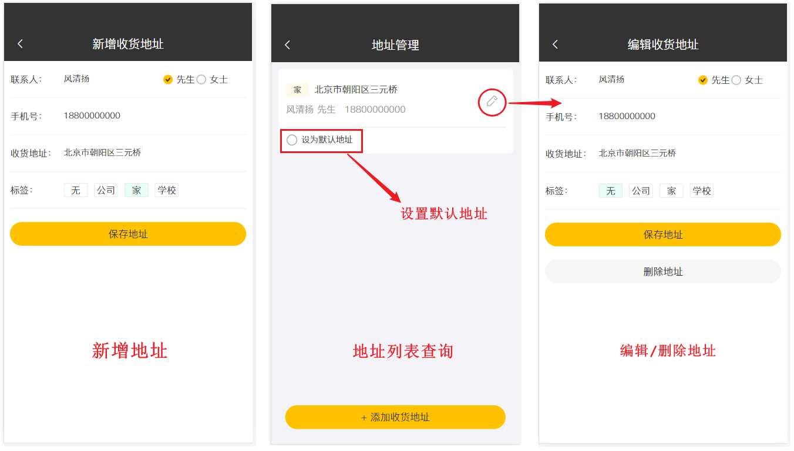
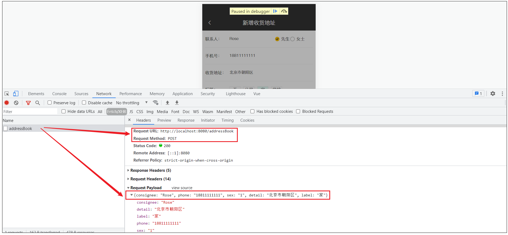
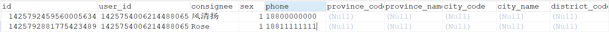

# 用户地址簿

## 需求分析

地址簿，指的是移动端消费者用户的地址信息，用户登录成功后可以维护自己的地址信息。同一个用户可以有多个地址信息，但是只能有一个**默认地址**。




对于地址簿管理，我们需要实现以下几个功能： 

- 新增地址
- 地址列表查询
- 设置默认地址
- 编辑地址
- 删除地址

## 数据模型

用户的地址信息会存储在address_book表，即地址簿表中。具体表结构如下：


这里面有一个字段**is_default**，实际上我们在设置默认地址时，只需要更新这个字段就可以了。


## 导入功能代码

对于这一类的单表的增删改查，我们已经写过很多了，基本的开发思路都是一样的，那么本小节的用户地址簿管理的增删改查功能，我们就不再一一实现了，基本的代码我们都已经提供了，直接导入进来，做一个测试即可。

对于下面的地址管理的代码，我们可以直接从资料拷贝，也可以直接从下面的讲义中复制。

### 实体类AddressBook

所属包: cn.suliu.reggie.entity

```java
/**
 * 地址簿
 */
@Data
public class AddressBook implements Serializable {
    private static final long serialVersionUID = 1L;

    private Long id;
	
    //用户id
    private Long userId;
	
    //收货人
    private String consignee;
	
    //手机号
    private String phone;
	
    //性别 0 女 1 男
    private String sex;
	
    //省级区划编号
    private String provinceCode;
	
    //省级名称
    private String provinceName;
	
    //市级区划编号
    private String cityCode;
	
    //市级名称
    private String cityName;
	
    //区级区划编号
    private String districtCode;
	
    //区级名称
    private String districtName;
	
    //详细地址
    private String detail;
	
    //标签
    private String label;
    
    //是否默认 0 否 1是
    private Integer isDefault;
    
    //创建时间
    @TableField(fill = FieldFill.INSERT)
    private LocalDateTime createTime;

    //更新时间
    @TableField(fill = FieldFill.INSERT_UPDATE)
    private LocalDateTime updateTime;

    //创建人
    @TableField(fill = FieldFill.INSERT)
    private Long createUser;

    //修改人
    @TableField(fill = FieldFill.INSERT_UPDATE)
    private Long updateUser;

    //是否删除
    private Integer isDeleted;
}
```


### AddressBookMapper

Mapper接口 AddressBookMapper

所属包: cn.suliu.reggie.mapper

```java

@Mapper
public interface AddressBookMapper extends BaseMapper<AddressBook> {
}
```

### AddressBookService

业务层接口 AddressBookService

所属包: cn.suliu.reggie.service

```java

public interface AddressBookService extends IService<AddressBook> {
}
```

### AddressBookServiceImpl

业务层实现类 AddressBookServiceImpl

所属包: cn.suliu.reggie.service.impl

```java

@Service
public class AddressBookServiceImpl extends ServiceImpl<AddressBookMapper, AddressBook> implements AddressBookService {
}
```

### AddressBookController

控制层 AddressBookController

所属包: cn.suliu.reggie.controller


controller主要开发的功能: 

1. 新增地址逻辑说明： 

	- 需要记录当前是哪个用户的地址(关联当前登录用户)

1. 设置默认地址 

	- 每个用户可以有很多地址，但是默认地址只能有一个 ；

	- 先将该用户所有地址的is_default更新为0 , 然后将当前的设置的默认地址的is_default设置为1

1. 根据ID查询地址

1. 查询默认地址

	- 根据当前登录用户ID 以及 is_default进行查询，查询当前登录用户is_default为1的地址信息

1. 查询指定用户的全部地址

	- 根据当前登录用户ID，查询所有的地址列表


代码实现如下： 

```java

/**
 * 地址簿管理
 */
@Slf4j
@RestController
@RequestMapping("/addressBook")
public class AddressBookController {
    @Autowired
    private AddressBookService addressBookService;

    /**
     * 新增
     */
    @PostMapping
    public R<AddressBook> save(@RequestBody AddressBook addressBook) {
        addressBook.setUserId(BaseContext.getCurrentId());
        log.info("addressBook:{}", addressBook);
        addressBookService.save(addressBook);
        return R.success(addressBook);
    }

    /**
     * 设置默认地址
     */
    @PutMapping("default")
    public R<AddressBook> setDefault(@RequestBody AddressBook addressBook) {
        log.info("addressBook:{}", addressBook);
        LambdaUpdateWrapper<AddressBook> wrapper = new LambdaUpdateWrapper<>();
        wrapper.eq(AddressBook::getUserId, BaseContext.getCurrentId());
        wrapper.set(AddressBook::getIsDefault, 0);
        //SQL:update address_book set is_default = 0 where user_id = ?
        addressBookService.update(wrapper);

        addressBook.setIsDefault(1);
        //SQL:update address_book set is_default = 1 where id = ?
        addressBookService.updateById(addressBook);
        return R.success(addressBook);
    }

    /**
     * 根据id查询地址
     */
    @GetMapping("/{id}")
    public R get(@PathVariable Long id) {
        AddressBook addressBook = addressBookService.getById(id);
        if (addressBook != null) {
            return R.success(addressBook);
        } else {
            return R.error("没有找到该对象");
        }
    }

    /**
     * 查询默认地址
     */
    @GetMapping("default")
    public R<AddressBook> getDefault() {
        LambdaQueryWrapper<AddressBook> queryWrapper = new LambdaQueryWrapper<>();
        queryWrapper.eq(AddressBook::getUserId, BaseContext.getCurrentId());
        queryWrapper.eq(AddressBook::getIsDefault, 1);

        //SQL:select * from address_book where user_id = ? and is_default = 1
        AddressBook addressBook = addressBookService.getOne(queryWrapper);

        if (null == addressBook) {
            return R.error("没有找到该对象");
        } else {
            return R.success(addressBook);
        }
    }

    /**
     * 查询指定用户的全部地址
     */
    @GetMapping("/list")
    public R<List<AddressBook>> list(AddressBook addressBook) {
        addressBook.setUserId(BaseContext.getCurrentId());
        log.info("addressBook:{}", addressBook);

        //条件构造器
        LambdaQueryWrapper<AddressBook> queryWrapper = new LambdaQueryWrapper<>();
        queryWrapper.eq(null != addressBook.getUserId(), AddressBook::getUserId, addressBook.getUserId());
        queryWrapper.orderByDesc(AddressBook::getUpdateTime);

        //SQL:select * from address_book where user_id = ? order by update_time desc
        return R.success(addressBookService.list(queryWrapper));
    }
}
```


## 功能测试

代码导入进来，并且去阅读了一下地址管理各个功能的逻辑实现，接下来，我们就可以启动项目，进行一个测试。测试过程中，通过debug断点调试观察服务端程序的执行过程，在浏览器中使用调试工具查看页面和服务端的交互过程和请求响应数据。

### 新增

填写表单数据，点击保存地址，查看网络请求。



测试完毕之后，检查数据库中的数据，是否正常插入。



### 列表查询

当新增地址完成后，页面会再次发送一个请求，来查询该用户的所有地址列表，在界面进行展示。


### 设置默认

在地址列表页面中，勾选 "设为默认地址" ，此时会发送PUT请求，来设置默认地址。


测试完毕后，我们再次查看数据库表中的数据：


