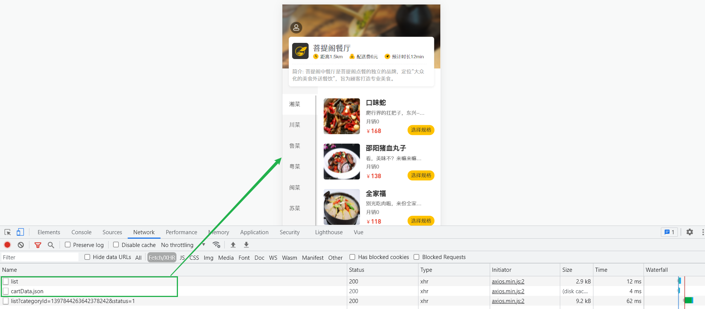

# 菜品展示

## 需求分析

用户登录成功后跳转到系统首页，在首页需要根据分类来展示菜品和套餐。如果菜品设置了口味信息，需要展示**选择规格按钮**，否则显示**添加按钮**。


## 前端页面分析

在开发代码之前，需要梳理一下前端页面和服务端的交互过程：

**1.页面(front/index.html)发送ajax请求，获取分类数据（菜品分类和套餐分类）**


该功能在之前的业务开发中，我们都已经实现了。通过请求响应的数据，我们也可以看到数据是可以正确获取到的。


注意：首页加载时，不仅发送请求获取分类列表，**还发送了一次ajax请求用于加载购物车数据，而这两次请求必须全部成功，页面才可以正常渲染**，而当前购物车列表查询功能还未实现(报404)，所以列表目前并未渲染。

**此处可以将这次请求的地址暂时修改一下，从静态json文件获取数据**，等后续开发购物车功能时再修改回来，如下：


修改之后，我们再次测试：  



目前该部分的功能我们已经调通，左侧的分类菜单，和右侧的菜品信息我们都可以看到，后续我们只需要将购物车列表的数据改成调用服务端接口查询即可。

**2.页面发送ajax请求，获取第一个分类下的菜品或者套餐**


- 根据分类ID查询套餐列表：


- 根据分类ID查询菜品列表： 


异步请求，查询分类对应的菜品列表，功能我们已经实现了，**但是我们之前查询的只是菜品的基本信息，不包含菜品的口味信息**。所以在前端界面中，我们看不到选择菜品分类的信息。


经过上述的分析，我们可以看到，服务端我们主要提供两个方法， 分别用来：

- 根据分类ID查询菜品列表(包含菜品口味列表), 具体请求信息如下: 

| 请求     | 说明                                     |
| -------- | ---------------------------------------- |
| 请求方式 | GET                                      |
| 请求路径 | /dish/list                               |
| 请求参数 | ?categoryId=1397844263642378242&status=1 |

该功能在服务端已经实现: [根据分类查询菜品](../../../../JAVA/3.Web框架/项目%20&%20实战案例/瑞吉外卖/19.后台系统功能之新增套餐.md#根据分类查询菜品)，我们需要修改此方法，在**原有方法的基础上增加查询菜品的口味信息**。


- 根据分类ID查询套餐列表, 具体请求信息如下: 

| 请求     | 说明                                     |
| -------- | ---------------------------------------- |
| 请求方式 | GET                                      |
| 请求路径 | /setmeal/list                            |
| 请求参数 | ?categoryId=1397844263642378242&status=1 |

该功能在服务端并未实现。

## 代码开发

### 查询菜品方法修改

由于之前我们实现的根据分类查询菜品列表[根据分类查询菜品](../../../../JAVA/3.Web框架/项目%20&%20实战案例/瑞吉外卖/19.后台系统功能之新增套餐.md#根据分类查询菜品)，**仅仅查询了菜品的基本信息，未查询菜品口味信息**，而移动端用户在点餐时，是需要选择口味信息的，所以我们需要对之前的代码实现进行完善，那么如何完善呢？

我们需要修改**DishController的list方法**，原来此方法的返回值类型为：`R<List<Dish>>`。为了满足移动端对数据的要求(**菜品基本信息和菜品对应的口味信息**)，现在需要将方法的返回值类型改为：`R<List<DishDto>>` ，因为在DishDto中封装了菜品对应的口味信息： 


**代码逻辑:** 

1. 根据分类ID查询，查询目前正在启售的菜品列表 (已实现)

1. 遍历菜品列表，并查询菜品的分类信息及菜品的口味列表

1. 组装数据DishDto，并返回


**代码实现：**

```java
@GetMapping("/list")
    public R<List<DishDto>> list(Dish dish){
        //构造查询条件
        LambdaQueryWrapper<Dish> queryWrapper = new LambdaQueryWrapper<>();
        queryWrapper.eq(dish.getCategoryId() != null ,Dish::getCategoryId,dish.getCategoryId());
        //添加条件，查询状态为1（起售状态）的菜品
        queryWrapper.eq(Dish::getStatus,1);
        //添加排序条件
        queryWrapper.orderByAsc(Dish::getSort).orderByDesc(Dish::getUpdateTime);
		
        List<Dish> list = dishService.list(queryWrapper);
	
        List<DishDto> dishDtoList = list.stream().map((item) -> {
            DishDto dishDto = new DishDto();
            BeanUtils.copyProperties(item,dishDto);

            Long categoryId = item.getCategoryId();//分类id
            //根据id查询分类对象
            Category category = categoryService.getById(categoryId);
            if(category != null){
                String categoryName = category.getName();
                dishDto.setCategoryName(categoryName);
            }

            //当前菜品的id
            Long dishId = item.getId();
            LambdaQueryWrapper<DishFlavor> lambdaQueryWrapper = new LambdaQueryWrapper<>();
            lambdaQueryWrapper.eq(DishFlavor::getDishId,dishId);
            //SQL:select * from dish_flavor where dish_id = ?
            List<DishFlavor> dishFlavorList = dishFlavorService.list(lambdaQueryWrapper);
            dishDto.setFlavors(dishFlavorList);
            
            return dishDto;
        }).collect(Collectors.toList());

        return R.success(dishDtoList);
    }
```

- 代码可以参考[菜品分页查询代码实现](../../../../JAVA/3.Web框架/项目%20&%20实战案例/瑞吉外卖/17.后台系统功能之菜品分页查询.md#代码实现)


### 根据分类ID查询套餐

在**SetmealController**中创建list方法，根据条件查询套餐数据。

```java
/**
 * 根据条件查询套餐数据
 * @param setmeal
 * @return
 */
@GetMapping("/list")
public R<List<Setmeal>> list(Setmeal setmeal){
    LambdaQueryWrapper<Setmeal> queryWrapper = new LambdaQueryWrapper<>();
    queryWrapper.eq(setmeal.getCategoryId() != null,Setmeal::getCategoryId,setmeal.getCategoryId());
    queryWrapper.eq(setmeal.getStatus() != null,Setmeal::getStatus,setmeal.getStatus());
    queryWrapper.orderByDesc(Setmeal::getUpdateTime);

    List<Setmeal> list = setmealService.list(queryWrapper);
    return R.success(list);
}
```


## 功能测试

把菜品展示的功能代码完善完成之后，我们重新启动服务，来测试一个菜品展示的功能。测试过程中可以使用浏览器的监控工具查看页面和服务端的数据交互细节。


点击分类，根据分类查询菜品列表/套餐列表:


