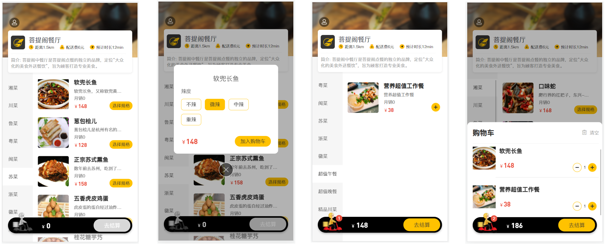
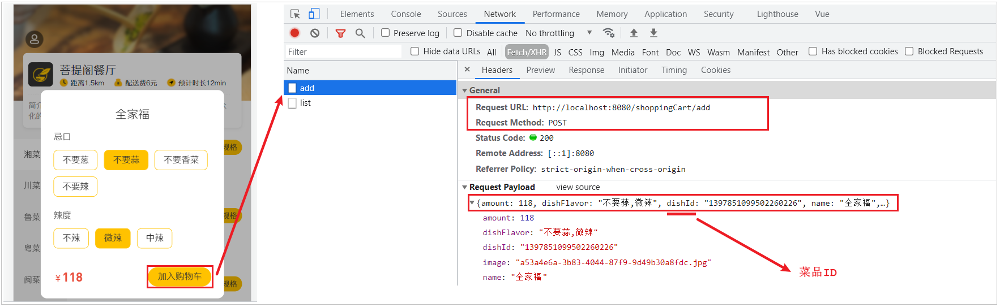
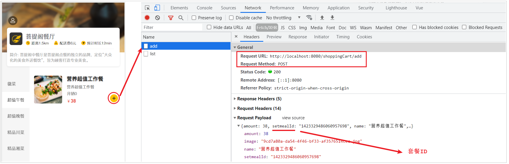
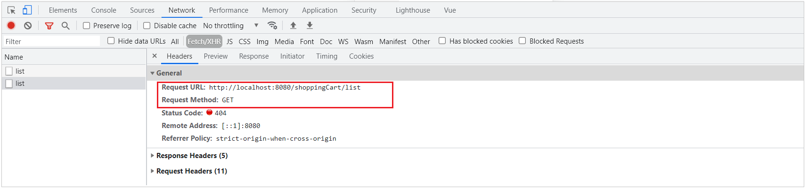
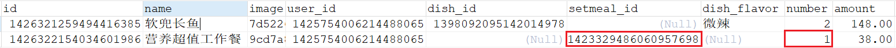

# 购物车

## 需求分析

移动端用户可以将菜品或者套餐添加到购物车。对于菜品来说，如果设置了口味信息，则需要选择规格后才能加入购物车;对于套餐来说，可以直接点击**添加按钮**将当前套餐加入购物车。在购物车中可以修改菜品和套餐的数量，也可以清空购物车。



这里面我们需要实现的功能包括: 

1. 添加购物车

2. 查询购物车

3. 清空购物车


## 数据模型

用户的购物车数据，也是需要保存在数据库中的，购物车对应的数据表为**shopping_cart表**，具体表结构如下：


说明： 

- 购物车数据是关联用户的，在表结构中，我们需要记录，每一个用户的购物车数据是哪些
- 菜品列表展示出来的既有套餐，又有菜品，如果APP端选择的是套餐，就保存套餐ID(setmeal_id)，如果APP端选择的是菜品，就保存菜品ID(dish_id)
- 对同一个菜品/套餐，如果选择多份不需要添加多条记录，增加数量number即可

最终shopping_cart表中存储的数据示例:


## 前端页面分析

在开发代码之前，需要梳理一下购物车操作时前端页面和服务端的交互过程：

1.点击 **"加入购物车"** 或者 **"+" 按钮**，页面发送ajax请求，请求服务端，将菜品或者套餐添加到购物车






2.点击购物车图标，页面发送ajax请求，请求服务端查询购物车中的菜品和套餐

此时，我们就需要将查询购物车的代码放开，不用再加载静态的json数据了。




3.点击清空购物车按钮，页面发送ajax请求，请求服务端来执行清空购物车操作


经过上述的分析，我们可以看到，对于购物车的功能，我们主要需要开发以下几个功能，具体的请求信息如下：

- **加入购物车**

| 请求     | 说明              |
| -------- | ----------------- |
| 请求方式 | POST              |
| 请求路径 | /shoppingCart/add |
| 请求参数 | json格式          |

```json
菜品数据: 
{"amount":118,"dishFlavor":"不要蒜,微辣","dishId":"1397851099502260226","name":"全家福","image":"a53a4e6a-3b83-4044-87f9-9d49b30a8fdc.jpg"}

套餐数据: 
{"amount":38,"setmealId":"1423329486060957698","name":"营养超值工作餐","image":"9cd7a80a-da54-4f46-bf33-af3576514cec.jpg"}
```


- **查询购物车列表**

| 请求     | 说明               |
| -------- | ------------------ |
| 请求方式 | GET                |
| 请求路径 | /shoppingCart/list |


- **清空购物车功能**

| 请求     | 说明                |
| -------- | ------------------- |
| 请求方式 | DELETE              |
| 请求路径 | /shoppingCart/clean |


## 准备工作

分析完毕购物车的业务需求和实现思路之后，在开发业务功能前，先将需要用到的类和接口基本结构创建好：

### 实体类 ShoppingCart

所属包: cn.suliu.reggie.entity

```
/**
 * 购物车
 */
@Data
public class ShoppingCart implements Serializable {
    private static final long serialVersionUID = 1L;
	
    private Long id;

    //名称
    private String name;

    //用户id
    private Long userId;

    //菜品id
    private Long dishId;

    //套餐id
    private Long setmealId;

    //口味
    private String dishFlavor;

    //数量
    private Integer number;

    //金额
    private BigDecimal amount;

    //图片
    private String image;

    private LocalDateTime createTime;
}
```

### ShoppingCartMapper

Mapper接口 ShoppingCartMapper

所属包: cn.suliu.reggie.mapper

```java

@Mapper
public interface ShoppingCartMapper extends BaseMapper<ShoppingCart> {
}
```

### ShoppingCartService

业务层接口 ShoppingCartService

所属包: cn.suliu.reggie.service

```java

public interface ShoppingCartService extends IService<ShoppingCart> {
}
```

### ShoppingCartServiceImpl

业务层实现类 ShoppingCartServiceImpl

所属包: cn.suliu.reggie.service.impl

```java

@Service
public class ShoppingCartServiceImpl extends ServiceImpl<ShoppingCartMapper, ShoppingCart> implements ShoppingCartService {
}
```

### ShoppingCartController

控制层 ShoppingCartController

所属包: cn.suliu.reggie.controller

```java

/**
 * 购物车
 */
@Slf4j
@RestController
@RequestMapping("/shoppingCart")
public class ShoppingCartController {
    @Autowired
    private ShoppingCartService shoppingCartService;
 
 }   
```


## 代码开发

### 添加购物车

在**ShoppingCartController**中创建add方法，来完成添加购物车的逻辑实现，具体的逻辑如下： 

1. 获取当前登录用户，为购物车对象赋值

1. 根据当前登录用户ID 及 本次添加的菜品ID/套餐ID，查询购物车数据是否存在

1. 如果已经存在，就在原来数量基础上加1

1. 如果不存在，则添加到购物车，数量默认就是1


代码实现如下：

```java
/**
* 添加购物车
* @param shoppingCart
* @return
*/
@PostMapping("/add")
public R<ShoppingCart> add(@RequestBody ShoppingCart shoppingCart){
    log.info("购物车数据:{}",shoppingCart);

    //设置用户id，指定当前是哪个用户的购物车数据
    Long currentId = BaseContext.getCurrentId();
    shoppingCart.setUserId(currentId);

    Long dishId = shoppingCart.getDishId();

    LambdaQueryWrapper<ShoppingCart> queryWrapper = new LambdaQueryWrapper<>();
    queryWrapper.eq(ShoppingCart::getUserId,currentId);

    if(dishId != null){
        //添加到购物车的是菜品
        queryWrapper.eq(ShoppingCart::getDishId,dishId);
    }else{
        //添加到购物车的是套餐
        queryWrapper.eq(ShoppingCart::getSetmealId,shoppingCart.getSetmealId());
    }

    //查询当前菜品或者套餐是否在购物车中
    //SQL:select * from shopping_cart where user_id = ? and dish_id/setmeal_id = ?
    ShoppingCart cartServiceOne = shoppingCartService.getOne(queryWrapper);

    if(cartServiceOne != null){
        //如果已经存在，就在原来数量基础上加一
        Integer number = cartServiceOne.getNumber();
        cartServiceOne.setNumber(number + 1);
        shoppingCartService.updateById(cartServiceOne);
    }else{
        //如果不存在，则添加到购物车，数量默认就是一
        shoppingCart.setNumber(1);
        shoppingCart.setCreateTime(LocalDateTime.now());
        shoppingCartService.save(shoppingCart);
        cartServiceOne = shoppingCart;
    }
    return R.success(cartServiceOne);
}
```


### 查询购物车

在**ShoppingCartController**中创建list方法，根据当前登录用户ID查询购物车列表，并对查询的结果进行创建时间的倒序排序。

代码实现如下： 

```java
/**
* 查看购物车
* @return
*/
@GetMapping("/list")
public R<List<ShoppingCart>> list(){
    log.info("查看购物车...");
	
    LambdaQueryWrapper<ShoppingCart> queryWrapper = new LambdaQueryWrapper<>();
    queryWrapper.eq(ShoppingCart::getUserId,BaseContext.getCurrentId());
    queryWrapper.orderByAsc(ShoppingCart::getCreateTime);
	
    List<ShoppingCart> list = shoppingCartService.list(queryWrapper);

    return R.success(list);
}
```


### 清空购物车

在**ShoppingCartController**中创建clean方法，在方法中获取当前登录用户，根据登录用户ID，删除购物车数据。

代码实现如下： 

```java
/**
* 清空购物车
* @return
*/
@DeleteMapping("/clean")
public R<String> clean(){
    //SQL:delete from shopping_cart where user_id = ?
    LambdaQueryWrapper<ShoppingCart> queryWrapper = new LambdaQueryWrapper<>();
    queryWrapper.eq(ShoppingCart::getUserId,BaseContext.getCurrentId());

    shoppingCartService.remove(queryWrapper);
    return R.success("清空购物车成功");
}
```


## 功能测试

按照前面分析的操作流程进行测试，测试功能以及数据库中的数据是否是否正常。

### 添加购物车

当添加的是菜品信息，而这个用户的购物车中当前并没有这个菜品时，添加一条数据，数量为1。


检查数据库数据，由于是菜品保存的是dish_id。


这时在页面上，我们可以继续点击+号，在购物车中增加该菜品，此时，应该是对现有的购物车菜品数量加1，而不应该插入新的记录。


检查数据库数据：


如果添加的是套餐，该套餐在当前用户的购物车中并不存在，则添加一条数据，数量为1。


检查数据库数据：



### 查看购物车

点击页面下面的购物车边栏，查看购物车数据列表是否正常展示。


### 清空购物车

在购物车列表展示页中点击"清空", 查看购物车是否被清空。


并检查数据库中的数据，可以看到数据已经被删除。


