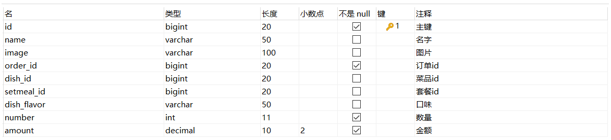

# 下单

## 需求分析

移动端用户将菜品或者套餐加入购物车后，可以点击购物车中的 **去结算** 按钮，页面跳转到订单确认页面，点击 **去支付** 按钮则完成下单操作。


这里，我们需要说明一下，这里并**不会去开发支付功能**，因为不论是支付宝的支付，还是微信支付，都是需要企业资质的，而我们大家在测试的时候，是没有办法提供企业资质的，所以这一部分支付功能我们就不去实现了。

## 数据模型

用户下单业务对应的数据表为orders表和order_detail表(一对多关系,一个订单关联多个订单明细)：

| 表名         | 含义       | 说明                                                         |
| ------------ | ---------- | ------------------------------------------------------------ |
| orders       | 订单表     | 主要存储订单的基本信息(如: 订单号、状态、金额、支付方式、下单用户、收件地址等) |
| order_detail | 订单明细表 | 主要存储订单详情信息(如: 该订单关联的套餐及菜品的信息)       |


具体的表结构如下: 

### orders 订单表


### order_detail




数据示例: 


用户提交订单时，需要往订单表orders中插入一条记录，并且需要往order_detail中插入一条或多条记录。

## 前端页面分析

在开发代码之前，需要梳理一下用户下单操作时前端页面和服务端的交互过程：


**1.在购物车中点击去结算按钮，页面跳转到订单确认页面**


页面跳转前端已经完成，我们无需操作。


**2.在订单确认页面，发送ajax请求，请求服务端获取当前登录用户的默认地址**


该功能在用户地址簿管理功能开发时，已经实现(导入):[用户地址簿addressbookcontroller](../../../../JAVA/3.Web框架/项目%20&%20实战案例/瑞吉外卖/23.移动端之用户地址簿.md#addressbookcontroller)，我们无需操作。


**3.在订单确认页面，发送ajax请求，请求服务端获取当前登录用户的购物车数据**


该功能已经实现:[查询购物车](../../../../JAVA/3.Web框架/项目%20&%20实战案例/瑞吉外卖/25.移动端之购物车.md#查询购物车)，我们无需操作。


**4.在订单确认页面点击去支付按钮，发送ajax请求，请求服务端完成下单操作**


经过上述的分析，我们看到前三步的功能我们都已经实现了，我们主要需要实现最后一步的下单功能，该功能具体的请求信息如下： 

| 请求     | 说明                                                         |
| -------- | ------------------------------------------------------------ |
| 请求方式 | POST                                                         |
| 请求路径 | /order/submit                                                |
| 请求参数 | `{"remark":"老板,记得带一次性筷子","payMethod":1,"addressBookId":"1425792459560005634"}` |


## 准备工作

在开发业务功能前，先将需要用到的类和接口基本结构创建好：

### 实体类

**实体类 Orders、OrderDetail**

所属包: cn.suliu.reggie.entity

```java

/**
 * 订单
 */
@Data
public class Orders implements Serializable {
    private static final long serialVersionUID = 1L;

    private Long id;
    //订单号
    private String number;
    //订单状态 1待付款，2待派送，3已派送，4已完成，5已取消
    private Integer status;

    //下单用户id
    private Long userId;

    //地址id
    private Long addressBookId;

    //下单时间
    private LocalDateTime orderTime;

    //结账时间
    private LocalDateTime checkoutTime;

    //支付方式 1微信，2支付宝
    private Integer payMethod;

    //实收金额
    private BigDecimal amount;

    //备注
    private String remark;

    //用户名
    private String userName;

    //手机号
    private String phone;

    //地址
    private String address;

    //收货人
    private String consignee;
}
```


```java

/**
 * 订单明细
 */
@Data
public class OrderDetail implements Serializable {
    private static final long serialVersionUID = 1L;

    private Long id;

    //名称
    private String name;

    //订单id
    private Long orderId;

    //菜品id
    private Long dishId;

    //套餐id
    private Long setmealId;

    //口味
    private String dishFlavor;

    //数量
    private Integer number;

    //金额
    private BigDecimal amount;

    //图片
    private String image;
}
```

### Mapper接口

**Mapper接口 OrderMapper、OrderDetailMapper**

所属包: cn.suliu.reggie.mapper

```java

@Mapper
public interface OrderMapper extends BaseMapper<Orders> {
}
```

```java

@Mapper
public interface OrderDetailMapper extends BaseMapper<OrderDetail> {
}
```

### 业务层接口

**业务层接口 OrderService、OrderDetailService**

所属包: cn.suliu.reggie.service

```java

public interface OrderService extends IService<Orders> {
}
```

```java

public interface OrderDetailService extends IService<OrderDetail> {
}
```

### 业务层实现类

**业务层实现类 OrderServiceImpl、OrderDetailServiceImpl**

所属包: cn.suliu.reggie.service.impl

```java

@Service
@Slf4j
public class OrderServiceImpl extends ServiceImpl<OrderMapper, Orders> implements OrderService {
}
```

```java

@Service
public class OrderDetailServiceImpl extends ServiceImpl<OrderDetailMapper, OrderDetail> implements OrderDetailService {
}
```

### 控制层

**控制层 OrderController、OrderDetailController**

所属包: cn.suliu.reggie.controller

```java

/**
 * 订单
 */
@Slf4j
@RestController
@RequestMapping("/order")
public class OrderController {
    @Autowired
    private OrderService orderService;
}
```

```java

/**
 * 订单明细
 */
@Slf4j
@RestController
@RequestMapping("/orderDetail")
public class OrderDetailController {

    @Autowired
    private OrderDetailService orderDetailService;
}
```


## 代码开发

在**OrderController**中创建submit方法，处理用户下单的逻辑 ：

```java
/**
 * 用户下单
 * @param orders
 * @return
 */
@PostMapping("/submit")
public R<String> submit(@RequestBody Orders orders){
    log.info("订单数据：{}",orders);
    orderService.submit(orders);
    return R.success("下单成功");
}
```


由于下单的逻辑相对复杂，我们可以在**OrderService**中定义submit方法，来处理下单的具体逻辑：

```java
/**
* 用户下单
* @param orders
*/
public void submit(Orders orders);
```


然后在**OrderServiceImpl**中完成下单功能的具体实现，下单功能的具体逻辑如下： 

1. 获得当前用户id, 查询当前用户的购物车数据

1. 根据当前登录用户id, 查询用户数据

1. 根据地址ID, 查询地址数据

1. 组装订单明细数据, 批量保存订单明细 

1. 组装订单数据, 批量保存订单数据

1. 删除当前用户的购物车列表数据


具体代码实现如下: 

```java
@Autowired
private ShoppingCartService shoppingCartService;

@Autowired
private UserService userService;

@Autowired
private AddressBookService addressBookService;

@Autowired
private OrderDetailService orderDetailService;

/**
* 用户下单
* @param orders
*/
@Transactional
public void submit(Orders orders) {
    //获得当前用户id
    Long userId = BaseContext.getCurrentId();

    //查询当前用户的购物车数据
    LambdaQueryWrapper<ShoppingCart> wrapper = new LambdaQueryWrapper<>();
    wrapper.eq(ShoppingCart::getUserId,userId);
    List<ShoppingCart> shoppingCarts = shoppingCartService.list(wrapper);

    if(shoppingCarts == null || shoppingCarts.size() == 0){
    	throw new CustomException("购物车为空，不能下单");
    }

    //查询用户数据
    User user = userService.getById(userId);

    //查询地址数据
    Long addressBookId = orders.getAddressBookId();
    AddressBook addressBook = addressBookService.getById(addressBookId);
    if(addressBook == null){
    	throw new CustomException("用户地址信息有误，不能下单");
    }

    long orderId = IdWorker.getId();//订单号

    AtomicInteger amount = new AtomicInteger(0);

    //组装订单明细信息
    List<OrderDetail> orderDetails = shoppingCarts.stream().map((item) -> {
        OrderDetail orderDetail = new OrderDetail();
        orderDetail.setOrderId(orderId);
        orderDetail.setNumber(item.getNumber());
        orderDetail.setDishFlavor(item.getDishFlavor());
        orderDetail.setDishId(item.getDishId());
        orderDetail.setSetmealId(item.getSetmealId());
        orderDetail.setName(item.getName());
        orderDetail.setImage(item.getImage());
        orderDetail.setAmount(item.getAmount());
        amount.addAndGet(item.getAmount().multiply(new BigDecimal(item.getNumber())).intValue());
        return orderDetail;
    }).collect(Collectors.toList());

    //组装订单数据
    orders.setId(orderId);
    orders.setOrderTime(LocalDateTime.now());
    orders.setCheckoutTime(LocalDateTime.now());
    orders.setStatus(2);
    orders.setAmount(new BigDecimal(amount.get()));//总金额
    orders.setUserId(userId);
    orders.setNumber(String.valueOf(orderId));
    orders.setUserName(user.getName());
    orders.setConsignee(addressBook.getConsignee());
    orders.setPhone(addressBook.getPhone());
    orders.setAddress((addressBook.getProvinceName() == null ? "" : addressBook.getProvinceName())
        + (addressBook.getCityName() == null ? "" : addressBook.getCityName())
        + (addressBook.getDistrictName() == null ? "" : addressBook.getDistrictName())
        + (addressBook.getDetail() == null ? "" : addressBook.getDetail()));
    //向订单表插入数据，一条数据
    this.save(orders);

    //向订单明细表插入数据，多条数据
    orderDetailService.saveBatch(orderDetails);

    //清空购物车数据
    shoppingCartService.remove(wrapper);
}
```

- 上述逻辑处理中，计算购物车商品的总金额时，为保证我们每一次执行的累加计算是一个原子操作，我们这里用到了JDK中提供的一个原子类 AtomicInteger , 详细可参考[原子性#atomicinteger](../../../../undefined#atomicinteger)


## 功能测试

代码编写完成，我们重新启动服务，按照前面分析的操作流程进行测试，查看数据是否正常即可。在测试过程中，我们可以通过debug的形式来跟踪代码的正常执行。


**检查数据库数据**

订单表插入一条记录：


订单明细表插入四条记录()： 


同时，购物车的数据被删除： 


