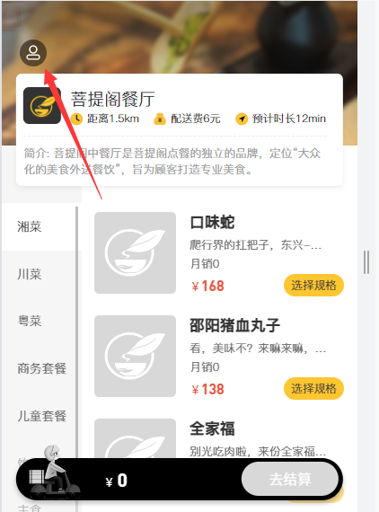
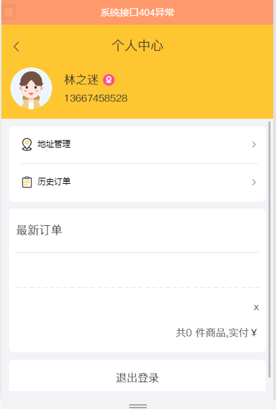

# 介绍

到目前为止 , 项目的大部分功能已经完成 , 还有少部分功能未实现(老师未讲) , 是留给我们尝试根据前面的编程经验来自己完成 . 这里就做一个未实现功能的汇总 , 待空闲时间自己完成(可能吧:) .

也有大佬已经实现 , 具体参考 : [瑞吉外卖项目剩余功能补充](https://blog.csdn.net/weixin_53142722/article/details/124371940) .

# 未完成功能汇总

## 后台系统

### 菜品启售和停售

### 菜品批量启售停售

### 菜品批量删除

### 菜品删除优化

### 套餐启售停售

### 套餐管理的修改

### 展示客户订单

### 修改订单状态

## 移动端

### 登录退出

### 删除地址

### 修改地址

### 减少数量优化

### 查看套餐菜品

### 查看当前订单

### 再来一单

### 最新订单

点击左上角进入个人中心

这时会因为 **最新订单功能** 未实现而报错 

### 历史订单

同时我们进入 **历史订单** 页面 , 也因为功能未实现而报错

