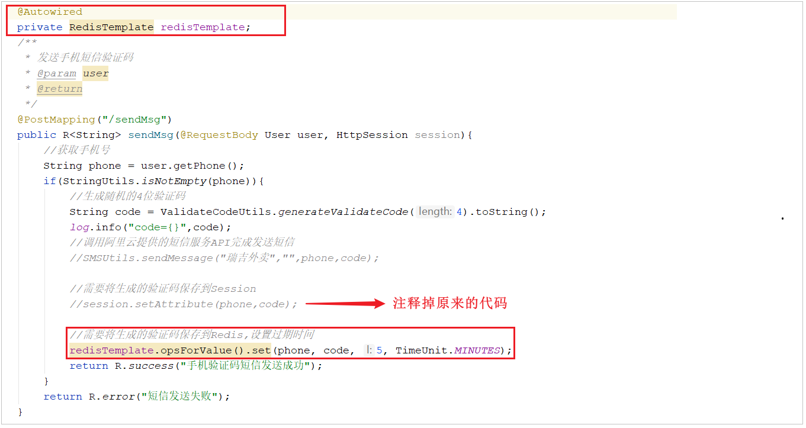

# 缓存短信验证码

## 思路分析

前面我们已经实现了[移动端手机验证码登录](../../../../JAVA/3.Web框架/项目%20&%20实战案例/瑞吉外卖/22.移动端之手机号验证码登录.md)，随机生成的验证码我们是保存在**HttpSession**中的。但是在我们实际的业务场景中，**一般验证码都是需要设置过期时间的**，如果存在HttpSession中就无法设置过期时间，此时我们就需要对这一块的功能进行优化。

现在需要改造为将验证码缓存在Redis中，具体的实现思路如下：

1. 在服务端UserController中注入RedisTemplate对象，用于操作Redis;

2. 在服务端UserController的sendMsg方法中，将随机生成的验证码缓存到Redis中，并设置有效期为5分钟;

3. 在服务端UserController的login方法中，从Redis中获取缓存的验证码，如果登录成功则删除Redis中的验证码;

## 代码改造

1.在**UserController**中注入RedisTemplate对象，用于操作Redis

```java
@Autowired
private RedisTemplate redisTemplate;
```


2.在**UserController**的**sendMsg方法**中，将生成的验证码保存到Redis

```java
//需要将生成的验证码保存到Redis,设置过期时间
redisTemplate.opsForValue().set(phone, code, 5, TimeUnit.MINUTES);
```



3.在**UserController**的**login方法**中，从Redis中获取生成的验证码，如果登录成功则删除Redis中缓存的验证码

```java
//从Redis中获取缓存的验证码
Object codeInSession = redisTemplate.opsForValue().get(phone);
```


```java
//从Redis中删除缓存的验证码
redisTemplate.delete(phone);
```


## 功能测试

代码编写完毕之后 , 重启服务。

**1.访问前端工程，获取验证码**


通过控制台的日志，我们可以看到生成的验证码：


**2.通过Redis的图形化界面工具查看Redis中的数据**


**3.在登录界面填写验证码登录完成后,查看Redis中的数据是否删除**


