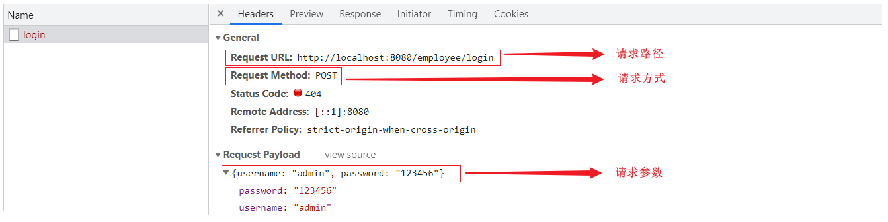
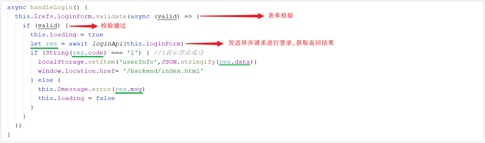
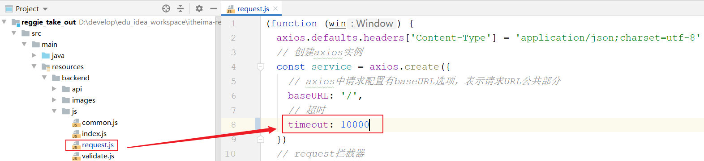

# 系统登录

## 需求分析

### 页面原型


### 成品展示

登录页面存放目录 `/resources/backend/page/login/login.html`


### 查看登录请求

通过**浏览器调试工具**，可以发现**点击登录按钮**后的操作

1. 页面会发送请求(请求地址为http://localhost:8080/employee/login)
2. 并提交参数 username和password, 请求参数为json格式数据 `{"username":"admin","password":"123456"}`。




但是此时报**404错误**，是因为我们的后台系统还**没有响应此请求的处理器**，所以我们需要创建相关类来处理登录请求 ；


### 数据模型employee表


## 前端页面分析


当点击 "登录" 按钮, 会触发Vue中定义的 **handleLogin 方法**:



在上述的前端代码中, 大家可以看到, 发送登录的异步请求之后, 获取到响应结果, 在**响应结果**中至少包含三个属性: **code、data、msg** 。


同时也可以看到，在用户登录成功之后，服务端会返回用户信息，而前端是将这些用户信息，存储在客户端的 **localStorage** 中了。

```
localStorage.setItem('userInfo',JSON.stringify(res.data))
```


## 准备工作

### 创建实体类Employee

该实体类主要用于和员工表 employee 进行映射。 在 `cn.suliu.reggie.entity` 中创建

```
@Data
public class Employee implements Serializable {
    private static final long serialVersionUID = 1L;

    private Long id;

    private String username;

    private String name;

    private String password;

    private String phone;

    private String sex;

    private String idNumber; //驼峰命名法 ---> 映射的字段名为 id_number

    private Integer status;

    private LocalDateTime createTime;

    private LocalDateTime createTime;

    @TableField(fill = FieldFill.INSERT)
    private Long createUser;

    @TableField(fill = FieldFill.INSERT_UPDATE)
    private Long updateUser;
}
```

注意:

这里id、username、name、password、phone、sex等属性与数据库表字段名相一致，但如idNumber、createTime、createUser、updateUser等属性在实体类中是**驼峰命名法**，在数据库表字段中又是id_number**下划线形式**


此时想要映射实体或属性不出问题，需要在配置文件中**开启命名规则转换**，即从下划线形式转成驼峰命名形式。


### 创建Mapper接口

在MybatisPlus中, 自定义的Mapper接口, 需要继承自 BaseMapper。

所属包: cn.suliu.reggie.mapper

```
@Mapper
public interface EmployeeMapper extends BaseMapper<Employee>{
}
```


### 创建Service接口

本项目的Service接口, 在定义时需要继承自MybatisPlus提供的Service层接口 **IService**, 这样就可以直接调用父接口的方法直接执行业务操作, 简化业务层代码实现。

所属包: cn.suliu.reggie.service

```
public interface EmployeeService extends IService<Employee> {}
```

### 创建Service实现类

所属包: cn.suliu.reggie.service.impl

```
@Service
public class EmployeeServiceImpl extends ServiceImpl<EmployeeMapper,Employee> implements EmployeeService{
}
```

### 创建Controller

所属包: cn.suliu.reggie.controller

```
@Slf4j
@RestController
@RequestMapping("/employee")
public class EmployeeController {

    @Autowired
    private EmployeeService employeeService;
	
}   
```

### 创建通用结果类R

此类是一个通用结果类，服务端响应的所有结果最终都会包装成此种类型返回给前端页面。

所属包: cn.suliu.reggie.common

```java
/**
 * 通用返回结果，服务端响应的数据最终都会封装成此对象
 * @param <T>
 */
@Data
public class R<T> {
    private Integer code; //编码：1成功，0和其它数字为失败
    private String msg; //错误信息
    private T data; //数据
    private Map map = new HashMap(); //动态数据

    public static <T> R<T> success(T object) {
        R<T> r = new R<T>();
        r.data = object;
        r.code = 1;
        return r;
    }
    public static <T> R<T> error(String msg) {
        R r = new R();
        r.msg = msg;
        r.code = 0;
        return r;
    }
    public R<T> add(String key, Object value) {
        this.map.put(key, value);
        return this;
    }
}
```

- 如果业务执行结果为成功, 构建R对象时, 只需要调用 success 方法; 如果需要返回数据传递 object 参数, 如果无需返回, 可以直接传递null。

- 如果业务执行结果为失败, 构建R对象时, 只需要调用error 方法, 传递错误提示信息即可。

## 登录逻辑分析


处理逻辑如下：

1. 将页面提交的密码password进行md5加密处理, 得到加密后的字符串

1. 根据页面提交的用户名username查询数据库中员工数据信息

1. 如果没有查询到, 则返回登录失败结果

1. 密码比对，如果不一致, 则返回登录失败结果

1. 查看员工状态，如果为已禁用状态，则返回员工已禁用结果

1. 登录成功，将员工id存入Session, 并返回登录成功结果

## 代码实现

### 技术点

- 由于需求分析时, 我们看到**前端发起的请求为post请求**, 所以服务端需要使用**注解 @PostMapping**

- 由于前端传递的请求参数为json格式的数据, 这里使用Employee对象接收, 但是将json格式数据封装到实体类中, 在**形参前**需要加**注解@RequestBody**


### 代码

```java
/**
 * 员工登录
 * @param request
 * @param employee
 * @return
 */
@PostMapping("/login")
public R<Employee> login(HttpServletRequest request,@RequestBody Employee employee){

    //1、将页面提交的密码password进行md5加密处理
    String password = employee.getPassword();
    password = DigestUtils.md5DigestAsHex(password.getBytes());

    //2、根据页面提交的用户名username查询数据库
    LambdaQueryWrapper<Employee> queryWrapper = new LambdaQueryWrapper<>();
    queryWrapper.eq(Employee::getUsername,employee.getUsername());
    Employee emp = employeeService.getOne(queryWrapper);

    //3、如果没有查询到则返回登录失败结果
    if(emp == null){
        return R.error("登录失败");
    }

    //4、密码比对，如果不一致则返回登录失败结果
    if(!emp.getPassword().equals(password)){
        return R.error("登录失败");
    }

    //5、查看员工状态，如果为已禁用状态，则返回员工已禁用结果
    if(emp.getStatus() == 0){
        return R.error("账号已禁用");
    }

    //6、登录成功，将员工id存入Session并返回登录成功结果
    request.getSession().setAttribute("employee",emp.getId());
    return R.success(emp);
}
```


## 功能测试

代码实现完毕后, 启动项目, 访问url: http://localhost:8080/backend/page/login/login.html , 进行登录测试。

在测试过程中， 可以通过**debug断点调试**的方式来跟踪程序的执行过程，并且可以查看程序运行时各个对象的具体赋值情况。而且需要注意, 在测试过程中，需要**将所有的情况都覆盖到**。

### 超时问题

当我们在进行debug端点调试时, 前端可能会出现如下问题: 前端页面的控制台报出错误-超时;


解决方式：

前端进行异步请求时, 默认超时10000ms , 可以将该值调大一些。





由于修改了JS文件，**需要手动清理一下浏览器缓存，避免缓存影响，JS不能及时生效**。


# 系统退出

## 需求分析

在后台管理系统中，管理员或者员工，登录进入系统之后，页面跳转到后台系统首页面(backend/index.html)，此时会在系统的右上角显示当前登录用户的姓名。

如果员工需要退出系统，直接点击右侧的退出按钮即可退出系统，退出系统后页面应跳转回登录页面。

### 页面展示


### 前端分析


点击退出图标将会调用一个**js方法logout**, 在logout的方法中执行如下逻辑: 


1. 发起post请求, 调用服务端接口 /employee/logout 执行退出操作 ;

2. 删除客户端 localStorage 中存储的用户登录信息, 跳转至登录页面 ;

## 代码实现

需要在Controller中创建对应的处理方法, 接收页面发送的POST请求 /employee/logout ，具体的处理逻辑：

1. **清理Session中的用户id**

2. 返回结果

```
/**
* 员工退出
* @param request
* @return
*/
@PostMapping("/logout")
public R<String> logout(HttpServletRequest request){
    //清理Session中保存的当前登录员工的id
    request.getSession().removeAttribute("employee");
    return R.success("退出成功");
}
```


## 功能测试

代码实现完毕后, 重启服务, 访问登录界面 http://localhost:8080/backend/page/login/login.html

登录完成之后, 进入到系统首页 backend/index.html, 点击右上角退出按钮执行退出操作, 完成后看看是否可以跳转到登录页面 , 并检查localStorage。


