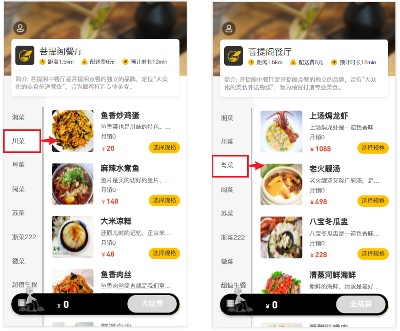
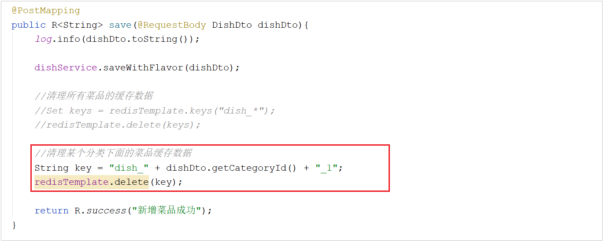

# 缓存菜品信息

## 思路分析

前面我们已经实现了[移动端菜品查看功能](../../../../JAVA/3.Web框架/项目%20&%20实战案例/瑞吉外卖/24.移动端之菜品展示.md)，对应的服务端方法为 DishController 的 list 方法，此方法会根据前端提交的查询条件(categoryId)进行数据库查询操作。在高并发的情况下，频繁查询数据库会导致系统性能下降，服务端响应时间增长。现在需要对此方法进行缓存优化，提高系统的性能。


那么 , 我们又需要思考一个问题 , 具体缓存几份数据呢 , 所有的菜品缓存一份 , 还是说需要缓存多份呢? 我们可以看一下我们之前做的移动端效果: 



我们点击哪一个分类 , 展示的就是该分类下的菜品 , 其他菜品无需展示。所以，这里面我们在缓存时，**可以根据菜品的分类，缓存多份数据，页面在查询时，点击的是哪个分类，我们就查询该分类下的菜品缓存数据**。


**具体的实现思路如下：**

1. 改造DishController的list方法，先从Redis中获取分类对应的菜品数据，如果有则直接返回，无需查询数据库;如果没有则查询数据库，并将查询到的菜品数据存入Redis。

2. 改造DishController的save和update方法，加入清理缓存的逻辑。

### 注意

在使用缓存过程中，要注意保证数据库中的数据和缓存中的数据一致，如果数据库中的数据发生变化，需要及时清理缓存数据。否则就会造成缓存数据与数据库数据不一致的情况。

## 代码改造

需要改造的代码为： **DishController**

### 查询菜品缓存

| 改造的方法 | redis的数据类型 | redis缓存的key                              | redis缓存的value |
| ---------- | --------------- | ------------------------------------------- | ---------------- |
| list       | string          | dish_分类Id_状态 , 比如: dish_12323232323_1 | `List<DishDto>`  |


**1.在DishController中注入RedisTemplate**

```
@Autowired
private RedisTemplate redisTemplate;
```

**2.在list方法中,查询数据库之前,先查询缓存, 缓存中有数据, 直接返回**

```java
List<DishDto> dishDtoList = null;
//动态构造key
String key = "dish_" + dish.getCategoryId() + "_" + dish.getStatus();//dish_1397844391040167938_1
//先从redis中获取缓存数据
dishDtoList = (List<DishDto>) redisTemplate.opsForValue().get(key);
if(dishDtoList != null){
    //如果存在，直接返回，无需查询数据库
    return R.success(dishDtoList);
}
```


**3.如果redis不存在，查询数据库，并将数据库查询结果，缓存在redis，并设置过期时间**

```java
//如果不存在，需要查询数据库，将查询到的菜品数据缓存到Redis
redisTemplate.opsForValue().set(key,dishDtoList,60, TimeUnit.MINUTES);
```


### 清理菜品缓存

**为了保证数据库中的数据和缓存中的数据一致，如果数据库中的数据发生变化，需要及时清理缓存数据**。所以，我们需要在**添加菜品、更新菜品**时清空缓存数据。


#### 添加菜品时

在保存菜品的**方法save**中，当菜品数据保存完毕之后，需要清空菜品的缓存。

那么这里清理菜品缓存的方式存在两种：

- 清理所有分类下的菜品缓存

```java
//清理所有菜品的缓存数据
Set keys = redisTemplate.keys("dish_*"); //获取所有以dish_xxx开头的key
redisTemplate.delete(keys); //删除这些key
```


- 清理当前添加菜品分类下的缓存

```java
//清理某个分类下面的菜品缓存数据
String key = "dish_" + dishDto.getCategoryId() + "_1";
redisTemplate.delete(key);
```

此处, 我们**推荐使用第二种清理的方式**, 只清理当前菜品关联的分类下的菜品数据。



#### 更新菜品时

在更新菜品的**方法update**中，当菜品数据更新完毕之后，需要清空菜品的缓存。这里清理缓存的方式和上述基本一致。

- 清理所有分类下的菜品缓存

```java
//清理所有菜品的缓存数据
Set keys = redisTemplate.keys("dish_*"); //获取所有以dish_xxx开头的key
redisTemplate.delete(keys); //删除这些key
```


- 清理当前添加菜品分类下的缓存

```java
//清理某个分类下面的菜品缓存数据
String key = "dish_" + dishDto.getCategoryId() + "_1";
redisTemplate.delete(key);
```


注意: 在这里我们**推荐使用第一种方式**进行清理，这样逻辑更加严谨。 因为对于修改操作，用户是可以修改菜品的分类的，如果用户修改了菜品的分类，那么原来分类下将少一个菜品，新的分类下将多一个菜品，这样的话，两个分类下的菜品列表数据都发生了变化。

## 功能测试

代码编写完毕之后,重新启动服务。

1.访问移动端，根据分类查询菜品列表，然后再检查Redis的缓存数据，是否可以正常缓存；


我们也可以在服务端，通过debug断点的形式一步一步的跟踪代码的执行。

2.当我们在进行新增及修改菜品时, 查询Redis中的缓存数据, 是否被清除;


## Git操作

### 提交并推送代码

在v1.0分支中 , 将我们已经实现并且测试通过的使用Redis缓存验证码和菜品信息的代码 , 提交并推送至Gitee


### 合并代码到master分支

1. 将代码切换到master分支


2. 将v1.0分支的代码合并到当前master分支


3. 将master分支合并后代码推送到Gitee


