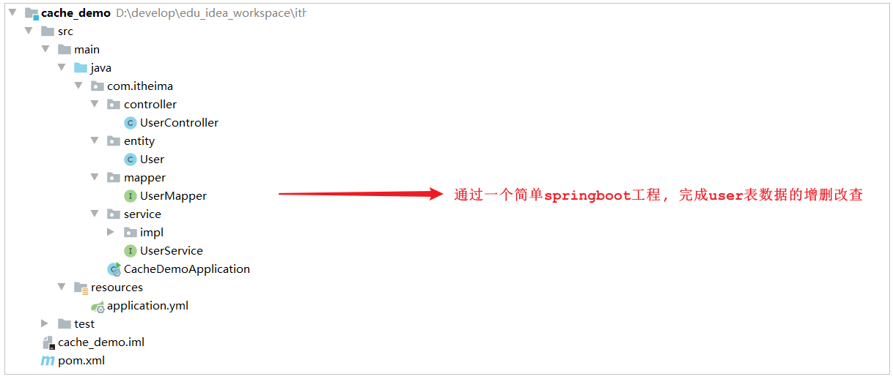
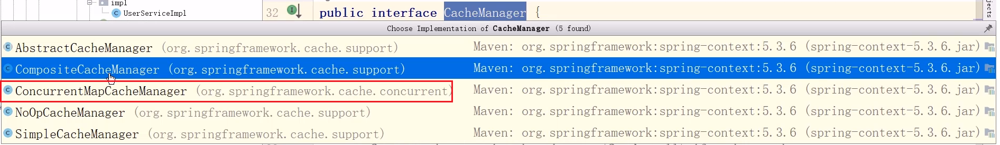
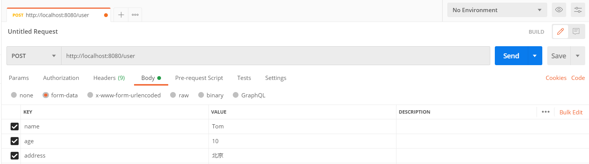
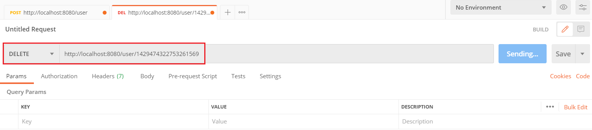
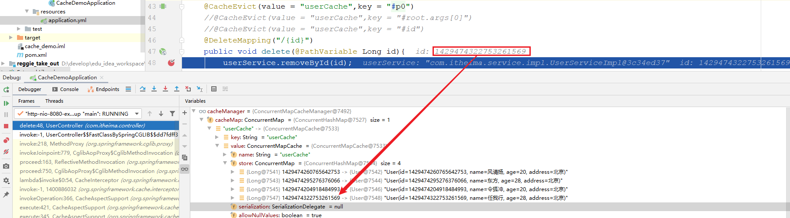
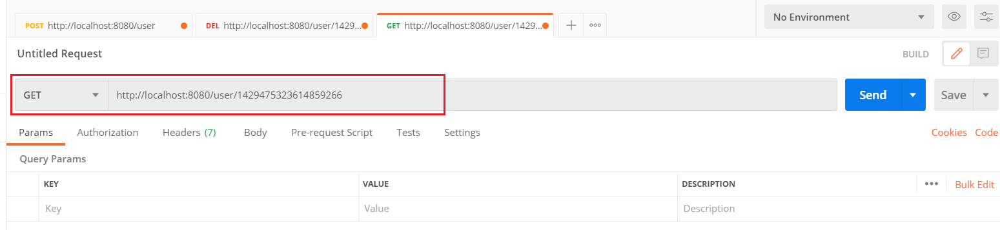
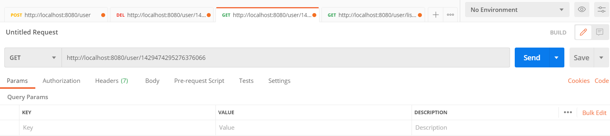
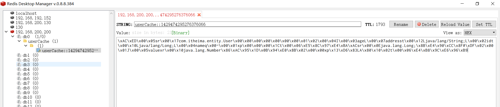

# 介绍

## Spring Cache

**Spring Cache**是一个框架，实现了基于注解的缓存功能，只需要简单地加一个注解，就能实现缓存功能，大大简化我们在业务中操作缓存的代码。

Spring Cache只是提供了一层抽象，底层可以切换不同的cache实现。具体就是通过**CacheManager**接口来统一不同的缓存技术。**CacheManager是Spring提供的各种缓存技术抽象接口。**


针对不同的缓存技术需要实现不同的CacheManager：

| CacheManager   | 描述                          |
| ------------------- | ---------------------------------- |
| EhCacheCacheManager | 使用EhCache作为缓存技术            |
| GuavaCacheManager   | 使用Google的GuavaCache作为缓存技术 |
| RedisCacheManager   | 使用Redis作为缓存技术              |

## 注解

在SpringCache中提供了很多缓存操作的注解，常见的是以下的几个：

| 注解       | 说明                                                     |
| -------------- | ------------------------------------------------------------ |
| @EnableCaching | 开启缓存注解功能                                             |
| @Cacheable     | 在方法执行前Spring先查看缓存中是否有数据，如果有数据，则直接返回缓存数据；若没有数据，调用方法并将方法返回值放到缓存中 |
| @CachePut      | 将方法的返回值放到缓存中                                     |
| @CacheEvict    | 将一条或多条数据从缓存中删除                                 |


在SpringBoot项目中，使用缓存技术只需在项目中**导入相关缓存技术的依赖包**，并在启动类上使用 **@EnableCaching** 开启缓存支持即可。

例如: 使用Redis作为缓存技术，只需要导入Spring data Redis的maven坐标即可。

# 入门程序

接下来，我们将通过一个入门案例来演示一下SpringCache的常见用法。 

上面我们提到，SpringCache可以集成不同的缓存技术，如Redis、Ehcache甚至我们可以使用Map来缓存数据， 接下来我们在演示的时候，**就先通过一个Map来缓存数据，最后我们再换成Redis来缓存**。

## 环境准备

### 数据库准备

将下面的SQL脚本直接导入数据库中。


### 导入基础工程

基础环境的代码，工程结构如下： 



```
<?xml version="1.0" encoding="UTF-8"?>
<project xmlns="http://maven.apache.org/POM/4.0.0"
         xmlns:xsi="http://www.w3.org/2001/XMLSchema-instance"
         xsi:schemaLocation="http://maven.apache.org/POM/4.0.0 http://maven.apache.org/xsd/maven-4.0.0.xsd">
    <modelVersion>4.0.0</modelVersion>
    <parent>
        <groupId>org.springframework.boot</groupId>
        <artifactId>spring-boot-starter-parent</artifactId>
        <version>2.4.5</version>
        <relativePath/> <!-- lookup parent from repository -->
    </parent>
    <groupId>com.itheima</groupId>
    <artifactId>cache_demo</artifactId>
    <version>1.0-SNAPSHOT</version>
    <properties>
        <java.version>1.8</java.version>
    </properties>

    <dependencies>
        <dependency>
            <groupId>org.springframework.boot</groupId>
            <artifactId>spring-boot-starter-web</artifactId>
            <scope>compile</scope>
        </dependency>
        <dependency>
            <groupId>org.projectlombok</groupId>
            <artifactId>lombok</artifactId>
            <version>1.18.20</version>
        </dependency>

        <dependency>
            <groupId>com.alibaba</groupId>
            <artifactId>fastjson</artifactId>
            <version>1.2.76</version>
        </dependency>

        <dependency>
            <groupId>commons-lang</groupId>
            <artifactId>commons-lang</artifactId>
            <version>2.6</version>
        </dependency>
		
		<!--
        <dependency>
            <groupId>org.springframework.boot</groupId>
            <artifactId>spring-boot-starter-cache</artifactId>
        </dependency>

        <dependency>
            <groupId>org.springframework.boot</groupId>
            <artifactId>spring-boot-starter-data-redis</artifactId>
        </dependency>
		-->
		
        <dependency>
            <groupId>mysql</groupId>
            <artifactId>mysql-connector-java</artifactId>
            <scope>runtime</scope>
        </dependency>

        <dependency>
            <groupId>com.baomidou</groupId>
            <artifactId>mybatis-plus-boot-starter</artifactId>
            <version>3.4.2</version>
        </dependency>

        <dependency>
            <groupId>com.alibaba</groupId>
            <artifactId>druid-spring-boot-starter</artifactId>
            <version>1.1.23</version>
        </dependency>
    </dependencies>
    <build>
        <plugins>
            <plugin>
                <groupId>org.springframework.boot</groupId>
                <artifactId>spring-boot-maven-plugin</artifactId>
                <version>2.4.5</version>
            </plugin>
        </plugins>
    </build>
</project>
```

```
server:
  port: 8080
spring:
  application:
    #应用的名称，可选
    name: cache_demo
  datasource:
    druid:
      driver-class-name: com.mysql.cj.jdbc.Driver
      url: jdbc:mysql://localhost:3306/cache_demo?serverTimezone=Asia/Shanghai&useUnicode=true&characterEncoding=utf-8&zeroDateTimeBehavior=convertToNull&useSSL=false&allowPublicKeyRetrieval=true
      username: root
      password: root
mybatis-plus:
  configuration:
    #在映射实体或者属性时，将数据库中表名和字段名中的下划线去掉，按照驼峰命名法映射
    map-underscore-to-camel-case: true
    log-impl: org.apache.ibatis.logging.stdout.StdOutImpl
  global-config:
    db-config:
      id-type: ASSIGN_ID
```

```
@RestController
@RequestMapping("/user")
@Slf4j
public class UserController {

    @Autowired
    private CacheManager cacheManager;

    @Autowired
    private UserService userService;

    @PostMapping
    public User save(User user){
        userService.save(user);
        return user;
    }

    @DeleteMapping("/{id}")
    public void delete(@PathVariable Long id){
        userService.removeById(id);
    }

    @PutMapping
    public User update(User user){
        userService.updateById(user);
        return user;
    }

    @GetMapping("/{id}")
    public User getById(@PathVariable Long id){
        User user = userService.getById(id);
        return user;
    }

    @GetMapping("/list")
    public List<User> list(User user){
        LambdaQueryWrapper<User> queryWrapper = new LambdaQueryWrapper<>();
        queryWrapper.eq(user.getId() != null,User::getId,user.getId());
        queryWrapper.eq(user.getName() != null,User::getName,user.getName());
        List<User> list = userService.list(queryWrapper);
        return list;
    }
}

```

```
@Slf4j
@SpringBootApplication
@EnableCaching
public class CacheDemoApplication {
    public static void main(String[] args) {
        SpringApplication.run(CacheDemoApplication.class,args);
        log.info("项目启动成功...");
    }
}
```

```
public interface UserService extends IService<User> {
}

```

```
@Service
public class UserServiceImpl extends ServiceImpl<UserMapper,User> implements UserService {
}
```

```
@Mapper
public interface UserMapper extends BaseMapper<User>{
}

```

```
@Data
public class User implements Serializable {

    private static final long serialVersionUID = 1L;

    private Long id;

    private String name;

    private int age;

    private String address;

}

```

由于SpringCache的基本功能是Spring核心(spring-context)中提供的，所以目前我们**进行简单的SpringCache测试，是可以不用额外引入其他依赖的**。

### 注入CacheManager

我们可以在**UserController**注入一个**CacheManager**，在Debug时，我们可以通过CacheManager跟踪缓存中数据的变化。


我们可以看到CacheManager是一个接口，默认的实现有以下几种 ；



而在上述的这几个实现中，默认使用的是 **ConcurrentMapCacheManager**。稍后我们可以通过断点的形式跟踪缓存数据的变化。

### 引导类上加@EnableCaching

在引导类上加该注解，就代表当前项目开启缓存注解功能。


## @CachePut注解

@CachePut 说明： 

- 作用: **将方法返回值，放入缓存**

- value: 缓存的名称 , 每个缓存名称下面可以有很多key

- key: 缓存的key , 支持Spring的表达式语言SPEL语法

### 使用注解@CachePut

当前UserController的save方法是用来保存用户信息的，我们希望在该用户信息保存到数据库的同时，也往缓存中缓存一份数据，我们可以在save方法上加上注解 @CachePut，用法如下： 

```java
/**
* CachePut：将方法返回值放入缓存
* value：缓存的名称，每个缓存名称下面可以有多个key
* key：缓存的key
*/
@CachePut(value = "userCache", key = "#user.id")
@PostMapping
public User save(User user){
    userService.save(user);
    return user;
}
```


key的写法如下： 

- **#user.id** : #user指的是方法形参的名称, id指的是user的id属性 , 也就是使用user的id属性作为key ;

- **#user.name**: #user指的是方法形参的名称, name指的是user的name属性 ,也就是使用user的name属性作为key ;

- **#result.id** : #result代表方法返回值，该表达式 代表以返回对象的id属性作为key ；

- **#result.name** : #result代表方法返回值，该表达式 代表以返回对象的name属性作为key ；


### 测试

启动服务,通过Postman请求访问UserController的方法, 然后通过断点的形式跟踪缓存数据。



第一次访问时，缓存中的数据是空的，因为save方法执行完毕后才会缓存数据。 


第二次访问时，我们通过debug可以看到已经有一条数据了，就是上次保存的数据，已经缓存了，缓存的key就是用户的id。


注意: 上述的演示，最终的数据，**实际上是缓存在ConcurrentHashMap中，那么当我们的服务器重启之后，缓存中的数据就会丢失。** 我们后面使用了Redis来缓存就不存在这样的问题了。

## @CacheEvict注解

@CacheEvict 说明： 

- 作用: 清理指定缓存

- value: 缓存的名称，每个缓存名称下面可以有多个key

- key: 缓存的key , 支持Spring的表达式语言SPEL语法

### 删除使用@CacheEvict

当我们在删除数据库user表的数据的时候 , 我们需要删除缓存中对应的数据 , 此时就可以使用@CacheEvict注解 , 具体的使用方式如下: 

```java
/**
* CacheEvict：清理指定缓存
* value：缓存的名称，每个缓存名称下面可以有多个key
* key：缓存的key
*/
@CacheEvict(value = "userCache",key = "#p0")  //#p0 代表第一个参数
//@CacheEvict(value = "userCache",key = "#root.args[0]") //#root.args[0] 代表第一个参数
//@CacheEvict(value = "userCache",key = "#id") //#id 代表变量名为id的参数
@DeleteMapping("/{id}")
public void delete(@PathVariable Long id){
    userService.removeById(id);
}
```

注意:

- 这里key的三种写法`"#p0"`、`"#root.args[0]"`、`"#id"` 是等价的，写法非常灵活，但是建议使用`"#id"`比较简洁

#### 测试

要测试缓存的删除，我们先访问save方法4次，保存4条数据到数据库的同时，也保存到缓存中，最终我们可以通过debug看到缓存中的数据信息。 然后我们在通过Postman访问delete方法， 如下： 



删除数据时，通过debug我们可以看到已经缓存的4条数据：




当执行完delete操作之后，我们再次保存一条数据，在保存的时候debug查看一下删除的ID值是否已经被删除。


### 更新使用@CacheEvict

在更新数据之后，数据库的数据已经发生了变更，我们需要将缓存中对应的数据删除掉，避免出现数据库数据与缓存数据不一致的情况。

``` java
//@CacheEvict(value = "userCache",key = "#p0.id")   //第一个参数的id属性
//@CacheEvict(value = "userCache",key = "#user.id") //参数名为user参数的id属性
//@CacheEvict(value = "userCache",key = "#root.args[0].id") //第一个参数的id属性
@CacheEvict(value = "userCache",key = "#result.id")         //返回值的id属性
@PutMapping
public User update(User user){
    userService.updateById(user);
    return user;
}
```

加上注解之后，我们可以重启服务，然后测试方式，基本和上述相同，先缓存数据，然后再更新某一条数据，通过debug的形式查询缓存数据的情况。


## @Cacheable注解

@Cacheable 说明:

- 作用: 在方法执行前，spring先查看缓存中是否有数据，如果有数据，则直接返回缓存数据；若没有数据，调用方法并将方法返回值放到缓存中

- value: 缓存的名称，每个缓存名称下面可以有多个key

- key: 缓存的key , 支持Spring的表达式语言SPEL语法

### getById()使用@Cacheable

在getById上加注解@Cacheable

```java
/**
* Cacheable：在方法执行前spring先查看缓存中是否有数据，如果有数据，则直接返回缓存数据；若没有数据，调用方法并将方法返回值放到缓存中
* value：缓存的名称，每个缓存名称下面可以有多个key
* key：缓存的key
*/
@Cacheable(value = "userCache",key = "#id")
@GetMapping("/{id}")
public User getById(@PathVariable Long id){
    User user = userService.getById(id);
    return user;
}
```


#### 测试

我们可以重启服务，然后通过debug断点跟踪程序执行。我们发现，第一次访问，会请求我们controller的方法，查询数据库。后面再查询相同的id，就直接获取到数据库，不用再查询数据库了，就说明缓存生效了。



当我们在测试时，查询一个数据库不存在的id值，第一次查询缓存中没有，也会查询数据库。而第二次再查询时，会发现，不再查询数据库了，而是直接返回，那也就是说如果根据ID没有查询到数据,那么会自动缓存一个null值。 我们可以通过debug，验证一下： 


我们能不能做到，**当查询到的值不为null时，再进行缓存，如果为null，则不缓存呢? 答案是可以的**。


### 缓存非null值

在@Cacheable注解中，提供了两个属性分别为： condition， unless 。

- **condition** : 表示满足什么条件, 再进行缓存 ;

- **unless** : 表示满足条件则不缓存 ; 与上述的condition是反向的 ;

具体实现方式如下: 

```java
/**
 * Cacheable：在方法执行前spring先查看缓存中是否有数据，如果有数据，则直接返回缓存数据；若没有数据，调用方法并将方法返回值放到缓存中
 * value：缓存的名称，每个缓存名称下面可以有多个key
 * key：缓存的key
 * condition：条件，满足条件时才缓存数据
 * unless：满足条件则不缓存
 */
@Cacheable(value = "userCache",key = "#id", unless = "#result == null")
@GetMapping("/{id}")
public User getById(@PathVariable Long id){
    User user = userService.getById(id);
    return user;
}
```

注意： 此处，**我们使用的时候只能够使用 unless， 因为在condition中，我们是无法获取到结果 #result的**。

### list()使用@Cacheable

在list方法中进行查询时，有两个查询条件，如果传递了id，根据id查询； 如果传递了name， 根据name查询，那么我们缓存的key在设计的时候，就需要既包含id，又包含name。 

具体的代码实现如下： 

```java
@Cacheable(value = "userCache",key = "#user.id + '_' + #user.name")
@GetMapping("/list")
public List<User> list(User user){
    LambdaQueryWrapper<User> queryWrapper = new LambdaQueryWrapper<>();
    queryWrapper.eq(user.getId() != null,User::getId,user.getId());
    queryWrapper.eq(user.getName() != null,User::getName,user.getName());
    List<User> list = userService.list(queryWrapper);
    return list;
}
```


然后再次重启服务，进行测试。


第一次查询时，需要查询数据库，在后续的查询中，就直接查询了缓存，不再查询数据库了。

## 集成Redis

在使用上述默认的ConcurrentHashMap做缓存时，服务重启之后，之前缓存的数据就全部丢失了，操作起来并不友好。

在项目中使用，我们会选择使用Redis来做缓存，主要需要操作以下几步： 

### pom.xml

```xml
<dependency>
    <groupId>org.springframework.boot</groupId>
    <artifactId>spring-boot-starter-cache</artifactId>
</dependency>

<dependency>
    <groupId>org.springframework.boot</groupId>
    <artifactId>spring-boot-starter-data-redis</artifactId>
</dependency>
```


### application.yml

```yml
spring:
  redis:
    host: 192.168.200.200
    port: 6379
    password: root@123456
    database: 0
  cache:
    redis:
      time-to-live: 1800000   #设置缓存过期时间，可选
```


### 测试

重新启动项目，通过Postman发送根据id查询数据的请求，然后通过Redis的图形化界面工具，查看Redis中是否可以正常的缓存数据。






