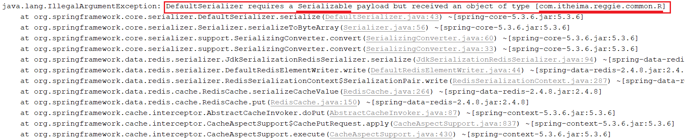
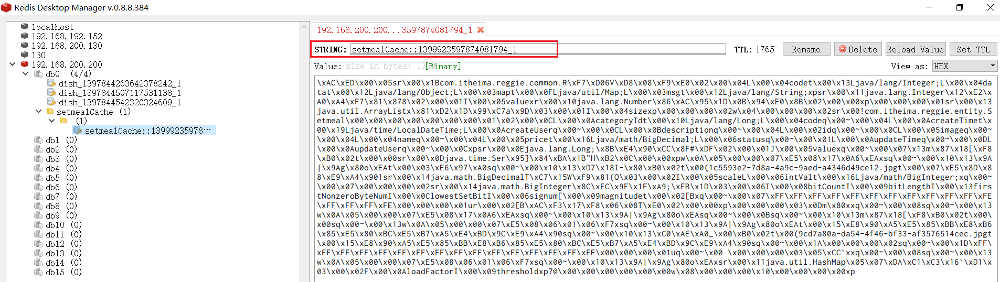
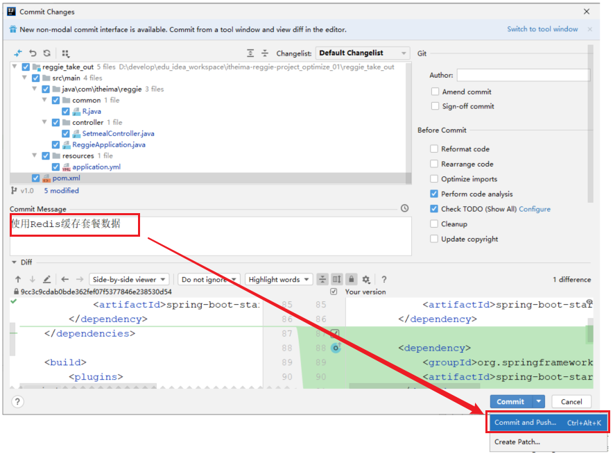
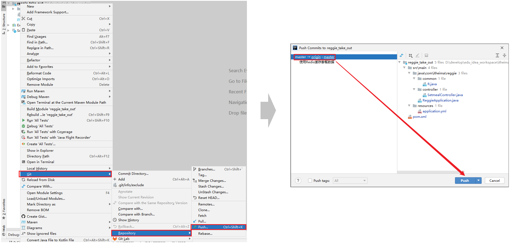

# 缓存套餐数据

## 思路分析

前面我们已经实现了[移动端套餐查看功能](../../../../JAVA/3.Web框架/项目%20&%20实战案例/瑞吉外卖/24.移动端之菜品展示.md#根据分类id查询套餐)，对应的服务端方法为SetmealController的list方法，此方法会根据前端提交的查询条件进行数据库查询操作。

在高并发的情况下，频繁查询数据库会导致系统性能下降，服务端响应时间增长。现在需要对此方法进行缓存优化，提高系统的性能。

具体的实现思路如下：

1. 导入Spring Cache和Redis相关maven坐标

2. 在application.yml中配置缓存数据的过期时间

3. 在启动类上加入@EnableCaching注解，开启缓存注解功能

4. 在SetmealController的list方法上加入@Cacheable注解

5. 在SetmealController的save和delete方法上加入CacheEvict注解


## 缓存套餐数据

### 代码实现

1.pom.xml中引入依赖

```xml
<dependency>
    <groupId>org.springframework.boot</groupId>
    <artifactId>spring-boot-starter-cache</artifactId>
</dependency>
```

备注: spring-boot-starter-data-redis 这个依赖前面已经引入了, 无需再次引入。


2.application.yml中设置缓存过期时间

```yml
spring:  
  cache:
    redis:
      time-to-live: 1800000 #设置缓存数据的过期时间
```

- 1800000 毫秒 = 30 分钟


3.启动类上加入@EnableCaching注解


4.**SetmealController的list方法**上加入 **@Cacheable** 注解

在进行套餐数据查询时，我们需要根据分类ID和套餐的状态进行查询，所以我们在缓存数据时，可以将套餐分类ID和套餐状态组合起来作为key，如： 1627182182_1 (1627182182为分类ID，1为状态)。

```java
/**
* 根据条件查询套餐数据
* @param setmeal
* @return
*/
@GetMapping("/list")
@Cacheable(value = "setmealCache",key = "#setmeal.categoryId + '_' + #setmeal.status")
public R<List<Setmeal>> list(Setmeal setmeal){
    LambdaQueryWrapper<Setmeal> queryWrapper = new LambdaQueryWrapper<>();
    queryWrapper.eq(setmeal.getCategoryId() != null,Setmeal::getCategoryId,setmeal.getCategoryId());
    queryWrapper.eq(setmeal.getStatus() != null,Setmeal::getStatus,setmeal.getStatus());
    queryWrapper.orderByDesc(Setmeal::getUpdateTime);

    List<Setmeal> list = setmealService.list(queryWrapper);

    return R.success(list);
}
```


### 测试

缓存数据的代码编写完毕之后，重新启动服务，访问移动端进行测试，我们登陆之后在点餐界面，点击某一个套餐分类，查询套餐列表数据时，服务端报错了，错误信息如下： 




#### 异常错误

为什么会报出这个错误呢？

**因为 @Cacheable 会将方法的返回值R缓存在Redis中，而在Redis中存储对象，该对象是需要被序列化的，而对象要想被成功的序列化，就必须得实现 Serializable 接口**。而当前我们定义的R，并未实现 Serializable 接口。所以，要解决该异常，只需要让R实现  Serializable 接口即可。如下： 


修复完毕之后，再次重新测试，访问套餐分类下对应的套餐列表数据后，我们会看到Redis中确实可以缓存对应的套餐列表数据。




## 清理套餐数据

### 代码实现

为了保证数据库中数据与缓存数据的一致性，在我们添加套餐或者删除套餐数据之后，需要清空当前套餐缓存的全部数据。

那么@CacheEvict注解如何**清除某一份缓存下所有的数据**呢，这里我们可以指定@CacheEvict中的一个属性 allEnties，将其设置为true即可。

**1.在delete方法上加注解@CacheEvict**

```java
/**
 * 删除套餐
 * @param ids
 * @return
 */
@DeleteMapping
@CacheEvict(value = "setmealCache",allEntries = true) //清除setmealCache名称下,所有的缓存数据
public R<String> delete(@RequestParam List<Long> ids){
    log.info("ids:{}",ids);
    setmealService.removeWithDish(ids);
    return R.success("套餐数据删除成功");
}
```


**2.在save方法上加注解@CacheEvict**

```java
/**
 * 新增套餐
 * @param setmealDto
 * @return
 */
@PostMapping
@CacheEvict(value = "setmealCache",allEntries = true) //清除setmealCache名称下,所有的缓存数据
public R<String> save(@RequestBody SetmealDto setmealDto){
    log.info("套餐信息：{}",setmealDto);

    setmealService.saveWithDish(setmealDto);

    return R.success("新增套餐成功");
}
```


### 测试

代码编写完成之后,重启工程,然后访问后台管理系统,对套餐数据进行新增 以及 删除, 然后通过Redis的图形化界面工具,查看Redis中的套餐缓存是否已经被删除。

## Git操作

到目前为止，我们已经在v1.0这个分支中完成了套餐数据的缓存，接下来我们就需要将代码提交并推送到远程仓库。



然后，在Idea中切换到master分支，然后将v1.0分支的代码合并到master。


再将合并后的master分支的代码，推送到远程仓库。



