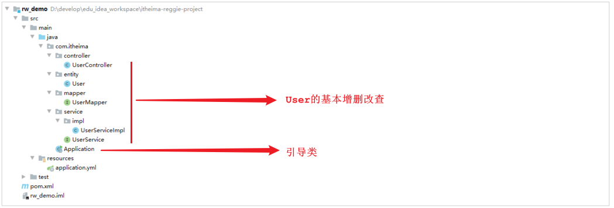
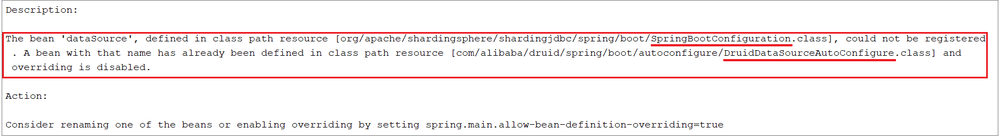
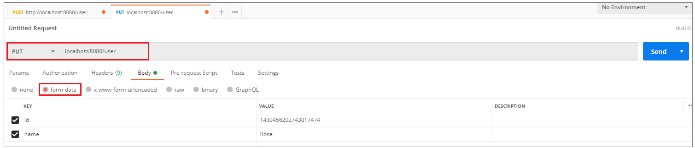

# 项目问题

## 问题描述

在前面基础功能实现的过程中，我们后台管理系统及移动端的用户，在进行数据访问时，都是直接操作数据库MySQL的。结构如下图： 


而在当前，MySQL服务器只有一台，那么就可能会存在如下问题： 

- 读和写所有压力都由一台数据库承担，压力大

- 数据库服务器磁盘损坏则数据丢失，单点故障


## 解决方案

为了解决上述提到的两个问题，我们可以准备两台MySQL，一台主(Master)服务器，一台从(Slave)服务器，主库的数据变更，需要同步到从库中(主从复制)。

而用户在访问我们项目时：

- 如果是**写操作(insert、update、delete)**，则直接操作**主库**
- 如果是**读(select)操作**，则直接操作**从库**(在这种读写分离的结构中，从库是可以有多个的)

这种结构我们称为**读写分离** 。


# MySQL主从复制

MySQL数据库默认是支持主从复制的，不需要借助于其他的技术，我们只需要在数据库中简单的配置即可。

## 介绍

MySQL主从复制是一个**异步**的复制过程，底层是基于Mysql数据库自带的 **二进制日志** 功能。

MySQL主从复制就是一台或多台MySQL数据库（slave，即**从库**）从另一台MySQL数据库（master，即**主库**）进行日志的复制，然后再解析日志并应用到自身，最终实现 **从库** 的数据和 **主库** 的数据保持一致。

MySQL主从复制是MySQL数据库自带功能，无需借助第三方工具。

> **二进制日志：** 二进制日志（BINLOG）记录了所有的 DDL（数据定义语言）语句和 DML（数据操纵语言）语句，但是不包括数据查询语句。此日志对于灾难时的数据恢复起着极其重要的作用，MySQL的主从复制， 就是通过该binlog实现的。默认MySQL是未开启该日志的。

## 原理

**MySQL的主从复制原理如下：** 


MySQL复制过程分成三步：

1. MySQL master 将数据变更写入二进制日志( binary log)

2. slave将master的binary log拷贝到它的中继日志（relay log）

3. slave重做中继日志中的事件，将数据变更反映它自己的数据

## 入门案例

### 准备工作

提前准备两台服务器，并且在服务器中安装MySQL，服务器的信息如下：

| 数据库 | IP              | 数据库版本 |
| ------ | --------------- | ---------- |
| Master | 192.168.200.200 | 5.7.25     |
| Slave  | 192.168.200.201 | 5.7.25     |

**并在两台服务器上做如下准备工作:** 

1. 防火墙开放3306端口号

```
firewall-cmd --zone=public --add-port=3306/tcp --permanent

firewall-cmd --zone=public --list-ports
```


2. 并将两台数据库服务器启动起来：

```
systemctl start mysqld
```

登录MySQL，验证是否正常启动


### 主库配置

这里以 `192.168.200.200` 服务器为主库

**1. 修改Mysql数据库的配置文件/etc/my.cnf**

在最下面增加配置: 

```
log-bin=mysql-bin   #[必须]启用二进制日志
server-id=200       #[必须]服务器唯一ID(唯一即可)
```


**2. 重启Mysql服务**

执行指令： 

```
 systemctl restart mysqld
```


**3. 创建数据同步的用户并授权**

登录mysql，并执行如下指令，创建用户并授权：

```sql
GRANT REPLICATION SLAVE ON *.* to 'xiaoming'@'%' identified by 'Root@123456';
```

注：上面SQL的作用是创建一个用户 xiaoming ，密码为 Root@123456 ，并且给xiaoming用户授予REPLICATION SLAVE权限。常用于建立复制时所需要用到的用户权限，也就是slave必须被master授权具有该权限的用户，才能通过该用户复制。


> MySQL密码复杂程度说明: 
>
> 
> ​	目前mysql5.7默认密码校验策略等级为 MEDIUM , 该等级要求密码组成为: 数字、小写字母、大写字母 、特殊字符、长度至少8位


**4. 登录Mysql数据库，查看master同步状态**

执行下面SQL，记录下结果中**File**和**Position**的值

```
show master status;
```


注：上面SQL的作用是查看Master的状态，执行完此SQL后不要再执行任何操作


### 从库配置

这里以 `192.168.200.201` 服务器为主库

**1. 修改Mysql数据库的配置文件/etc/my.cnf**

```
server-id=201 	#[必须]服务器唯一ID
```


**2. 重启Mysql服务**

```
systemctl restart mysqld
```


**3. 登录Mysql数据库，设置主库地址及同步位置**

```
change master to master_host='192.168.200.200',master_user='xiaoming',master_password='Root@123456',master_log_file='mysql-bin.000001',master_log_pos=154;

start slave;
```

参数说明： 
- master_host : 主库的IP地址
- master_user : 访问主库进行主从复制的用户名(上面在主库创建的)
- master_password : 访问主库进行主从复制的用户名对应的密码
- master_log_file : 从哪个日志文件开始同步(上述查询master状态中展示的有)
- master_log_pos : 从指定日志文件的哪个位置开始同步(上述查询master状态中展示的有)


**4. 查看从数据库的状态**

```
show slave status;
```

然后通过状态信息中的 Slave_IO_running 和 Slave_SQL_running 可以看出主从同步是否就绪，如果这两个参数全为Yes，表示主从同步已经配置完成。


> MySQL命令行技巧： 
> \G : 在MySQL的sql语句后加上\G，表示将查询结果进行按列打印，可以使每个字段打印到单独的行。即将查到的结构旋转90度变成纵向；


### 测试

主从复制的环境, 已经搭建好了, 接下来我们可以通过Navicat连接上两台MySQL服务器,进行测试。

测试时，我们只需要在主库Master执行操作，查看从库Slave中是否将数据同步过去即可。

1. 在master中创建数据库itcast, 刷新slave查看是否可以同步过去


2. 在master的itcast数据下创建user表, 刷新slave查看是否可以同步过去


3. 在master的user表中插入一条数据, 刷新slave查看是否可以同步过去


# 读写分离

## 介绍

面对日益增加的系统访问量，数据库的吞吐量面临着巨大瓶颈。 对于同一时刻有大量并发读操作和较少写操作类型的应用系统来说，将数据库拆分为**主库**和**从库**，主库负责处理事务性的增删改操作，从库负责处理查询操作，能够有效的避免由数据更新导致的行锁，使得整个系统的查询性能得到极大的改善。


**通过读写分离可以降低单台数据库的访问压力, 提高访问效率，也可以避免单机故障**。

MySQL主从复制的结构，我们在[主从复制](#mysql主从复制)已经完成了，那么我们在项目中，如何通过Java代码来完成读写分离呢？如何在执行select的时候查询从库，而在执行insert、update、delete的时候，操作主库呢？

这个时候，我们就需要介绍一个新的技术**ShardingJDBC**。


## ShardingJDBC

Sharding-JDBC定位为轻量级Java框架，在Java的JDBC层提供的额外服务。 它使用客户端直连数据库，以jar包形式提供服务，无需额外部署和依赖，可理解为增强版的JDBC驱动，完全兼容JDBC和各种ORM框架。

使用Sharding-JDBC可以在程序中轻松的实现数据库读写分离。

Sharding-JDBC具有以下几个特点： 

- 适用于任何基于JDBC的ORM框架，如：JPA, Hibernate, Mybatis, Spring JDBC Template或直接使用JDBC。

- 支持任何第三方的数据库连接池，如：DBCP, C3P0, BoneCP, Druid, HikariCP等。

- 支持任意实现JDBC规范的数据库。目前支持MySQL，Oracle，SQLServer，PostgreSQL以及任何遵循SQL92标准的数据库。


### 依赖

```xml
<dependency>
    <groupId>org.apache.shardingsphere</groupId>
    <artifactId>sharding-jdbc-spring-boot-starter</artifactId>
    <version>4.0.0-RC1</version>
</dependency>
```

## 入门案例

### 数据库环境

在主库中创建一个**数据库rw**, 并且创建一张表， 该数据库及表结构创建完毕后会自动同步至从数据库，SQL语句如下： 

```SQL
create database rw default charset utf8mb4;

use rw;

CREATE TABLE `user` (
  `id` int(11) NOT NULL AUTO_INCREMENT,
  `name` varchar(255) DEFAULT NULL,
  `age` int(11) DEFAULT NULL,
  `address` varchar(255) DEFAULT NULL,
  PRIMARY KEY (`id`)
) ENGINE=InnoDB DEFAULT CHARSET=utf8mb4;
```


### 初始工程

我们本案例主要是演示一下读写分离操作，对于基本的增删改查的业务操作，我们就不再去编写了，我们可以直接使用下面提供的demo工程，在demo工程中，我们已经完成了user的增删改查操作，具体的工程结构如下：



 ### 读写分离配置

1.在pom.xml中增加shardingJdbc的maven坐标

```xml
<dependency>
    <groupId>org.apache.shardingsphere</groupId>
    <artifactId>sharding-jdbc-spring-boot-starter</artifactId>
    <version>4.0.0-RC1</version>
</dependency>
```


2.在application.yml中增加数据源的配置

```yml
spring:
  shardingsphere:
    datasource:
      names:
        master,slave
      # 主数据源
      master:
        type: com.alibaba.druid.pool.DruidDataSource
        driver-class-name: com.mysql.cj.jdbc.Driver
        url: jdbc:mysql://192.168.200.200:3306/rw?characterEncoding=utf-8
        username: root
        password: root
      # 从数据源
      slave:
        type: com.alibaba.druid.pool.DruidDataSource
        driver-class-name: com.mysql.cj.jdbc.Driver
        url: jdbc:mysql://192.168.200.201:3306/rw?characterEncoding=utf-8
        username: root
        password: root
    masterslave:
      # 读写分离配置
      load-balance-algorithm-type: round_robin #轮询
      # 最终的数据源名称
      name: dataSource
      # 主库数据源名称
      master-data-source-name: master
      # 从库数据源名称列表，多个逗号分隔
      slave-data-source-names: slave
    props:
      sql:
        show: true #开启SQL显示，默认false
```


配置解析: 


3.在application.yml中增加配置

```yml
spring:  
  main:
    allow-bean-definition-overriding: true
```

该配置项的目的,就是如果当前项目中存在同名的bean,后定义的bean会覆盖先定义的。

如果不配置该项，项目启动之后将会报错：



报错信息表明，在声明 `org.apache.shardingsphere.shardingjdbc.spring.boot` 包下的**SpringBootConfiguration**中的dataSource这个bean时出错, 原因是有一个同名的 dataSource 的bean在`com.alibaba.druid.spring.boot.autoconfigure`包下的**DruidDataSourceAutoConfigure**类加载时已经声明了。


而我们需要用到的是 **shardingjdbc** 包下的dataSource，所以我们需要配置上述属性，让后加载的覆盖先加载的。

### 测试

我们使用shardingjdbc来实现读写分离，直接通过上述简单的配置就可以了。配置完毕之后，我们就可以重启服务，通过postman来访问controller的方法，来完成用户信息的增删改查，我们可以通过debug及日志的方式来查看每一次执行增删改查操作，使用的是哪个数据源，连接的是哪个数据库。

### 保存数据


控制台输出日志，可以看到操作master主库：


### 修改数据



控制台输出日志，可以看到操作master主库：


### 查询数据


控制台输出日志，可以看到操作slave主库： 


### 删除数据


控制台输出日志，可以看到操作master主库：


