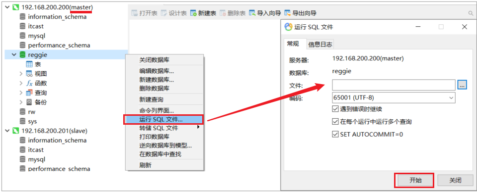
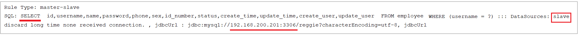
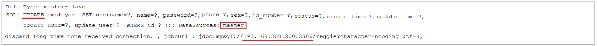
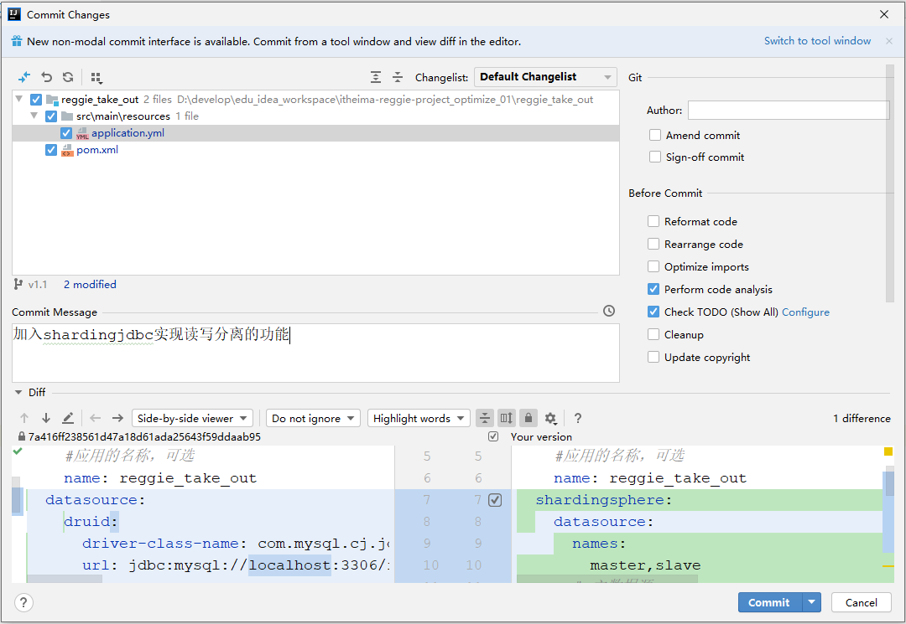

# 实现读写分离

## 数据库环境准备

直接使用我们前面在虚拟机中搭建的[主从复制的数据库环境](../../../../JAVA/3.Web框架/项目%20&%20实战案例/瑞吉外卖/33.主从复制%20&%20读写分离.md#准备工作)即可。

在主库中创建瑞吉外卖项目的业务数据库reggie, 并导入相关表结构和数据(我们可以将自己之前在本地开发时使用的数据库数据导出, 然后导入到服务器中的主库即可)。

1.将自己本地的reggie数据库的数据导出SQL文件


这样做的话，我们之前自己开发时，添加的测试数据都还在的，便于测试。

2.在主数据库master中，创建数据库reggie，并导入该SQL文件

master中创建数据库，会自动同步至slave从库


在master的reggie中导入sql文件




## 创建Git分支

目前默认git中有两个分支master 和 v1.0 ，我们接下来进行读写分离的优化，就不在master和v1.0分支来操作了，我们需要在git上创建一个单独的分支v1.1，读写分离的优化，我们就在该分支上进行操作。具体创建分支的操作，和前面[缓存创建分支](../../../../JAVA/3.Web框架/项目%20&%20实战案例/瑞吉外卖/28.项目优化之缓存.md#创建分支)演示的一致。

当前创建的v1.1分支，是基于master分支创建出来的，所以目前master分支的代码， 和v1.1分支的代码是完全一样的，接下来把v1.1的代码也推送至远程仓库。

## 读写分离配置

**1.在项目的pom.xml增加依赖**

```xml
<dependency>
    <groupId>org.apache.shardingsphere</groupId>
    <artifactId>sharding-jdbc-spring-boot-starter</artifactId>
    <version>4.0.0-RC1</version>
</dependency>
```


**2.在项目的application.yml中配置数据源相关信息**

```yml
spring:
  shardingsphere:
    datasource:
      names:
        master,slave
      # 主数据源
      master:
        type: com.alibaba.druid.pool.DruidDataSource
        driver-class-name: com.mysql.cj.jdbc.Driver
        url: jdbc:mysql://192.168.200.200:3306/reggie?characterEncoding=utf-8
        username: root
        password: root
      # 从数据源
      slave:
        type: com.alibaba.druid.pool.DruidDataSource
        driver-class-name: com.mysql.cj.jdbc.Driver
        url: jdbc:mysql://192.168.200.201:3306/reggie?characterEncoding=utf-8
        username: root
        password: root
    masterslave:
      # 读写分离配置
      load-balance-algorithm-type: round_robin #轮询
      # 最终的数据源名称
      name: dataSource
      # 主库数据源名称
      master-data-source-name: master
      # 从库数据源名称列表，多个逗号分隔
      slave-data-source-names: slave
    props:
      sql:
        show: true #开启SQL显示，默认false
  main:
    allow-bean-definition-overriding: true
```


## 功能测试

配置完毕之后，我们启动项目进行测试，直接访问系统管理后台的页面，然后执行相关业务操作，看控制台输出的日志信息即可。

查询操作： 




更新操作：





插入操作：


删除操作：


## Git合并代码

读写分离的功能我们已经实现完毕了，那么接下来我们就可以将当前分支v1.1代码提交并推送到远程仓库。




然后，再将v1.1的代码，合并到master分支，然后推送至远程仓库。


