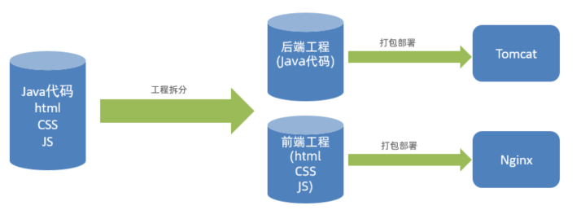

# 项目问题

## 问题描述

当前项目中，前端代码和后端代码混合在一起 :

主要存在以下几点问题： 

-  开发人员同时负责前端和后端代码开发，分工不明确

-  开发效率低

-  前后端代码混合在一个工程中，不便于管理

-  对开发人员要求高(既会前端，又会后端)，人员招聘困难

## 解决方式

为了解决上述提到的问题，现在比较主流的开发方式，就是**前后端分离开发**，前端人员开发前端的代码，后端开发人员开发服务端的业务功能，分工明确，各司其职。

# 前后端分离开发

## 介绍

**前后端分离开发**，就是在项目开发过程中，对于前端代码的开发由专门的前端开发人员负责，后端代码则由后端开发人员负责，这样可以做到分工明确、各司其职，提高开发效率，前后端代码并行开发，可以加快项目开发进度。

目前，前后端分离开发方式已经被越来越多的公司所采用，成为当前项目开发的主流开发方式。

## 前端工程 & 后端工程

前后端分离开发后，从工程结构上也会发生变化，即前后端代码不再混合在同一个maven工程中，而是分为 **前端工程** 和 **后端工程** 。

前后端分离之后，不仅工程结构变化，后期项目上线部署时，与之前也不同:

- 之前: 前后端代码都混合在一起，我们只需要将前端和后端的代码统一打成jar包，直接运行就可以了。 

- 现在: 拆分为前后端分离的项目后，最终部署时:
	- 后端工程会打成一个jar包，运行在Tomcat中(Springboot内嵌的Tomcat)
	- 前端工程的静态资源，会直接部署在Nginx中进行访问

## 开发流程

前后端分离开发后面临一个问题，就是前端开发人员和后端开发人员如何进行配合来共同开发一个项目？

可以按照如下流程进行：

1. **定制接口**: 这里所说的接口不是我们之前在service， mapper层定义的interface； **这里的接口(API接口)就是一个http的请求地址**，主要就是去定义：请求路径、请求方式、请求参数、响应数据等内容。

2. **前后端并行开发**: 依据定义好的接口信息，前端人员开发前端的代码，服务端人员开发服务端的接口； 在开发中前后端都需要进行测试，后端需要通过对应的工具来进行接口的测试，前端需要根据接口定义的参数进行Mock数据模拟测试。

3. **联调**: 当前后端都开发完毕并且自测通过之后，就可以进行前后端的联调测试了，在这一阶段主要就是校验接口的参数格式。

4. **提测**: 前后端联调测试通过之后，就可以将项目部署到测试服务器，进行自动化测试了。

