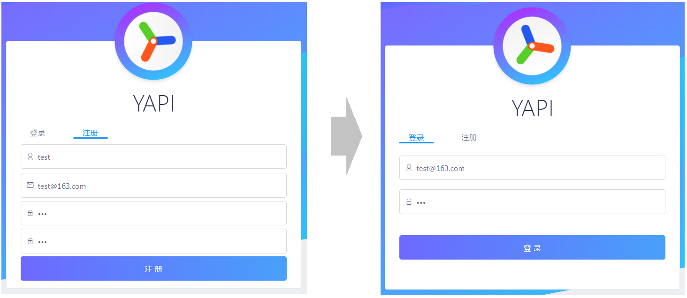
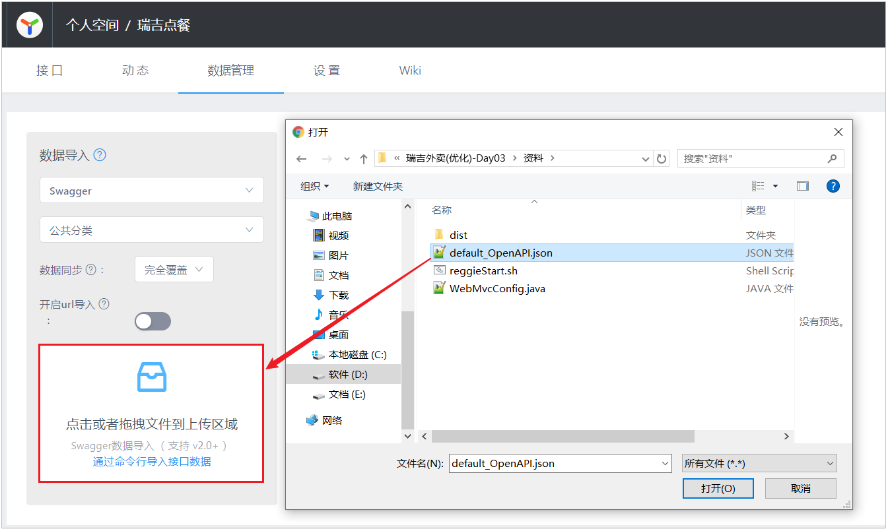
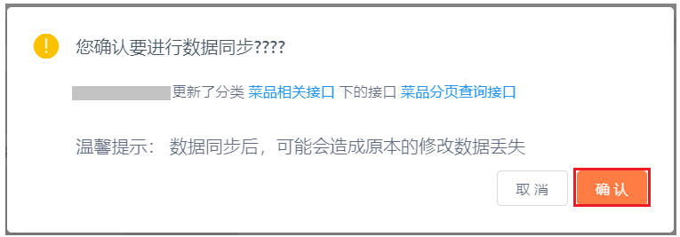
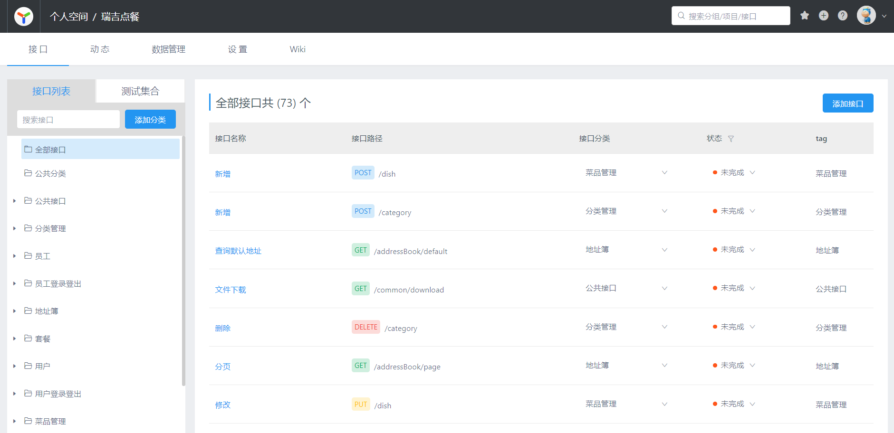
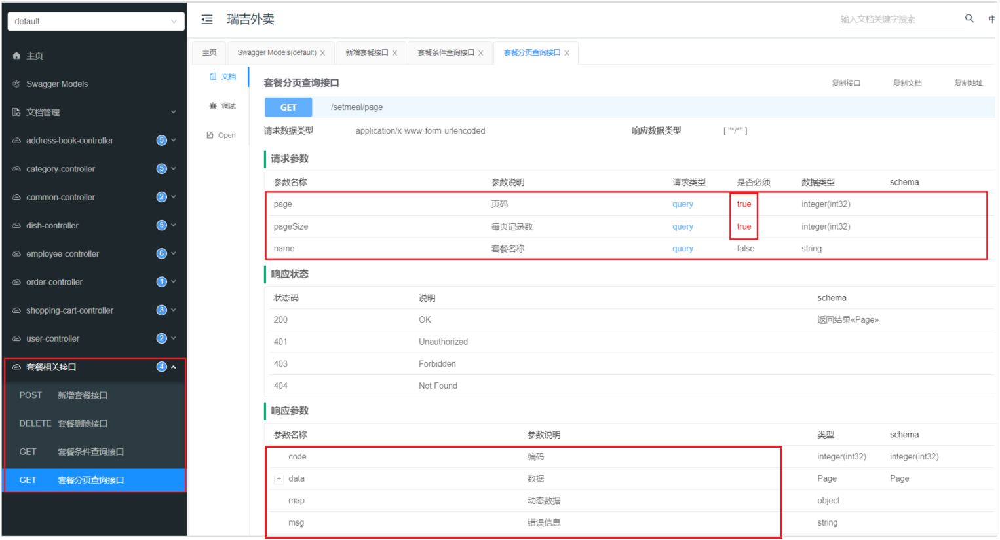

# YApi

YApi 是高效、易用、功能强大的 api 管理平台，旨在为开发、产品、测试人员提供更优雅的接口管理服务。可以帮助开发者轻松创建、发布、维护 API，YApi 还为用户提供了优秀的交互体验，开发人员只需利用平台提供的接口数据写入工具以及简单的点击操作就可以实现接口的管理。

关于YApi更详细的内容可参考:[YApi](../../../../undefined)

这里是根据黑马瑞吉外卖项目项目接口文档的使用案例进行的操作.

**要使用YApi，项目组需要自己进行部署**，在该项目中是使用黑马所提供的平台进行测试，域名： https://mock-java.itheima.net/

## 注册登录

首先是注册账号，登录平台



## 定义接口

登录到Yapi平台之后，我们可以创建项目，在项目下创建接口分类，在对应的分类中添加接口。

### 创建项目


### 添加分类

在当前项目中有针对于员工、菜品、套餐、订单的操作，我们在进行接口维护时，可以针对接口进行分类，如果没有对应的分类，我们自己添加分类。


### 添加接口


接口基本信息录入之后，添加提交，就可以看到该接口的基本信息：


但是目前，接口中我们并未指定请求参数，响应数据等信息，我们可以进一步点击编辑，对该接口详情进行编辑处理。


### 运行接口

Yapi也提供了接口测试功能，当我们接口编辑完毕后，后端服务的代码开发完毕，启动服务，就可以使用Yapi进行接口测试了。


注意： 由于菜品分页查询接口，是需要登录后才可以访问的，所以在测试该接口时，需要先请求员工管理接口中的登录接口，登录完成后，再访问该接口。


## 导出接口文档

在Yapi平台中，将接口文档定义好了之后，前后端开发人员就需要根据接口文档中关于接口的描述进行前端和后端功能的开发。

在Yapi平台中我们不仅可以在线阅读文档，还可以将Yapi中维护的文档直接导出来离线查看，可以导出md，json，html格式，在导出时自行选择即可 。


而在导出的html文件或md文件中，主要描述的就是接口的基本信息， 包括： **请求路径、请求方式、接口描述、请求参数、返回数据等信息**。

展示形式如下： 


## 导入接口文档

上面我们讲解了接口文档的导出，我们也可以将外部的接口文档导入到Yapi的平台中，这样我们就不用一个接口一个接口的添加了。

我们可以将Github中的json格式的接口文档直接导入Yapi平台中来。



入过程中出现的确认弹窗，选择"确认"。



导入成功之后，我们就可以在Yapi平台查看到已导入的接口。




# Swagger

Swagger 是一个规范和完整的框架，用于生成、描述、调用和可视化 RESTful 风格的 Web 服务。更详细的内容参考:[Swagger](../../../../undefined)

直接使用Swagger, 需要按照Swagger的规范定义接口, 实际上就是编写Json文件，编写起来比较繁琐、并不方便,。而在项目中使用，我们一般会选择一些现成的框架来简化文档的编写，而这些框架是基于Swagger的，如knife4j。knife4j是为Java MVC框架集成Swagger生成Api文档的增强解决方案。而我们要使用kinfe4j，需要在pom.xml中引入如下依赖即可： 

```xml
<dependency>
    <groupId>com.github.xiaoymin</groupId>
    <artifactId>knife4j-spring-boot-starter</artifactId>
    <version>3.0.2</version>
</dependency>
```


## 使用

接下来，我们将瑞吉外卖项目集成Knife4j，来自动生成接口文档。

这里我们还是需要再创建一个新的分支v1.2，在该分支中进行knife4j的集成，集成测试完毕之后没有问题，我们再将v1.2分支合并到master。

使用knife4j，主要需要操作以下几步:

### 导坐标

导入knife4j的maven坐标

```
<dependency>
    <groupId>com.github.xiaoymin</groupId>
    <artifactId>knife4j-spring-boot-starter</artifactId>
    <version>3.0.2</version>
</dependency>
```

### 配置类

这里我们就不需要再创建一个新的配置类了，我们直接在WebMvcConfig配置类中声明即可。

1. 在该配置类中加上两个注解 @EnableSwagger2 @EnableKnife4j ,开启Swagger和Knife4j的功能。

1. 在配置类中声明一个Docket类型的bean, 通过该bean来指定生成文档的信息。

```
@Slf4j
@Configuration
@EnableSwagger2
@EnableKnife4j
public class WebMvcConfig extends WebMvcConfigurationSupport {
	
    /**
     * 设置静态资源映射
     * @param registry
     */
    @Override
    protected void addResourceHandlers(ResourceHandlerRegistry registry) {
        log.info("开始进行静态资源映射...");
        registry.addResourceHandler("/backend/**").addResourceLocations("classpath:/backend/");
        registry.addResourceHandler("/front/**").addResourceLocations("classpath:/front/");
    }
	
    /**
     * 扩展mvc框架的消息转换器
     * @param converters
     */
    @Override
    protected void extendMessageConverters(List<HttpMessageConverter<?>> converters) {
        log.info("扩展消息转换器...");
        //创建消息转换器对象
        MappingJackson2HttpMessageConverter messageConverter = new MappingJackson2HttpMessageConverter();
        //设置对象转换器，底层使用Jackson将Java对象转为json
        messageConverter.setObjectMapper(new JacksonObjectMapper());
        //将上面的消息转换器对象追加到mvc框架的转换器集合中
        converters.add(0,messageConverter);
    }
	
    @Bean
    public Docket createRestApi() {
        // 文档类型
        return new Docket(DocumentationType.SWAGGER_2)
                .apiInfo(apiInfo())
                .select()
                .apis(RequestHandlerSelectors.basePackage("com.itheima.reggie.controller"))
                .paths(PathSelectors.any())
                .build();
    }
	
    private ApiInfo apiInfo() {
        return new ApiInfoBuilder()
                .title("瑞吉外卖")
                .version("1.0")
                .description("瑞吉外卖接口文档")
                .build();
    }
}
```

注意： **Docket声明时，指定的有一个包扫描的路径，该路径指定的是Controller所在包的路径**。因为Swagger在生成接口文档时，就是根据这里指定的包路径，自动的扫描该包下的@Controller， @RestController， @RequestMapping等SpringMVC的注解，依据这些注解来生成对应的接口文档。


### 设置静态资源映射

由于Swagger生成的在线文档中，涉及到很多静态资源，这些静态资源需要添加静态资源映射，否则接口文档页面无法访问。因此需要在 **WebMvcConfig类中的addResourceHandlers方法**中增加如下配置。

```java
registry.addResourceHandler("doc.html").addResourceLocations("classpath:/META-INF/resources/");
registry.addResourceHandler("/webjars/**").addResourceLocations("classpath:/META-INF/resources/webjars/");
```

### 请求路径处理

在LoginCheckFilter中设置不需要处理的请求路径

需要将Swagger及Knife4j相关的静态资源直接放行，无需登录即可访问，否则我们就需要登录之后，才可以访问接口文档的页面。

在原有的不需要处理的请求路径中，再增加如下链接： 

```java
"/doc.html",
"/webjars/**",
"/swagger-resources",
"/v2/api-docs"
```


### 查看接口文档

经过上面的集成配置之后，我们的项目集成Swagger及Knife4j就已经完成了，接下来我们可以重新启动项目，访问接口文档，访问链接为： http://localhost:8080/doc.html


我们可以看到，在所有的Controller中提供的所有的业务增删改查的接口，全部都已经自动生成了，我们通过接口文档可以看到请求的url、请求方式、请求参数、请求实例、响应的参数，响应的示例。 并且呢，我们也可以通过这份在线的接口文档，对接口进行测试。


注意： 由于我们服务端的Controller中的业务增删改查的方法，都是必须登录之后才可以访问的，所以，我们在测试时候，也是需要先访问登录接口。登录完成之后，我们可以再访问其他接口进行测试。

### 下载接口文档

我们不仅可以在浏览器浏览生成的接口文档，Knife4j还支持离线文档，对接口文档进行下载，支持下载的格式有：markdown、html、word、openApi。


这里选择 **openApi** 格式导出来之后 , 可以很方便的导入的YApi 等Api管理系统


## 常用注解

在上面我们直接访问Knife4j的接口文档页面，可以查看到所有的接口文档信息，但是我们发现，这些接口文档分类及接口描述都是Controller的类名(驼峰命名转换而来)及方法名，而且在接口文档中，所有的请求参数，响应数据，都没有中文的描述，并不知道里面参数的含义，接口文档的可读性很差。


为了解决上述的问题，Swagger提供了很多的注解，通过这些注解，我们可以更好更清晰的描述我们的接口，包含接口的请求参数、响应数据、数据模型等。

核心的注解，主要包含以下几个： 

| 注解               | 位置             | 说明                                                         |
| ------------------ | ---------------- | ------------------------------------------------------------ |
| @Api               | 类               | 加载Controller类上,表示对类的说明                            |
| @ApiModel          | 类(通常是实体类) | 描述实体类的作用                                             |
| @ApiModelProperty  | 属性             | 描述实体类的属性                                             |
| @ApiOperation      | 方法             | 说明方法的用途、作用                                         |
| @ApiImplicitParams | 方法             | 表示一组参数说明                                             |
| @ApiImplicitParam  | 方法             | 用在@ApiImplicitParams注解中，指定一个请求参数的各个方面的属性 |

### 使用案例

#### 实体类

可以通过 @ApiModel , @ApiModelProperty 来描述实体类及属性

```
@Data
@ApiModel("套餐")
public class Setmeal implements Serializable {
    private static final long serialVersionUID = 1L;
    @ApiModelProperty("主键")
    private Long id;
    
    //分类id
    @ApiModelProperty("分类id")
    private Long categoryId;
    
    //套餐名称
    @ApiModelProperty("套餐名称")
    private String name;

    //套餐价格
    @ApiModelProperty("套餐价格")
    private BigDecimal price;

    //状态 0:停用 1:启用
    @ApiModelProperty("状态")
    private Integer status;

    //编码
    @ApiModelProperty("套餐编号")
    private String code;

    //描述信息
    @ApiModelProperty("描述信息")
    private String description;

    //图片
    @ApiModelProperty("图片")
    private String image;

    @TableField(fill = FieldFill.INSERT)
    private LocalDateTime createTime;

    @TableField(fill = FieldFill.INSERT_UPDATE)
    private LocalDateTime updateTime;

    @TableField(fill = FieldFill.INSERT)
    private Long createUser;

    @TableField(fill = FieldFill.INSERT_UPDATE)
    private Long updateUser;
}
```

#### 响应实体R

```
@Data
@ApiModel("返回结果")
public class R<T> implements Serializable{

    @ApiModelProperty("编码")
    private Integer code; //编码：1成功，0和其它数字为失败

    @ApiModelProperty("错误信息")
    private String msg; //错误信息

    @ApiModelProperty("数据")
    private T data; //数据

    @ApiModelProperty("动态数据")
    private Map map = new HashMap(); //动态数据
	
	//省略静态方法 ....
}    
```

#### Controller类及其方法

描述Controller、方法及其方法参数，可以通过注解： @Api， @APIOperation， @ApiImplicitParams, @ApiImplicitParam

```
@RestController
@RequestMapping("/setmeal")
@Slf4j
@Api(tags = "套餐相关接口")
public class SetmealController {

    @Autowired
    private SetmealService setmealService;
    @Autowired
    private CategoryService categoryService;
    @Autowired
    private SetmealDishService setmealDishService;

    /**
     * 新增套餐
     * @param setmealDto
     * @return
     */
    @PostMapping
    @CacheEvict(value = "setmealCache",allEntries = true)
    @ApiOperation(value = "新增套餐接口")
    public R<String> save(@RequestBody SetmealDto setmealDto){
        log.info("套餐信息：{}",setmealDto);

        setmealService.saveWithDish(setmealDto);

        return R.success("新增套餐成功");
    }

    /**
     * 套餐分页查询
     * @param page
     * @param pageSize
     * @param name
     * @return
     */
    @GetMapping("/page")
    @ApiOperation(value = "套餐分页查询接口")
    @ApiImplicitParams({
            @ApiImplicitParam(name = "page",value = "页码",required = true),
            @ApiImplicitParam(name = "pageSize",value = "每页记录数",required = true),
            @ApiImplicitParam(name = "name",value = "套餐名称",required = false)
    })
    public R<Page> page(int page,int pageSize,String name){
        //分页构造器对象
        Page<Setmeal> pageInfo = new Page<>(page,pageSize);
        Page<SetmealDto> dtoPage = new Page<>();

        LambdaQueryWrapper<Setmeal> queryWrapper = new LambdaQueryWrapper<>();
        //添加查询条件，根据name进行like模糊查询
        queryWrapper.like(name != null,Setmeal::getName,name);
        //添加排序条件，根据更新时间降序排列
        queryWrapper.orderByDesc(Setmeal::getUpdateTime);

        setmealService.page(pageInfo,queryWrapper);

        //对象拷贝
        BeanUtils.copyProperties(pageInfo,dtoPage,"records");
        List<Setmeal> records = pageInfo.getRecords();

        List<SetmealDto> list = records.stream().map((item) -> {
            SetmealDto setmealDto = new SetmealDto();
            //对象拷贝
            BeanUtils.copyProperties(item,setmealDto);
            //分类id
            Long categoryId = item.getCategoryId();
            //根据分类id查询分类对象
            Category category = categoryService.getById(categoryId);
            if(category != null){
                //分类名称
                String categoryName = category.getName();
                setmealDto.setCategoryName(categoryName);
            }
            return setmealDto;
        }).collect(Collectors.toList());

        dtoPage.setRecords(list);
        return R.success(dtoPage);
    }

    /**
     * 删除套餐
     * @param ids
     * @return
     */
    @DeleteMapping
    @CacheEvict(value = "setmealCache",allEntries = true)
    @ApiOperation(value = "套餐删除接口")
    public R<String> delete(@RequestParam List<Long> ids){
        log.info("ids:{}",ids);

        setmealService.removeWithDish(ids);

        return R.success("套餐数据删除成功");
    }

    /**
     * 根据条件查询套餐数据
     * @param setmeal
     * @return
     */
    @GetMapping("/list")
    @Cacheable(value = "setmealCache",key = "#setmeal.categoryId + '_' + #setmeal.status")
    @ApiOperation(value = "套餐条件查询接口")
    public R<List<Setmeal>> list(Setmeal setmeal){
        LambdaQueryWrapper<Setmeal> queryWrapper = new LambdaQueryWrapper<>();
        queryWrapper.eq(setmeal.getCategoryId() != null,Setmeal::getCategoryId,setmeal.getCategoryId());
        queryWrapper.eq(setmeal.getStatus() != null,Setmeal::getStatus,setmeal.getStatus());
        queryWrapper.orderByDesc(Setmeal::getUpdateTime);

        List<Setmeal> list = setmealService.list(queryWrapper);

        return R.success(list);
    }
}

```

#### 测试

我们上述通过Swagger的注解，对实体类及实体类中的属性，以及Controller和Controller的方法进行描述，接下来我们重新启动服务，然后看一下自动生成的接口文档有何变化。



在接口文档的页面中，我们可以看到接口的中文描述，清晰的看到每一个接口是做什么的，接口方法参数什么含义，参数是否是必填的，响应结果的参数是什么含义等，都可以清楚的描述出来。

总之，我们要想清晰的描述一个接口，就需要借助于Swagger给我们提供的注解。


