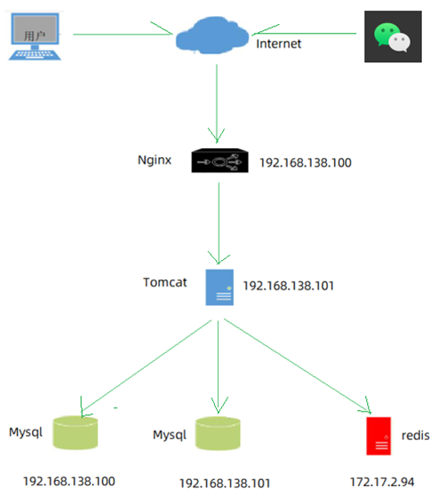
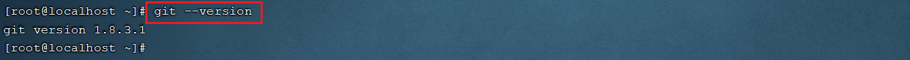
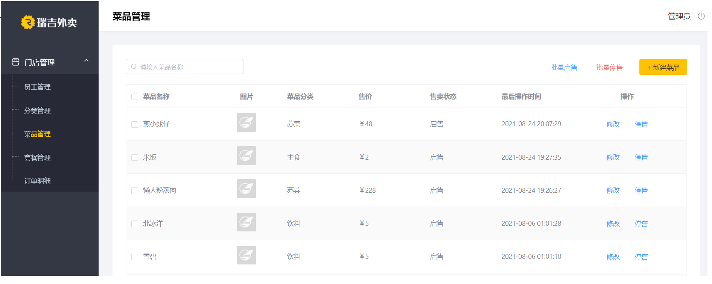
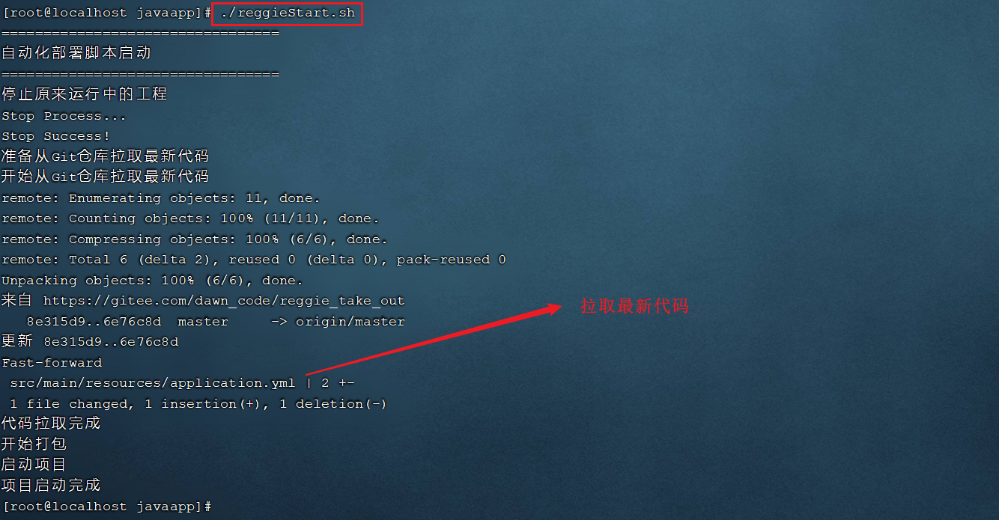

# 项目部署

项目的部署，包含前端项目的部署，及后端项目的部署。

## 部署架构

PC端： 主要是为餐厅的员工及管理员使用的后台管理系统，对分类、菜品、套餐信息进行维护。

移动端： 可以基于微信公众号或小程序实现，这里课上并未实现，这部分的工作是前端开发人员需要开发的。



前端部署服务器： Nginx

后端部署服务器： Tomcat(内嵌)

## 环境说明

由于服务器数量有限，就使用这三台服务器，具体的软件规划如下: 

| 服务器          | 软件                                                         | 名称    |
| --------------- | ------------------------------------------------------------ | ------- |
| 192.168.138.100 | Nginx(部署前端项目、配置反向代理)，MySQL(主从复制的主库)     | 服务器A |
| 192.168.138.101 | JDK1.8、Git、Maven、jar(项目jar包基于内嵌Tomcat运行)、MySQL(主从复制的从库) | 服务器B |
| 172.17.2.94     | Redis(缓存中间件)                                            | 服务器C |


## 前端部署

### 上传前端目录

在服务器A(192.168.138.100)中安装Nginx，将资料中的dist目录上传到Nginx的html目录下


将整个dist目录上传至/usr/local/nginx/html目录下


### 修改nginx.conf

将nginx.conf配置文件中，将原有的监听80, 82, 8080端口号 的虚拟主机注释掉，引入如下的配置信息：

````
    server {
        listen       80;
        server_name  localhost;

        location / {
            root   html/dist;
            index  index.html;
        }
		
		location ^~ /api/ {
			rewrite ^/api/(.*)$ /$1 break;
			proxy_pass http://192.168.138.101:8080;
		}
		
        location = /50x.html {
            root   html;
        }
    }
````


### 访问测试

通过nginx访问前端工程: http://192.168.138.100


## 反向代理配置

前端工程部署完成之后，我们可以正常的访问到系统的登录页面，点击登录按钮，可以看到服务端发起的请求，请求信息如下： 


而大家知道在我们之前开发的工程中，是没有/api这个前缀的，这时在不修改服务端代码的情况下，如何处理该请求呢? 

实际上，通过Nginx的就可以轻松解决这个问题。在上述我们配置的nginx.conf中，除了配置了静态资源的加载目录以外，我们还配置了一段**反向代理**的配置，配置信息如下： 

```
location ^~ /api/ {
    rewrite ^/api/(.*)$ /$1 break;
    proxy_pass http://192.168.138.101:8080;
}
```

这一段配置代表，如果请求当前Nginx，并且请求的路径如果是 **/api/** 开头，将会被该location处理。而在该location中，主要配置了两块儿信息： rewrite(url重写) 和 proxy_pass(反向代理)。

### rewrite

路径重写rewrite:

```
rewrite ^/api/(.*)$ /$1 break;
```

这里写的是一个正则表达式，代表如果请求路径是以 `/api/` 开头，后面的请求路径任意，此时将原始的url路径重写为 `/$1`，这里的`$1`指代的就是通配符 .* 这一块的内容。

比如： `/api/employee/login ------> ^/api/(.*)$ --------> 此时 (.*) 匹配的就是 employee/login ------> 最终重写为/$1 : /employee/login`

### proxy_pass

反向代理proxy_pass:

```
proxy_pass http://192.168.138.101:8080;
```


路径重写后的请求，将会转发到后端的 http://192.168.138.101:8080 服务器中。 而这台服务器中，就部署的是我们的后端服务。


## 后端部署

### 确认环境

在服务器B(192.168.138.101)中安装JDK、Git、Maven、MySQL

- 确认JDK环境

- 确认Git环境

- 确认Maven环境


### 拉取代码

 将我们开发完成的代码推送至远程仓库, 然后在服务器B中克隆下来

```
#创建java代码存放目录
mkdir -p /usr/local/javaapp

#切换目录
cd /usr/local/javaapp

#克隆代码 , 需要使用自己的远程仓库
git clone https://gitee.com/ChuanZhiBoKe/reggie_take_out.git 
```


### 上传脚本文件

将资料中提供的**reggieStart.sh**文件上传到服务器B，通过chmod命令设置执行权限


### 部署项目

 执行**reggieStart.sh**脚本文件，自动部署项目


执行完shell脚本之后，我们可以通过 `ps -ef|grep java` 指令，查看服务是否启动。


### 访问测试

访问系统测试 : http://192.168.138.101/



## 图片展示问题

在上述的测试中，我们发现菜品的图片无法正常展示。原因是因为，在我们的配置文件中，图片信息依然是从 D:/img 中加载的，但是在Linux服务器中，是不存在D盘的。


### 修改存储目录

将文件存储目录修改为：

```
reggie:
  path: /usr/local/img/
```

 修改完成之后，需要将变动的代码提交到本地仓库，并推送至远程仓库。


### 重新部署

执行shell脚本,进行自动化部署



### 上传图片

将本地的测试图片文件夹img(整个文件夹)上传到服务器B的/usr/local目录下


### 访问测试

访问测试: http://192.168.138.101/


