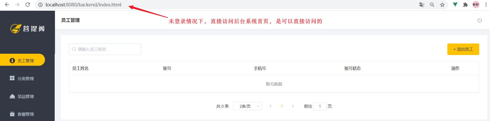

# 完善登录功能

在[后台系统功能之登录退出](../../../../JAVA/3.Web框架/项目%20&%20实战案例/瑞吉外卖/3.后台系统功能之登录退出.md)已经完成了后台系统的员工登录功能开发，但是目前还存在一个问题，接下来我们来说明一个这个问题， 以及如何处理。

## 问题描述

用户如果不登录，直接访问系统首页面，照样可以正常访问。



上述这种设计并不合理，我们希望看到的效果应该是: **只有登录成功后才可以访问系统中的页面**，如果没有登录, 访问系统中的任何界面都直接跳转到登录页面。


这时候就可以使用我们之前讲解过的**过滤器、拦截器**来实现，在过滤器、拦截器中拦截前端发起的请求，判断用户是否已经完成登录，如果没有登录则返回提示信息，跳转到登录页面。


1. 创建自定义过滤器LoginCheckFilter
1. 在启动类上加入注解@ServletComponentScan
1. 完善过滤器的处理逻辑


## 处理逻辑分析


1. 获取本次请求的URI

1. 判断本次请求, 是否需要登录, 才可以访问

1. 如果不需要，则直接放行

1. 判断登录状态，如果已登录，则直接放行

1. 如果未登录, 则返回未登录结果


如果未登录,我们需要给前端返回什么样的结果呢? 这个时候, 我们可以去看看前端是如何处理的:


## 代码实现

### 定义登录校验过滤器

自定义一个**过滤器 LoginCheckFilter** 并实现 Filter 接口, 在doFilter方法中完成校验的逻辑。

所属包: cn.suliu.reggie.filter

那么接下来, 我们就根据上述分析的步骤, 来完成具体的功能代码实现: 

```java
/**
 * 检查用户是否已经完成登录
 */
@WebFilter(filterName = "loginCheckFilter",urlPatterns = "/*")
@Slf4j
public class LoginCheckFilter implements Filter{
    //路径匹配器，支持通配符
    public static final AntPathMatcher PATH_MATCHER = new AntPathMatcher();

    @Override
    public void doFilter(ServletRequest servletRequest, ServletResponse servletResponse, FilterChain filterChain) throws IOException, ServletException {
        HttpServletRequest request = (HttpServletRequest) servletRequest;
        HttpServletResponse response = (HttpServletResponse) servletResponse;

        //1、获取本次请求的URI
        String requestURI = request.getRequestURI();// /backend/index.html

        log.info("拦截到请求：{}",requestURI);

        //定义不需要处理的请求路径
        String[] urls = new String[]{
                "/employee/login",
                "/employee/logout",
                "/backend/**",
                "/front/**"
        };
		
        //2、判断本次请求是否需要处理
        boolean check = check(urls, requestURI);

        //3、如果不需要处理，则直接放行
        if(check){
            log.info("本次请求{}不需要处理",requestURI);
            filterChain.doFilter(request,response);
            return;
        }
		
        //4、判断登录状态，如果已登录，则直接放行
        if(request.getSession().getAttribute("employee") != null){
            log.info("用户已登录，用户id为：{}",request.getSession().getAttribute("employee"));
            filterChain.doFilter(request,response);
            return;
        }

        log.info("用户未登录");
        //5、如果未登录则返回未登录结果，通过输出流方式向客户端页面响应数据
        response.getWriter().write(JSON.toJSONString(R.error("NOTLOGIN")));
        return;

    }

    /**
     * 路径匹配，检查本次请求是否需要放行
     * @param urls
     * @param requestURI
     * @return
     */
    public boolean check(String[] urls,String requestURI){
        for (String url : urls) {
            boolean match = PATH_MATCHER.match(url, requestURI);
            if(match){
                return true;
            }
        }
        return false;
    }
}
```


定义不需要处理的请求路径时,其中`/backend/**、/front/**`是访问静态资源我们无需拦截

```
        String[] urls = new String[]{
                "/employee/login",
                "/employee/logout",
                "/backend/**",
                "/front/**"
        };
```


#### AntPathMatcher

AntPathMatcher 是 Spring中提供的路径匹配器 , 支持通配符

```
public static final AntPathMatcher PATH_MATCHER = new AntPathMatcher();
```

**通配符规则:** 		

| 符号 | 含义                   |
| ---- | ---------------------- |
| ?    | 匹配一个字符           |
| *    | 匹配0个或多个字符      |
| **   | 匹配0个或多个目录/字符 |


### 开启组件扫描

需要在引导类上, 加上Servlet组件扫描的注解, 来扫描过滤器配置的@WebFilter注解， 扫描上之后， 过滤器在运行时就生效了。

```
@Slf4j
@SpringBootApplication
@ServletComponentScan
public class ReggieApplication {
    public static void main(String[] args) {
        SpringApplication.run(ReggieApplication.class,args);
        log.info("项目启动成功...");
    }
}
```

#### @ServletComponentScan

在SpringBoot项目中, 在引导类/配置类上加了 **@ServletComponentScan注解** 后, 会自动扫描项目中(当前包及其子包下)的@WebServlet , @WebFilter , @WebListener 注解, 自动注册Servlet的相关组件 ;

## 功能测试

代码编写完毕之后，我们需要将工程重启一下，然后在浏览器地址栏直接输入系统管理后台首页，然后看看是否可以跳转到登录页面即可。我们也可以通过debug的形式来跟踪一下代码执行的过程。


对于前端的代码, 也可以进行debug调试。

F12打开浏览器的调试工具, 找到我们前面提到的request.js, 在request.js的响应拦截器位置打上断点。


