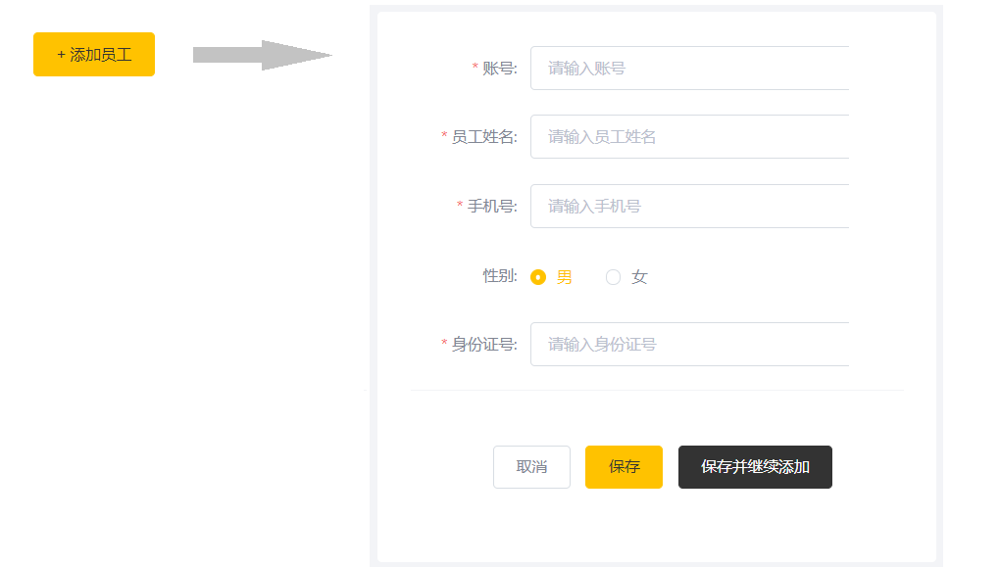
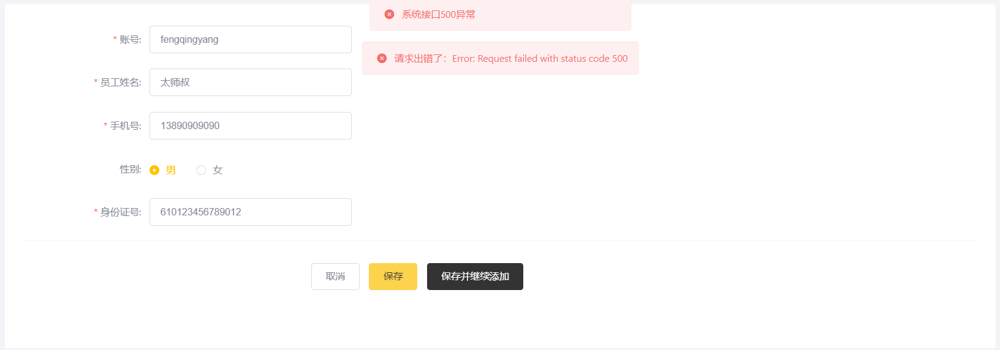
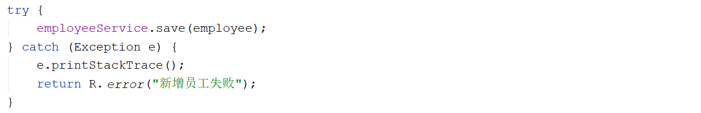

# 新增员工

## 需求分析

后台系统中可以管理员工信息，通过新增员工来添加后台系统用户。点击**添加员工按钮**跳转到新增页面，如下：



当填写完表单信息, 点击"保存"按钮后, 会提交该表单的数据到服务端, 在服务端中需要接受数据, 然后将数据保存至数据库中。


## 数据模型

新增员工，其实就是将我们新增页面录入的员工数据插入到**employee表**。employee表中的status字段已经设置了默认值1，表示状态正常。


需要注意，employee表中对username字段加入了**唯一约束**，因为username是员工的登录账号，必须是唯一的。


## 程序执行流程

在开发代码之前，我们需要结合着前端页面发起的请求， 梳理一下整个程序的执行过程：


1. 点击"保存"按钮, 页面发送ajax请求，将新增员工页面中输入的数据以json的形式提交到服务端, 请求方式POST, 请求路径 /employee

1. 服务端Controller接收页面提交的数据并调用Service将数据进行保存

1. Service调用Mapper操作数据库，保存数据


## 代码实现

在EmployeeController中增加save方法, 用于保存用户员工信息。

1. 在新增员工时， 按钮页面原型中的需求描述， 需要给员工设置初始默认密码 123456， 并对密码进行MD5加密。

1. 在组装员工信息时, 还需要封装创建时间、修改时间，创建人、修改人信息(从session中获取当前登录用户)。

```java
/**
 * 新增员工
 * @param employee
 * @return
 */
@PostMapping
public R<String> save(HttpServletRequest request,@RequestBody Employee employee){
    log.info("新增员工，员工信息：{}",employee.toString());

    //设置初始密码123456，需要进行md5加密处理
    employee.setPassword(DigestUtils.md5DigestAsHex("123456".getBytes()));
	
    employee.setCreateTime(LocalDateTime.now());
    employee.setUpdateTime(LocalDateTime.now());
	
    //获得当前登录用户的id
    Long empId = (Long) request.getSession().getAttribute("employee");

    employee.setCreateUser(empId);
    employee.setUpdateUser(empId);

    employeeService.save(employee);
    return R.success("新增员工成功");
}
```

注意:

- 获取现在时间: **LocalDateTime.now()**


## 功能测试

代码编写完毕之后，我们需要将工程重启, 完毕之后直接访问管理系统首页, 点击 "员工管理" 页面中的 "添加员工" 按钮, 输入员工基本信息, 然后点击 "保存" 进行数据保存, 保存完毕后, 检查数据库中是否录入员工数据。


当我们在测试中，添加用户时， 输入了一个已存在的用户名时，前端界面出现错误提示信息： 



而此时，服务端已经报错了， 报错信息如下： 


出现上述的错误， 主要就是因为在 employee 表结构中，我们针对于username字段，建立了唯一索引，添加重复的username数据时，违背该约束，就会报错。

但是此时前端提示的信息并不具体，用户并不知道是因为什么原因造成的该异常，我们需要给用户提示详细的错误信息 。

## 异常问题

要想解决上述测试中存在的问题，我们需要对程序中可能出现的异常进行捕获，通常有两种处理方式：

### try-catch

**在Controller方法中加入 try...catch 进行异常捕获**

形式如下： 




如果采用这种方式，虽然可以解决，但是存在弊端，需要我们在保存其他业务数据时，也需要在Controller方法中加上try...catch进行处理，代码冗余，不通用。

### 全局异常捕获

**使用异常处理器进行全局异常捕获**

采用这种方式来实现，我们只需要在项目中定义一个通用的[全局异常处理器](../../../../JAVA/3.Web框架/项目%20&%20实战案例/瑞吉外卖/6.全局异常处理.md)，就可以解决本项目的所有异常。