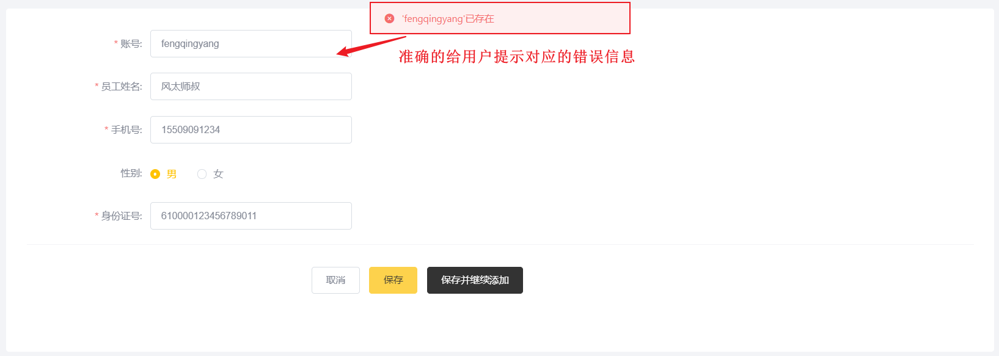

# 全局异常处理器

在项目中自定义一个全局异常处理器进行全局异常捕获

1. 首先要在异常处理器上加上注解 **@ControllerAdvice**,可以通过属性annotations指定拦截哪一类的Controller方法。 
2. 然后异常处理器的方法上加上注解 **@ExceptionHandler** 来指定拦截的是那一类型的异常。

## 异常处理方法

以[新增员工异常问题](../../../../JAVA/3.Web框架/项目%20&%20实战案例/瑞吉外卖/5.后台系统功能之新增员工.md#异常问题)异常处理为例 :


全局异常处理器方法基本逻辑如下: 

1. 指定捕获的异常类型为 SQLIntegrityConstraintViolationException
1. 解析异常的提示信息, 获取出是那个值违背了唯一约束 
1. 组装错误信息并返回


## 代码编写

所属包: cn.suliu.reggie.common

```java
/**
 * 全局异常处理
 */
@ControllerAdvice(annotations = {RestController.class, Controller.class})
@ResponseBody
@Slf4j
public class  GlobalExceptionHandler {

    /**
     * 异常处理方法
     * @return
     */
    @ExceptionHandler(SQLIntegrityConstraintViolationException.class)
    public R<String> exceptionHandler(SQLIntegrityConstraintViolationException ex){
        log.error(ex.getMessage());
        if(ex.getMessage().contains("Duplicate entry")){
            String[] split = ex.getMessage().split(" ");
            String msg = split[2] + "已存在";
            return R.error(msg);
        }
        return R.error("未知错误");
    }
}

```

### 注解说明

下面使用的两个注解, 也可以合并成为一个注解 **@RestControllerAdvice** 

#### @ControllerAdvice

@ControllerAdvice : 指定拦截那些类型的控制器;


#### @ResponseBody


@ResponseBody: 将方法的返回值 R 对象转换为json格式的数据, 响应给页面;


### 测试

全局异常处理器编写完毕之后，我们需要将项目重启, 完毕之后直接访问管理系统首页, 点击 "员工管理" 页面中的 "添加员工" 按钮。当我们在测试中，添加用户时， 输入了一个已存在的用户名时，前端界面出现如下错误提示信息：




