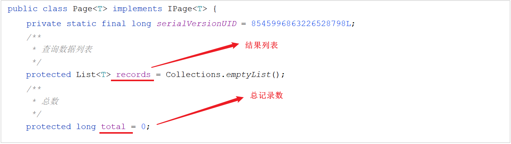
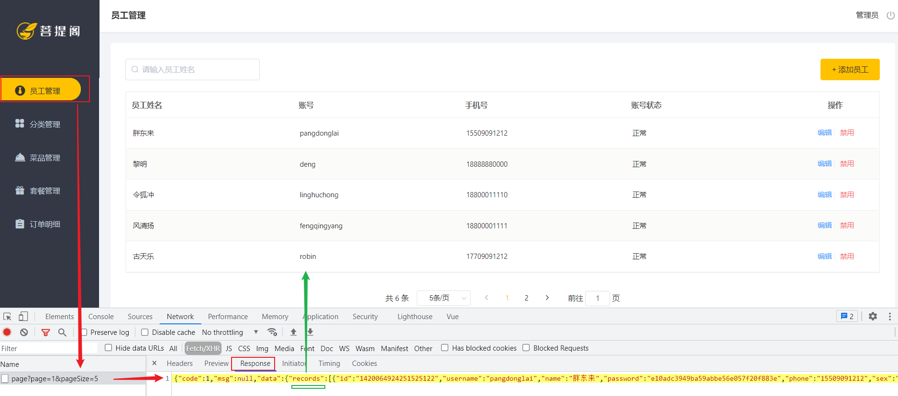

# 员工分页查询

## 需求分析

系统中的员工很多的时候，如果在一个页面中全部展示出来会显得比较乱，不便于查看，所以一般的系统中都会以分页的方式来展示列表数据。而在我们的分页查询页面中, 除了分页条件以外，还有一个查询条件 "员工姓名"。


- 请求参数

  - 搜索条件： 员工姓名(模糊查询)

  - 分页条件： 每页展示条数 ， 页码

- 响应数据

  - 总记录数

  - 结果列表


## 执行流程

在开发代码之前，需要梳理一下整个程序的执行过程。

### 前端页面流程

点击菜单，打开员工管理页面时，执行查询： 


搜索栏输入员工姓名,回车,执行查询:


1. 页面发送ajax请求，将分页查询参数(**page、pageSize、name**)提交到服务端

1. 服务端Controller接收页面提交的数据, 并组装条件调用Service查询数据

1. Service调用Mapper操作数据库，查询分页数据

1. Controller将查询到的分页数据, 响应给前端页面

1. 页面接收到分页数据, 并通过ElementUI的Table组件展示到页面上

### 前端代码分析

1.访问员工列表页面`/member/list.html`时, 会触发Vue.js中的**钩子方法**, 在页面初始化时调用**created方法**


从上述的前端代码中我们可以看到, 执行完分页查询, 我们需要给前端返回的信息中需要包含两项 : 
- **records 中封装结果列表**
- **total 中封装总记录数**

而在组装请求参数时 , page、pageSize 都是前端分页插件渲染时的参数:


2.在getMemberList方法中, 通过axios发起异步请求


axios发起的异步请求会被声明在 request.js 中的request拦截器拦截, 在其中对get请求进行进一步的封装处理


**最终发送给服务端的请求为 :** GET请求 , 请求链接 /employee/page?page=1&pageSize=10&name=xxx


## 代码实现

### 分页插件配置

当前我们要实现的分页查询功能，而在MybatisPlus要实现分页功能，就需要用到MybatisPlus中提供的分页插件，要使用分页插件，就要**在配置类中声明分页插件的bean对象**。

所属包: cn.suliu.reggie.config

```
/**
 * 配置MP的分页插件
 */
@Configuration
public class MybatisPlusConfig {

    @Bean
    public MybatisPlusInterceptor mybatisPlusInterceptor(){
        MybatisPlusInterceptor mybatisPlusInterceptor = new MybatisPlusInterceptor();
        mybatisPlusInterceptor.addInnerInterceptor(new PaginationInnerInterceptor());
        return mybatisPlusInterceptor;
    }
}
```

### 分页查询实现

在[前端代码分析](#前端代码分析)我们已经知道，页面在进行分页查询时， 具体的请求信息如下:

| 请求     | 说明                   |
| -------- | ---------------------- |
| 请求方式 | GET                    |
| 请求路径 | /employee/page         |
| 请求参数 | page , pageSize , name |


那么查询完毕后我们需要给前端返回什么样的结果呢? 

再由[前端代码分析](#前端代码分析), 查询返回的结果数据data中应该封装两项信息, 分别为: 
- **records** 封装分页**列表数据**
- **total** 中封装符合条件的**总记录数**

那么这个时候, 在定义controller方法的返回值类型R时, 我们可以直接将 MybatisPlus 分页查询的**结果 Page 直接封装返回**, 因为Page中的属性如下: 



那么接下来就依据于这些已知的需求和条件完成分页查询的代码实现。 具体的逻辑如下: 

1. 构造分页条件

1. **构建搜索条件** - name进行模糊匹配

1. **构建排序条件** - 更新时间倒序排序

1. 执行查询

1. 组装结果并返回

```java
/**
 * 员工信息分页查询
 * @param page 当前查询页码
 * @param pageSize 每页展示记录数
 * @param name 员工姓名 - 可选参数
 * @return
 */
@GetMapping("/page")
public R<Page> page(int page,int pageSize,String name){
    log.info("page = {},pageSize = {},name = {}" ,page,pageSize,name);
    //构造分页构造器
    Page pageInfo = new Page(page,pageSize);

    //构造条件构造器
    LambdaQueryWrapper<Employee> queryWrapper = new LambdaQueryWrapper();
    //添加过滤条件
    queryWrapper.like(StringUtils.isNotEmpty(name),Employee::getName,name);
    //添加排序条件
    queryWrapper.orderByDesc(Employee::getUpdateTime);

    //执行查询
    employeeService.page(pageInfo,queryWrapper);
    return R.success(pageInfo);
}
```

注意:

- StringUtils 字符串工具类(org.apache.commons.lang包下)
- like(boolean condition, R column, Object val) 这个方法的参数condition可以使我们少写一个if判断语句
- `Employee::getName` 要是使用这种形式 , 必须保证 LambdaQueryWrapper 的泛型是 **Employee**


## 功能测试

代码编写完毕之后，我们需要将工程重启, 完毕之后直接访问管理系统首页, 默认就会打开员工管理的列表页面, 我们可以查看列表数据是否可以正常展示, 也可以通过分页插件来测试分页功能, 及员工姓名的模糊查询功能。

在进行测试时，可以使用浏览器的监控工具查看页面和服务端的数据交互细节。 并借助于debug的形式， 根据服务端参数接收及逻辑执行情况。



测试过程中可以发现，对于员工状态字段（status）服务端返回的是状态码（1或者0），但是页面上显示的则是“正常”或者“已禁用”，这是因为页面中在展示数据时进行了处理。


