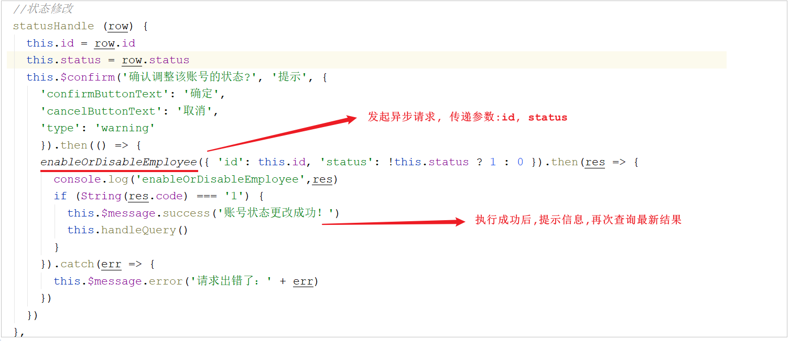

# 启用/禁用员工账号

## 需求分析

在员工管理列表页面，可以对某个员工账号进行**启用**或者**禁用**操作。

- 账号禁用的员工不能登录系统，启用后的员工可以正常登录。
- 如果某个员工账号状态为正常，则按钮显示为 "禁用"，如果员工账号状态为已禁用，则按钮显示为"启用"。

需要注意，只有**管理员（admin用户）** 可以对其他普通用户进行启用、禁用操作，所以普通用户登录系统后启用、禁用按钮不显示。

### 管理员登录


### 普通用户登录


## 程序执行流程

### 前端页面分析

在上述的需求中,我们提到需要实现的效果是 : **只有管理员（admin用户）可以对其他普通用户进行启用、禁用操作，所以普通用户登录系统后启用、禁用按钮不显示** 

页面中是怎么做到只有管理员admin能够看到启用、禁用按钮的？

1.在列表页面(list.html)加载时, 触发钩子函数created, 在钩子函数中, 会从localStorage中获取到用户登录信息, 然后获取到用户名


2.在页面中, 通过Vue指令v-if进行判断,如果登录用户为admin将展示 **启用/禁用** 按钮, 否则不展示


注意:这里修改状态码要反着来，因为正常的用户你只能把它设置为禁用；已经禁用的账号你只能把它设置为正常


### 执行流程分析


1.当管理员admin点击 "启用" 或 "禁用" 按钮时, 调用**方法statusHandle**


- **scope.row** : 获取到的是这一行的数据信息封装的Employee对象

2.statusHandle方法中进行二次确认, 然后发起ajax请求, 传递id、status参数




> **{...params}** : 三点是ES6中出现的扩展运算符。作用是遍历当前使用的对象能够访问到的所有属性，并将属性放入当前对象中。

最终发起异步请求, 请求服务端, 请求信息如下： 

| 请求     | 说明                    |
| -------- | ----------------------- |
| 请求方式 | PUT       |
| 请求路径 | /employee               |
| 请求参数 | `{"id":xxx,"status":xxx}`|


##  代码实现

在开发代码之前，需要梳理一下整个程序的执行过程：

1. 页面发送ajax请求，将参数(id、status)提交到服务端

2. 服务端Controller接收页面提交的数据并调用Service更新数据

3. Service调用Mapper操作数据库


启用、禁用员工账号，本质上就是一个**更新操作**，也就是对status状态字段进行操作。在Controller中创建**update方法**，此方法是一个**通用的修改员工信息的方法**。


```java
/**
 * 根据id修改员工信息
 * @param employee
 * @return
 */
@PutMapping
public R<String> update(HttpServletRequest request,@RequestBody Employee employee){
    log.info(employee.toString());

    Long empId = (Long)request.getSession().getAttribute("employee");

    employee.setUpdateTime(LocalDateTime.now());
    employee.setUpdateUser(empId);
    employeeService.updateById(employee);

    return R.success("员工信息修改成功");
}
```


## 功能测试

代码编写完毕之后，我们需要将工程重启。 然后访问前端页面， 进行 "启用" 或 "禁用" 的测试。


测试过程中没有报错，但是功能并没有实现，查看数据库中的数据也没有变化。但是从控制台输出的日志， 可以看出确实没有更新成功。


而在我们的数据库表结构中， **并不存在该ID**， 数据库中 **风清扬** 对应的ID为 **1420038345634918401**

## 异常问题

### 原因分析

通过观察控制台输出的SQL发现页面传递过来的员工id的值和数据库中的id值不一致，这是怎么回事呢？


在分页查询时，服务端会将返回的R对象进行json序列化，转换为json格式的数据，而员工的ID是一个Long类型的数据，而且是一个长度为 19 位的长整型数据， 该数据返回给前端是没有问题的。


问题实际上， **就出现在前端JS中， js在对长度较长的长整型数据进行处理时， 会损失精度， 从而导致提交的id和数据库中的id不一致**。 

这里，我们也可以做一个简单的测试，代码如下： 

```
<!DOCTYPE html>
<html lang="en">
<head>
    <meta charset="UTF-8">
    <title>Title</title>
    <script>
        alert(1420038345634918401);
    </script>
</head>
<body>
</body>
</html>
```

### 解决方案

要想解决这个问题，也很简单，我们只需要让JS处理的**ID数据类型为字符串类型**即可, 这样就不会损失精度了。

同样， 大家也可以做一个测试： 

```
<!DOCTYPE html>
<html lang="en">
<head>
    <meta charset="UTF-8">
    <title>Title</title>
    <script>
        alert("1420038345634918401");
    </script>
</head>
<body>
</body>
</html>
```

那么在我们的业务中, 我们**只需要让分页查询返回的json格式数据库中, long类型的属性, 不直接转换为数字类型, 转换为字符串类型就可以解决这个问题了** , 最终返回的结果为 : 


## 代码修复

由于在SpringMVC中, 将Controller方法返回值转换为json对象, 是通过jackson来实现的, 涉及到SpringMVC中的一个**消息转换器MappingJackson2HttpMessageConverter**, 所以我们要解决这个问题, 就需要对该消息转换器的功能进行拓展。


**具体实现步骤：**

1. 提供对象转换器JacksonObjectMapper，基于Jackson进行Java对象到json数据的转换

2. 在WebMvcConfig配置类中扩展Spring mvc的消息转换器，在此消息转换器中使用提供的对象转换器进行Java对象到json数据的转换


### 引入JacksonObjectMapper

在cn.suliu.reggie.common包中引入JacksonObjectMapper


```java

import static com.fasterxml.jackson.databind.DeserializationFeature.FAIL_ON_UNKNOWN_PROPERTIES;


/**
 * 对象映射器:基于jackson将Java对象转为json，或者将json转为Java对象
 * 将JSON解析为Java对象的过程称为 [从JSON反序列化Java对象]
 * 从Java对象生成JSON的过程称为 [序列化Java对象到JSON]
 */
public class JacksonObjectMapper extends ObjectMapper {
    public static final String DEFAULT_DATE_FORMAT = "yyyy-MM-dd";
    public static final String DEFAULT_DATE_TIME_FORMAT = "yyyy-MM-dd HH:mm:ss";
    public static final String DEFAULT_TIME_FORMAT = "HH:mm:ss";
    public JacksonObjectMapper() {
        super();
        //收到未知属性时不报异常
        this.configure(FAIL_ON_UNKNOWN_PROPERTIES, false);
        //反序列化时，属性不存在的兼容处理
        this.getDeserializationConfig().withoutFeatures(DeserializationFeature.FAIL_ON_UNKNOWN_PROPERTIES);

        SimpleModule simpleModule = new SimpleModule()
                .addDeserializer(LocalDateTime.class, new LocalDateTimeDeserializer(DateTimeFormatter.ofPattern(DEFAULT_DATE_TIME_FORMAT)))
                .addDeserializer(LocalDate.class, new LocalDateDeserializer(DateTimeFormatter.ofPattern(DEFAULT_DATE_FORMAT)))
                .addDeserializer(LocalTime.class, new LocalTimeDeserializer(DateTimeFormatter.ofPattern(DEFAULT_TIME_FORMAT)))

                .addSerializer(BigInteger.class, ToStringSerializer.instance)
                .addSerializer(Long.class, ToStringSerializer.instance)

                .addSerializer(LocalDateTime.class, new LocalDateTimeSerializer(DateTimeFormatter.ofPattern(DEFAULT_DATE_TIME_FORMAT)))
                .addSerializer(LocalDate.class, new LocalDateSerializer(DateTimeFormatter.ofPattern(DEFAULT_DATE_FORMAT)))
                .addSerializer(LocalTime.class, new LocalTimeSerializer(DateTimeFormatter.ofPattern(DEFAULT_TIME_FORMAT)));
        //注册功能模块 例如，可以添加自定义序列化器和反序列化器
        this.registerModule(simpleModule);
    }
}
```

**对象映射器**:基于jackson将Java对象转为json，或者将json转为Java对象

- 将JSON解析为Java对象的过程称为 **从JSON反序列化Java对象**
- 从Java对象生成JSON的过程称为 **序列化Java对象到JSON**


该自定义的对象转换器, 主要指定了在进行**json数据序列化及反序列化**时:

- LocalDateTime、LocalDate、LocalTime的处理方式
- **BigInteger及Long类型数据，直接转换为字符串**。

### 重写方法

在**WebMvcConfig**中重写方法**extendMessageConverters()**

```
/**
 * 扩展mvc框架的消息转换器
 * @param converters
 */
@Override
protected void extendMessageConverters(List<HttpMessageConverter<?>> converters) {
    log.info("扩展消息转换器...");
    //创建消息转换器对象
    MappingJackson2HttpMessageConverter messageConverter = new MappingJackson2HttpMessageConverter();
    //设置对象转换器，底层使用Jackson将Java对象转为json
    messageConverter.setObjectMapper(new JacksonObjectMapper());
    //将上面的消息转换器对象追加到mvc框架的转换器集合中
    converters.add(0,messageConverter);
}
```


