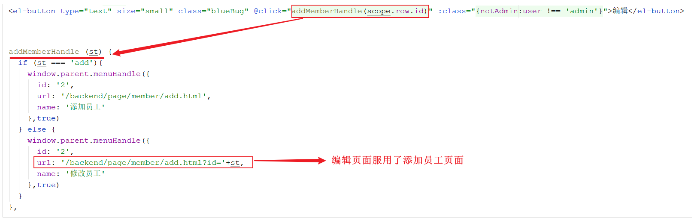
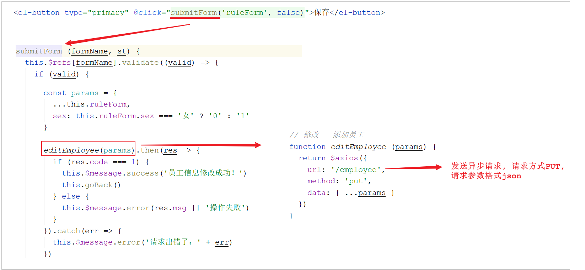

# 编辑员工信息

## 需求分析

在员工管理列表页面点击 "编辑" 按钮，跳转到编辑页面，在编辑页面回显员工信息并进行修改，最后点击 "保存" 按钮完成编辑操作。


那么从上述的分析中，我们可以看出当前实现的编辑功能,我们需要实现两个方法:

1. 根据ID查询, 用于页面数据回显

1. 保存修改

## 程序执行流程

在开发代码之前需要梳理一下操作过程和对应的程序的执行流程：

1.点击编辑按钮时，页面跳转到add.html，并在url中携带参数**员工id**



>注意：add.html页面为公共页面，新增员工和编辑员工都是在此页面操作

2.在add.html页面获取url中的参数**员工id**

3.发送ajax请求，请求服务端，同时提交**员工id**参数

4.服务端接收请求，根据员工id查询员工信息，将员工信息以json形式响应给页面


5.页面接收服务端响应的json数据，通过VUE的数据绑定进行员工信息回显

6.点击保存按钮，发送ajax请求，将页面中的员工信息以json方式提交给服务端

7.服务端接收员工信息，并进行处理，完成后给页面响应

8.页面接收到服务端响应信息后进行相应处理





## 代码实现

### 根据ID查询

经过上述的分析,我们看到,在根据ID查询员工信息时,请求信息如下: 

| 请求     | 说明           |
| -------- | -------------- |
| 请求方式 | GET            |
| 请求路径 | `/employee/{id}` |


**代码实现:** 

在EmployeeController中增加方法, 根据ID查询员工信息。

```
/**
 * 根据id查询员工信息
 * @param id
 * @return
 */
@GetMapping("/{id}")
public R<Employee> getById(@PathVariable Long id){
    log.info("根据id查询员工信息...");
    Employee employee = employeeService.getById(id);
    if(employee != null){
        return R.success(employee);
    }
    return R.error("没有查询到对应员工信息");
}
```


### 修改员工

经过上述的分析,我们看到,在修改员工信息时,请求信息如下: 

| 请求     | 说明                   |
| -------- | ---------------------- |
| 请求方式 | PUT                    |
| 请求路径 | /employee              |
| 请求参数 | `{.......}` json格式数据 |


**代码实现:** 

在EmployeeController中增加方法, 根据ID更新员工信息。

```
/**
 * 根据id修改员工信息
 * @param employee
 * @return
 */
@PutMapping
public R<String> update(HttpServletRequest request,@RequestBody Employee employee){
    log.info(employee.toString());

    Long empId = (Long)request.getSession().getAttribute("employee");

    employee.setUpdateTime(LocalDateTime.now());
    employee.setUpdateUser(empId);
    employeeService.updateById(employee);

    return R.success("员工信息修改成功");
}
```

## 功能测试

代码编写完毕之后，我们需要将工程重启。 然后访问前端页面， 按照前面分析的操作流程进行测试，查看数据是否正常修改即可。


